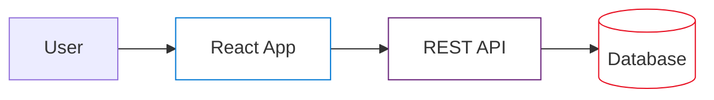

# Comprehensive Architecture Diagram Workflow

Use this workflow to generate high-quality, professional-level architecture diagrams for technical documentation.

## When to Use This Workflow

- Creating system architecture overviews
- Documenting authentication flows
- Explaining database schemas and relationships
- Visualizing API communication patterns
- Creating technical documentation for stakeholders

## Design Principles

**Visual Style:**
- Clean white background (no colored boxes/backgrounds)
- Professional corporate aesthetic
- Plenty of whitespace for clarity
- Subtle shadows for depth (optional)
- Official Azure/AWS/GCP icons where applicable

**Layout:**
- Left-to-right flow for data movement
- Orthogonal lines only (no diagonal connections)
- Clear component separation with spacing
- Logical grouping of related components
- Clean labels with consistent font sizes

**Colors:**
- Use official brand colors for known services (Azure blue, AWS orange, etc.)
- Icons should be recognizable without color
- Avoid random/gradient background colors on boxes
- Focus on clarity over decoration

## Step-by-Step Process

### 1. Identify Diagram Type

Choose the appropriate diagram type:

- **System Architecture**: Overview of components and their relationships
- **Sequence Diagram**: Time-based interaction flow
- **Data Flow**: How data moves through the system
- **Authentication Flow**: Security and identity workflows
- **Database Schema**: Entity relationships and data models

### 2. List Components

Create a comprehensive list of:
- Services/applications
- Databases
- External systems
- Security components
- Users/actors

### 3. Define Relationships

Document:
- Data flow directions
- Authentication/authorization paths
- API calls and responses
- Database connections
- Event streams

### 4. Generate Diagram

Use the `generate_image` tool with a structured prompt following this template:

```
Professional [DIAGRAM_TYPE] diagram showing [SYSTEM_NAME]. Clean white background.

Components arranged [LAYOUT_DIRECTION]:
- [Component 1]: [description, icon/color]
- [Component 2]: [description, icon/color]
- [Component 3]: [description, icon/color]

Connections:
- [Arrow type] from [source] to [destination] labeled "[label]"
- [Connection description]

Style: 
- Clean professional corporate design
- White background, no colored boxes
- Official [vendor] icons where applicable  
- Orthogonal lines only
- Clear labels
- Plenty of whitespace
```

### 5. Iterate Based on Feedback

Common refinements:
- Adjust component spacing
- Clarify labels
- Add/remove detail level
- Simplify complex flows
- Remove unnecessary visual elements (colored boxes, gradients)

## Example Prompts

### System Architecture Diagram

```
Professional cloud architecture diagram showing vendor management system. Clean white background.

Components arranged left to right:
- User icon (simple silhouette)
- Frontend application (use React/web icon)
- API Gateway (simple box with label)
- Three backend services (simple labeled boxes)
- Two databases (cylinder icons)

Connections:
- Blue arrows showing HTTPS requests from left to right
- Dotted orange lines showing authentication flow
- Clear labels: "HTTPS", "REST API", "Auth Token"

Style: Clean corporate design, white background, no colored boxes or gradients, 
official cloud vendor icons, orthogonal lines only, plenty of whitespace.
```

### Authentication Flow Diagram

```
Professional sequence diagram showing OAuth authentication flow. White background.

Vertical swim lanes from left to right:
1. "User Browser" (no background color)
2. "Application" (no background color)
3. "Auth Provider" (no background color)
4. "Resource Server" (no background color)

Sequence of interactions with numbered steps:
1. User initiates login
2. App redirects to Auth Provider
3. User authenticates
4. Auth Provider returns token
5. App requests resource with token
6. Resource validates and responds

Clean arrows between lanes, step numbers in circles, professional style, 
no colored backgrounds, orthogonal connections only.
```

### Database Schema Diagram

```
Professional database schema diagram showing entity relationships. Clean white background.

Left side - Primary tables (simple rectangles, no fill color):
- Users table with fields listed
- Orders table with fields listed
- Products table with fields listed

Right side - Audit tables (simple rectangles):
- UserAudit table
- OrderHistory table

Connections:
- Clean lines showing foreign key relationships
- "1:N" cardinality labels
- Primary keys marked with "PK"
- Foreign keys marked with "FK"

Style: Professional ERD, white background, no table fill colors, clean lines,
clear field names, standard database notation.
```

## Quality Checklist

Before finalizing, verify:

- [ ] All components are clearly labeled
- [ ] Arrows show correct direction
- [ ] Key relationships are visible
- [ ] Layout is left-to-right (or top-to-bottom if appropriate)
- [ ] No diagonal lines (use orthogonal routing)
- [ ] Sufficient whitespace between elements
- [ ] No unnecessary colored boxes or backgrounds
- [ ] Icons are recognizable and professional
- [ ] Labels are concise and clear
- [ ] Diagram serves its documentation purpose

## Output and Documentation

### Saving Generated Diagrams

```bash
# Copy to project documentation
cp /path/to/generated/diagram.png docs/images/[descriptive-name].png

# Reference in documentation

```

### Integration with Documentation

Create complementary documentation:

1. **Visual Guide** (`ARCHITECTURE_VISUAL.md`)
   - Embed generated diagrams
   - Add explanatory text
   - Include legends if needed

2. **Technical Details** (`ARCHITECTURE_DETAILED.md`)
   - Use Mermaid diagrams for embedde code
   - Provide detailed specifications
   - Link to visual guide

3. **README Updates**
   - Link to architecture docs
   - Include key diagram in main README

## Tips for Professional Results

**DO:**
- Use official vendor icons (Azure, AWS, etc.)
- Keep consistent spacing throughout
- Label all connections
- Use standard notation (ERD, UML, sequence diagrams)
- Test diagram clarity with non-technical reviewers

**DON'T:**
- Use random colors without purpose
- Create diagonal connections
- Overcrowd the diagram
- Use unclear abbreviations
- Add decorative elements that don't aid understanding

## Advanced: Mermaid Diagrams

For version-controlled diagrams in markdown:



Benefits:
- Version controlled with code
- Easy to update
- Renders in GitHub/GitLab
- Can be exported to images

## Workflow Summary

```
1. Identify diagram type and purpose
   ↓
2. List all components and relationships
   ↓
3. Choose layout (left-right, top-bottom)
   ↓
4. Generate with structured prompt
   ↓
5. Review against quality checklist
   ↓
6. Iterate based on feedback (remove colored boxes, etc.)
   ↓
7. Save to docs/images/ with descriptive name
   ↓
8. Embed in documentation with context
   ↓
9. Update README with links
```

## Examples from This Project

See successful implementations in:
- `docs/images/architecture-overview.png` - System architecture
- `docs/images/managed-identity-flow.png` - Authentication sequence
- `docs/images/hybrid-database-schema.png` - Database relationships

Each follows the principles above with clean, professional styling.
