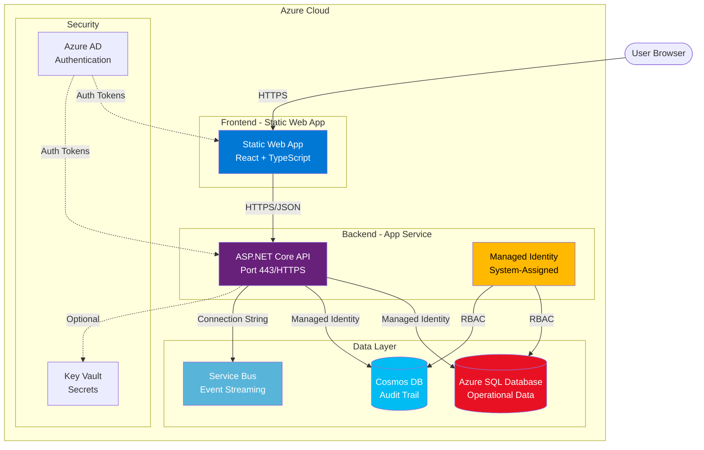
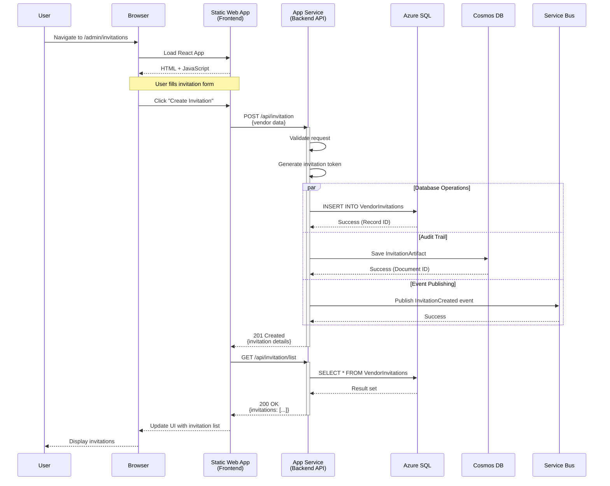
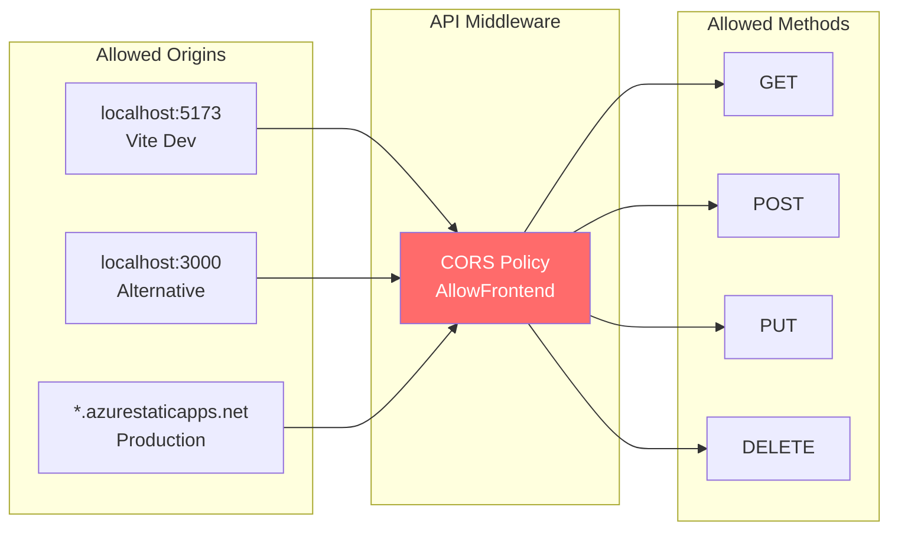
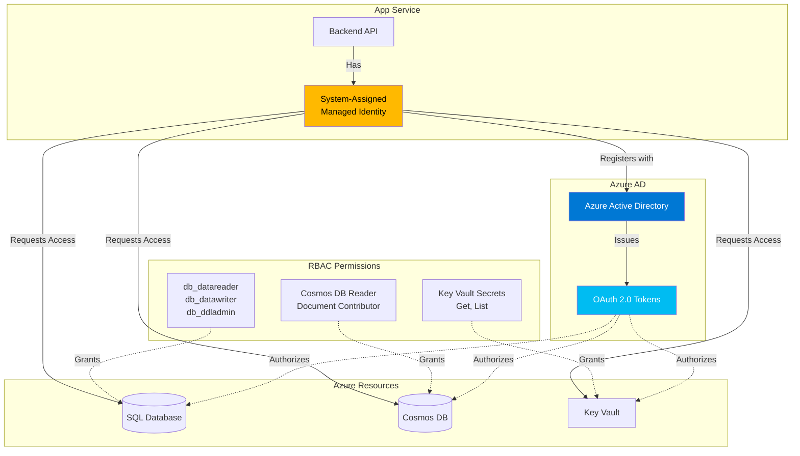
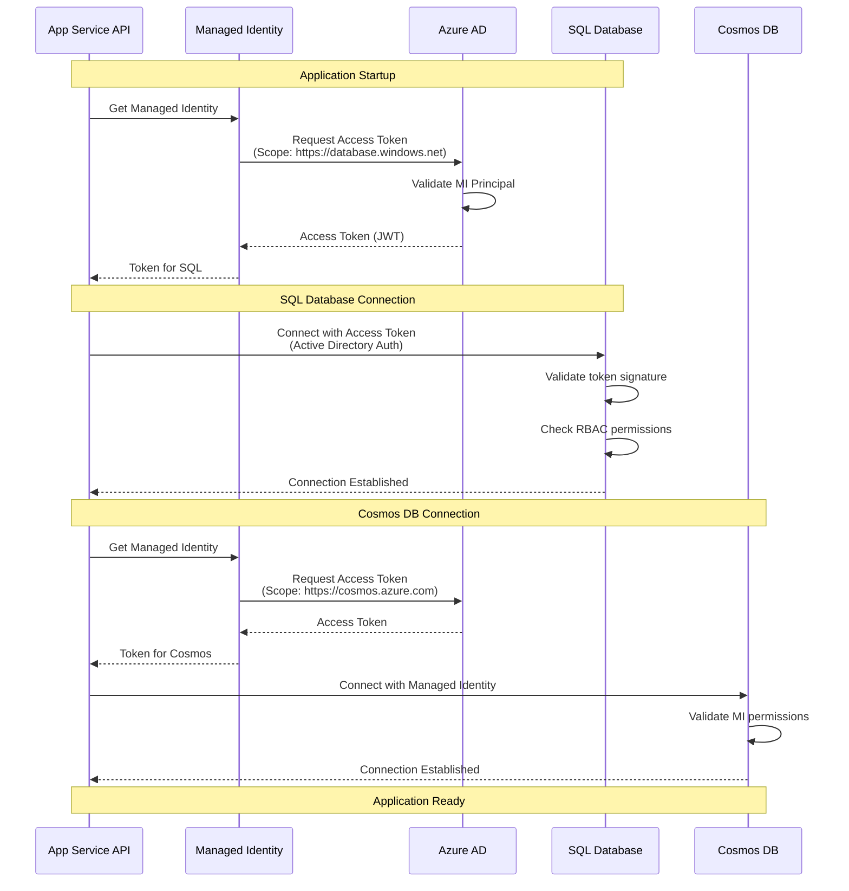
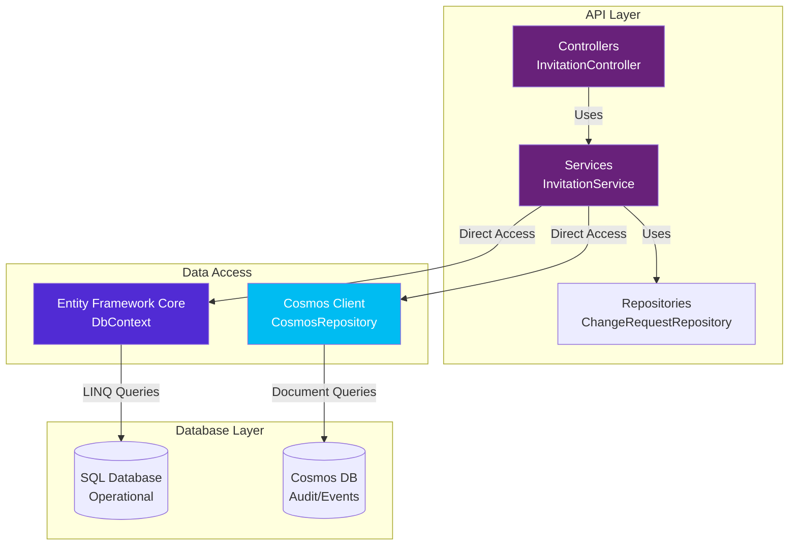
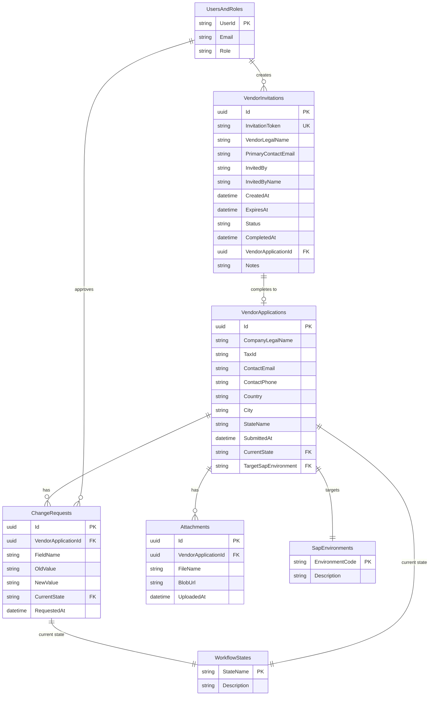
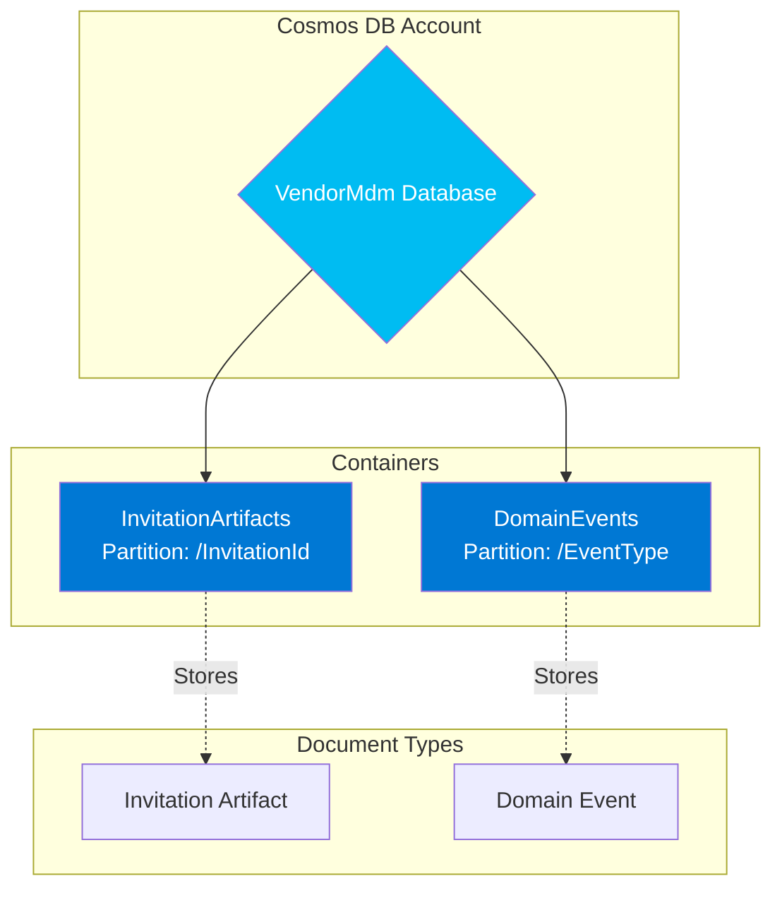
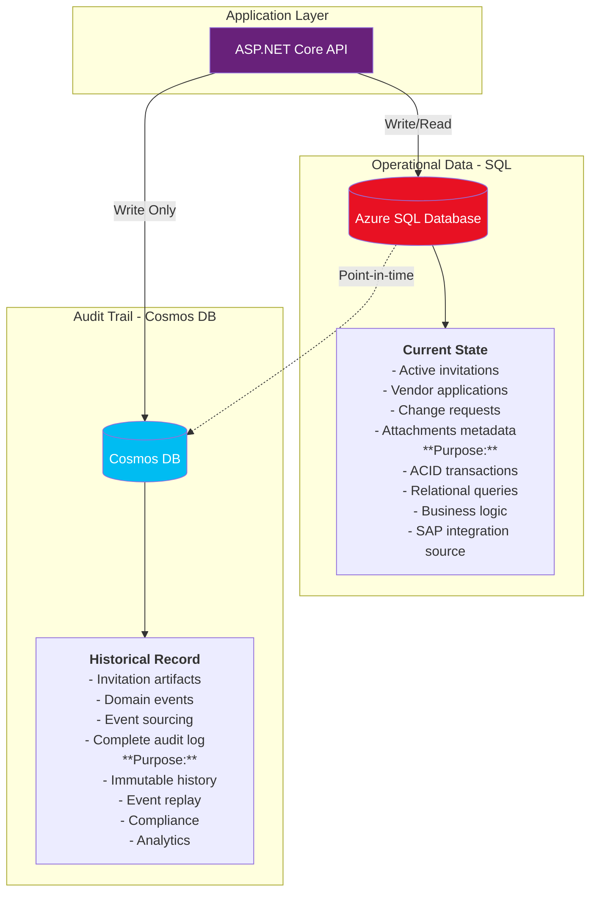
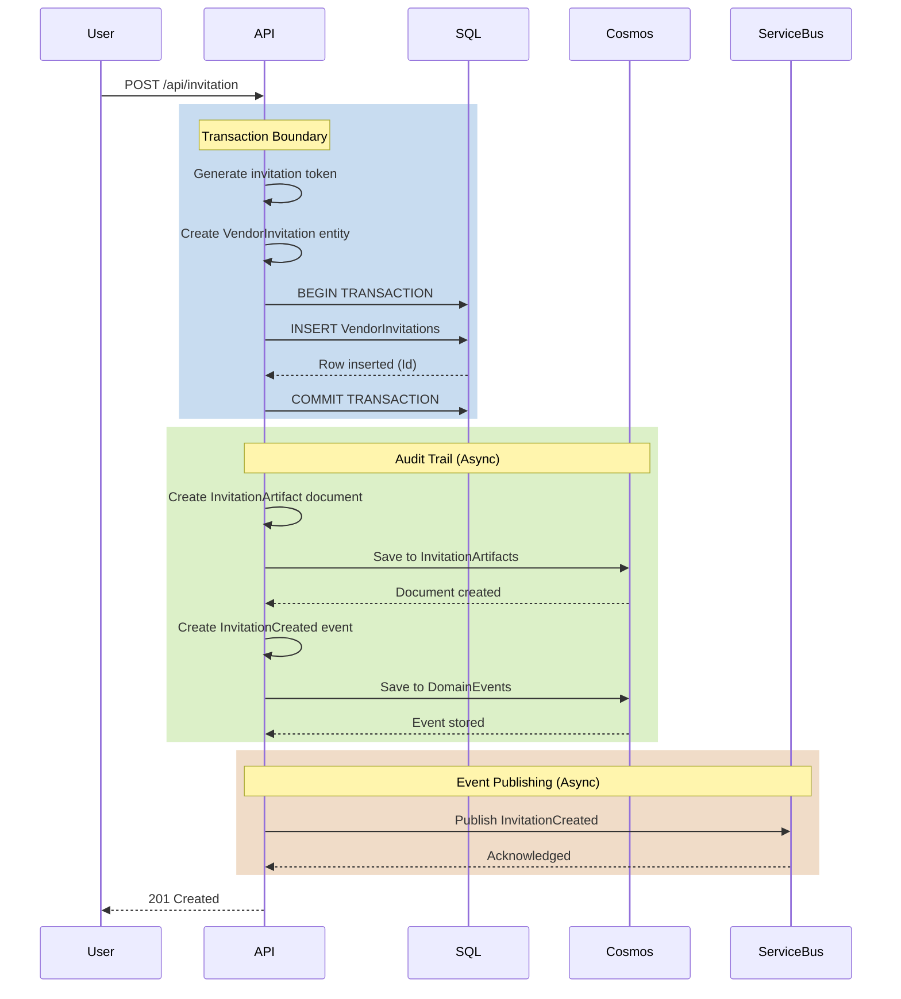

# Vendor MDM Portal - Architecture & Schema Documentation

## Table of Contents
1. [System Architecture Overview](#system-architecture-overview)
2. [Frontend-API Communication](#frontend-api-communication)
3. [Managed Identity Authentication](#managed-identity-authentication)
4. [API-Database Integration](#api-database-integration)
5. [SQL Database Schema](#sql-database-schema)
6. [Cosmos DB Schema](#cosmos-db-schema)
7. [Hybrid Database Model](#hybrid-database-model)

---

## 1. System Architecture Overview

### High-Level Component Diagram



### Resource Topology

| Component | Azure Service | SKU | Purpose |
|-----------|--------------|-----|---------|
| **Frontend** | Static Web App | Free | React UI hosting |
| **Backend API** | App Service | F1 (Free) | REST API (.NET 8) |
| **Operational DB** | Azure SQL | Basic (5 DTU) | Transactional data |
| **Audit Store** | Cosmos DB | Serverless | Event sourcing & audit |
| **Message Queue** | Service Bus | Basic | Async messaging |
| **Secrets** | Key Vault | Standard | Connection strings |

---

## 2. Frontend-API Communication

### Request/Response Flow



### API Endpoints

#### Invitation Endpoints
```
POST   /api/invitation              Create new invitation
GET    /api/invitation/list         List all invitations
GET    /api/invitation/{token}      Get invitation by token
POST   /api/invitation/validate     Validate invitation token
POST   /api/invitation/resend       Resend invitation email
```

#### Request/Response Examples

**Create Invitation Request:**
```json
POST /api/invitation
Content-Type: application/json

{
  "vendorLegalName": "Acme Corporation",
  "primaryContactEmail": "contact@acme.com",
  "invitedBy": "admin@company.com",
  "notes": "Preferred supplier"
}
```

**Create Invitation Response:**
```json
HTTP/1.1 201 Created
Content-Type: application/json

{
  "id": "66df29ee-bcdd-4daa-b3cc-3e4c267ef1bb",
  "invitationToken": "abc123xyz789...",
  "vendorLegalName": "Acme Corporation",
  "primaryContactEmail": "contact@acme.com",
  "status": "Pending",
  "createdAt": "2025-12-13T06:00:47Z",
  "expiresAt": "2025-12-27T06:00:47Z",
  "invitationLink": "https://portal.company.com/register?token=abc123..."
}
```

### CORS Configuration



---

## 3. Managed Identity Authentication

### Authentication Architecture



### Authentication Flow Sequence



### Connection Strings (No Secrets!)

**SQL Database Connection:**
```
Server=tcp:sql-vendor-mdm-dev.database.windows.net,1433;
Initial Catalog=VendorMdmDb;
Authentication=Active Directory Managed Identity;
Encrypt=True;
TrustServerCertificate=False;
```
✅ **No username or password** - uses Managed Identity

**Cosmos DB Connection:**
```
https://cosmos-vendor-mdm-dev.documents.azure.com:443/
```
✅ **No access key** - uses Managed Identity via DefaultAzureCredential

**Service Bus Connection:**
```
Endpoint=sb://sb-vendor-mdm-dev.servicebus.windows.net/;
SharedAccessKeyName=RootManageSharedAccessKey;
SharedAccessKey=[from Key Vault or App Settings]
```

---

## 4. API-Database Integration

### Data Access Pattern



### Entity Framework Configuration

**DbContext Setup:**
```csharp
public class SqlDbContext : DbContext
{
    public DbSet<VendorInvitation> VendorInvitations { get; set; }
    public DbSet<ChangeRequest> ChangeRequests { get; set; }
    public DbSet<VendorApplication> VendorApplications { get; set; }
    public DbSet<Attachment> Attachments { get; set; }
    public DbSet<WorkflowState> WorkflowStates { get; set; }
    public DbSet<SapEnvironment> SapEnvironments { get; set; }
    public DbSet<UserRole> UsersAndRoles { get; set; }
}
```

**Dependency Injection:**
```csharp
// SQL Database with EF Core
builder.Services.AddDbContext<SqlDbContext>(options =>
{
    if (sqlConnection.Contains("Data Source="))
        options.UseSqlite(sqlConnection);  // Local dev
    else
        options.UseSqlServer(sqlConnection);  // Azure
});

// Cosmos DB Client
builder.Services.AddSingleton<CosmosClient>(sp =>
{
    return new CosmosClient(
        cosmosConnection, 
        new DefaultAzureCredential()  // Managed Identity
    );
});
```

---

## 5. SQL Database Schema

### Entity Relationship Diagram



### Table Details

#### VendorInvitations Table
**Purpose:** Track invitation tokens sent to potential vendors

| Column | Type | Constraints | Description |
|--------|------|-------------|-------------|
| Id | uniqueidentifier | PK | Unique invitation ID |
| InvitationToken | nvarchar(256) | UNIQUE, NOT NULL | Secure random token |
| VendorLegalName | nvarchar(500) | NOT NULL | Company name |
| PrimaryContactEmail | nvarchar(320) | NOT NULL | Contact email |
| InvitedBy | nvarchar(256) | | User who created invitation |
| InvitedByName | nvarchar(256) | | Display name of inviter |
| CreatedAt | datetime2 | NOT NULL | When invitation was created |
| ExpiresAt | datetime2 | NOT NULL | Expiration date (14 days) |
| Status | nvarchar(50) | NOT NULL | Pending/Completed/Expired |
| CompletedAt | datetime2 | NULL | When vendor completed registration |
| VendorApplicationId | uniqueidentifier | FK, NULL | Link to completed application |
| Notes | nvarchar(max) | NULL | Internal notes |

**Indexes:**
- PRIMARY KEY on `Id`
- UNIQUE INDEX on `InvitationToken`
- INDEX on `Status, CreatedAt`

#### VendorApplications Table
**Purpose:** Store vendor master data submissions

| Column | Type | Description |
|--------|------|-------------|
| Id | uniqueidentifier | Primary key |
| CompanyLegalName | nvarchar(500) | Legal entity name |
| TaxId | nvarchar(50) | Tax identification number |
| ContactEmail | nvarchar(320) | Primary contact email |
| ContactPhone | nvarchar(50) | Phone number |
| Country | nvarchar(100) | Country of operation |
| City | nvarchar(100) | City |
| StateName | nvarchar(100) | State/Province |
| SubmittedAt | datetime2 | Submission timestamp |
| CurrentState | nvarchar(50) | FK to WorkflowStates |
| TargetSapEnvironment | nvarchar(10) | FK to SapEnvironments |

#### WorkflowStates (Seed Data)
| StateName | Description |
|-----------|-------------|
| Draft | Initial draft |
| Submitted | Submitted for approval |
| Approved | Approved by admin |
| Integrated | Synced to SAP |

#### SapEnvironments (Seed Data)
| EnvironmentCode | Description |
|-----------------|-------------|
| D01 | Development |
| Q01 | Quality Assurance |
| P01 | Production |

---

## 6. Cosmos DB Schema

### Container Structure



### InvitationArtifacts Container

**Purpose:** Complete immutable audit trail of every invitation

**Document Schema:**
```json
{
  "id": "66df29ee-bcdd-4daa-b3cc-3e4c267ef1bb",
  "InvitationId": "66df29ee-bcdd-4daa-b3cc-3e4c267ef1bb",
  "Type": "InvitationArtifact",
  "VendorLegalName": "Acme Corporation",
  "PrimaryContactEmail": "contact@acme.com",
  "InvitationToken": "abc123xyz789...",
  "InvitedBy": "admin@company.com",
  "InvitedByName": "John Admin",
  "CreatedAt": "2025-12-13T06:00:47.564946Z",
  "ExpiresAt": "2025-12-27T06:00:47.564324Z",
  "Status": "Pending",
  "Notes": "Preferred supplier",
  "EmailSent": true,
  "EmailSentAt": "2025-12-13T06:00:48.123456Z",
  "InvitationLink": "https://portal.company.com/register?token=abc123...",
  "_ts": 1702450847
}
```

**Partition Key:** `/InvitationId`  
**TTL:** None (permanent audit record)

### DomainEvents Container

**Purpose:** Event sourcing for all domain events

**Document Schema:**
```json
{
  "id": "event-uuid-here",
  "EventType": "InvitationCreated",
  "EventVersion": "1.0",
  "AggregateId": "66df29ee-bcdd-4daa-b3cc-3e4c267ef1bb",
  "AggregateType": "VendorInvitation",
  "EventData": {
    "vendorLegalName": "Acme Corporation",
    "contactEmail": "contact@acme.com",
    "invitedBy": "admin@company.com"
  },
  "Metadata": {
    "userId": "admin@company.com",
    "ipAddress": "94.204.171.89",
    "userAgent": "Mozilla/5.0..."
  },
  "Timestamp": "2025-12-13T06:00:47.564946Z",
  "_ts": 1702450847
}
```

**Partition Key:** `/EventType`  
**TTL:** Configurable (e.g., 90 days for non-critical events)

### Query Patterns

**Get Invitation Artifact:**
```sql
SELECT * FROM c 
WHERE c.InvitationId = '66df29ee-bcdd-4daa-b3cc-3e4c267ef1bb'
```

**Get All Events for an Aggregate:**
```sql
SELECT * FROM c 
WHERE c.EventType = 'InvitationCreated'
ORDER BY c.Timestamp DESC
```

---

## 7. Hybrid Database Model

### SQL vs Cosmos DB - Data Distribution



### Data Flow: Creating an Invitation



### When to Use SQL vs Cosmos DB

| Data Type | Storage | Reason |
|-----------|---------|--------|
| **Active invitations** | SQL | Need to query by status, email, date |
| **Vendor applications** | SQL | Relational integrity, joins with changes |
| **Change requests** | SQL | Complex queries, approval workflows |
| **Workflow states** | SQL | Lookup tables, foreign keys |
| **Invitation history** | Cosmos | Immutable audit trail |
| **Domain events** | Cosmos | Event sourcing, time-series |
| **Email logs** | Cosmos | Append-only, no updates needed |
| **Analytics snapshots** | Cosmos | Large documents, flexible schema |

### Data Consistency Model

**SQL Database: Strong Consistency**
- ACID transactions
- Immediate consistency
- Used for operational queries

**Cosmos DB: Eventual Consistency**
- Session consistency (default)
- Async writes
- Used for audit and history

**Pattern: Dual Write**
```csharp
public async Task<VendorInvitation> CreateInvitationAsync(CreateInvitationDto dto)
{
    // 1. Write to SQL (transactional, synchronous)
    var invitation = new VendorInvitation { /* ... */ };
    _context.VendorInvitations.Add(invitation);
    await _context.SaveChangesAsync();  // ✅ COMMITTED
    
    // 2. Write to Cosmos (audit, asynchronous, best-effort)
    try 
    {
        await SaveInvitationArtifactAsync(invitation);  // ⏳ Fire and forget
        await EmitDomainEventAsync("InvitationCreated", invitation);
    }
    catch (Exception ex) 
    {
        _logger.LogWarning("Cosmos write failed: {Error}", ex.Message);
        // ⚠️ Don't fail the request - audit is supplementary
    }
    
    return invitation;
}
```

### Database Size Estimates

**SQL Database (Operational):**
- VendorInvitations: ~1KB per row × 10,000 invitations = 10 MB
- VendorApplications: ~2KB per row × 5,000 applications = 10 MB
- ChangeRequests: ~500B per row × 20,000 changes = 10 MB
- **Total: < 100 MB** (fits in Basic tier)

**Cosmos DB (Audit):**
- InvitationArtifacts: ~2KB per document × 10,000 = 20 MB
- DomainEvents: ~1KB per event × 50,000 events = 50 MB
- **Total: ~70 MB** (minimal RU consumption on Serverless)

---

## Summary

This architecture provides:

✅ **Scalability** - Static Web App CDN + App Service auto-scale  
✅ **Security** - Managed Identity (no credentials in code)  
✅ **Performance** - SQL for queries, Cosmos for history  
✅ **Compliance** - Complete immutable audit trail  
✅ **Cost-Effective** - Free/Basic tiers for dev  
✅ **Maintainable** - Clear separation of concerns  

**Key Design Decisions:**
1. **Hybrid DB** - SQL for operational data, Cosmos for audit
2. **Managed Identity** - No secrets in connection strings
3. **Event-Driven** - Service Bus for async processing
4. **Dual Write** - Sync to SQL, async to Cosmos
5. **API-First** - Frontend is decoupled from backend
