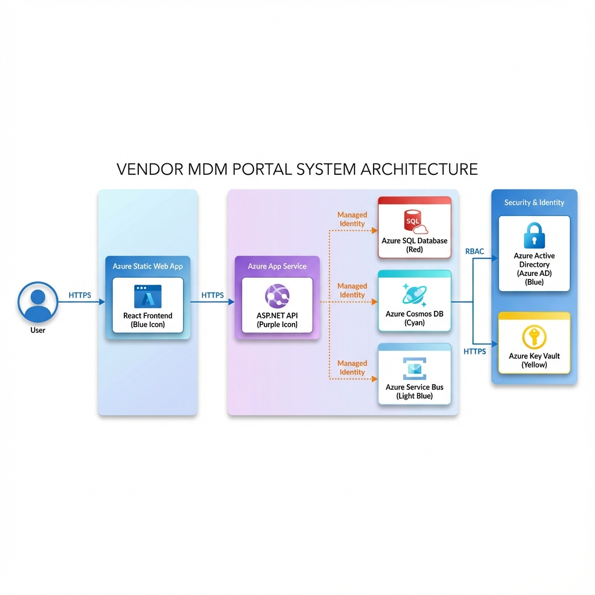
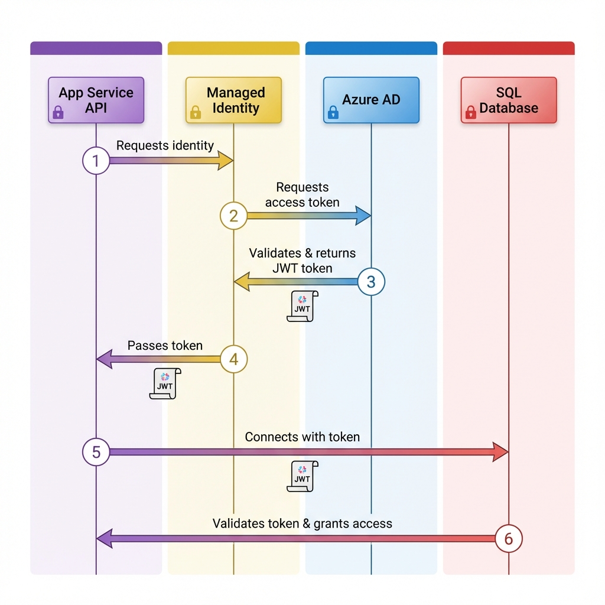
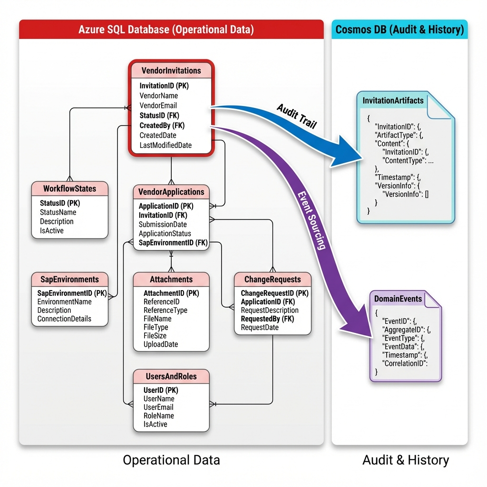

# Vendor MDM Portal - Visual Architecture Guide

A comprehensive visual guide to the system architecture, authentication flows, and database schemas.

---

## System Architecture Overview



### Components

**Frontend Layer:**
- **Static Web App**: React + TypeScript application hosted on Azure Static Web Apps
- **CDN**: Global content delivery for optimal performance

**Backend Layer:**
- **App Service**: ASP.NET Core 8 RESTful API
- **Managed Identity**: System-assigned identity for passwordless authentication

**Data Layer:**
- **Azure SQL Database**: Operational transactional data
- **Cosmos DB**: Audit trail and event sourcing
- **Service Bus**: Asynchronous event messaging

**Security Layer:**
- **Azure AD**: Identity and access management
- **Key Vault**: Secure secrets storage (optional)

---

## Authentication Flow: Managed Identity



### How It Works

1. **Identity Acquisition**: App Service requests its Managed Identity from the Azure platform
2. **Token Request**: Managed Identity requests an access token from Azure AD for specific resource (SQL/Cosmos)
3. **Token Validation**: Azure AD validates the Managed Identity principal
4. **Token Issuance**: Azure AD returns a short-lived JWT access token
5. **Resource Access**: App Service uses the token to authenticate to Azure SQL/Cosmos DB
6. **Permission Check**: Database validates token signature and checks RBAC permissions
7. **Access Granted**: Connection established without any credentials in code

### Benefits

✅ **No Secrets in Code**: Zero credentials stored in application  
✅ **Automatic Rotation**: Tokens auto-expire and renew  
✅ **Centralized Control**: RBAC managed in Azure Portal  
✅ **Audit Trail**: All access logged in Azure AD  

### Connection String Examples

**Azure SQL with Managed Identity:**
```
Server=tcp:sql-vendor-mdm-dev.database.windows.net,1433;
Initial Catalog=VendorMdmDb;
Authentication=Active Directory Managed Identity;
```

**Cosmos DB with Managed Identity:**
```csharp
var credential = new DefaultAzureCredential();
var client = new CosmosClient(endpoint, credential);
```

---

## Hybrid Database Model



### Design Philosophy

**SQL Database: Source of Truth**
- Current operational state
- Relational integrity enforced
- ACID transactions
- Complex queries with joins

**Cosmos DB: Historical Record**
- Complete audit trail
- Event sourcing
- Immutable documents
- Time-series analytics

### Data Flow Pattern

```
User Action → API → SQL Database (Primary Write)
                  ↓
                Cosmos DB (Audit Log)
                  ↓
              Service Bus (Events)
```

### SQL Schema Highlights

**VendorInvitations** (Primary table)
- Tracks invitation lifecycle
- Links to VendorApplications when completed
- Indexed on Status + CreatedAt for performance

**VendorApplications** (Core master data)
- Vendor registration details
- Links to ChangeRequests and Attachments
- References WorkflowStates for approval flow

**WorkflowStates** (Lookup table)
- Draft → Submitted → Approved → Integrated
- Seeded with standard workflow stages

**SapEnvironments** (Lookup table)
- D01 (Development), Q01 (QA), P01 (Production)
- Determines target SAP system

### Cosmos DB Containers

**InvitationArtifacts**
- Partition Key: `/InvitationId`
- Complete snapshot of every invitation
- Immutable audit record
- No TTL (permanent retention)

**DomainEvents**
- Partition Key: `/EventType`
- Event sourcing for all domain events
- InvitationCreated, ApplicationSubmitted, etc.
- Configurable TTL (e.g., 90 days)

### Query Patterns

**SQL Queries** (Operational):
```sql
-- Get pending invitations
SELECT * FROM VendorInvitations 
WHERE Status = 'Pending' 
  AND ExpiresAt > GETUTCDATE()
ORDER BY CreatedAt DESC;

-- Vendor application with changes
SELECT v.*, cr.FieldName, cr.NewValue
FROM VendorApplications v
LEFT JOIN ChangeRequests cr ON cr.VendorApplicationId = v.Id
WHERE v.Id = @vendorId;
```

**Cosmos Queries** (Audit):
```sql
-- Get invitation audit trail
SELECT * FROM c 
WHERE c.InvitationId = '66df29ee-bcdd-4daa-b3cc-3e4c267ef1bb';

-- Get all events by type
SELECT * FROM c 
WHERE c.EventType = 'InvitationCreated'
ORDER BY c.Timestamp DESC;
```

---

## Frontend-API Communication

### Request Flow

```
1. User Browser
   ↓ HTTPS (443)
2. Static Web App (CDN)
   ↓ Load React App
3. Browser (JavaScript)
   ↓ Axios HTTP Client
4. App Service API
   ↓ Entity Framework Core
5. Azure SQL Database
```

### API Endpoints

| Method | Endpoint | Purpose |
|--------|----------|---------|
| POST | `/api/invitation` | Create new invitation |
| GET | `/api/invitation/list` | List all invitations |
| GET | `/api/invitation/{token}` | Get by token |
| POST | `/api/invitation/validate` | Validate token |
| POST | `/api/invitation/resend` | Resend email |

### CORS Configuration

**Allowed Origins:**
- `http://localhost:5173` (Vite dev server)
- `http://localhost:3000` (Alternative local)
- `https://*.azurestaticapps.net` (Production)

**Allowed Methods:**
- GET, POST, PUT, DELETE

**Allowed Headers:**
- Content-Type, Authorization

---

## Data Consistency Model

### Write Pattern: Dual Write

```csharp
// 1. PRIMARY: Write to SQL (synchronous, transactional)
using var transaction = await _context.Database.BeginTransactionAsync();
try 
{
    var invitation = new VendorInvitation { /* ... */ };
    _context.VendorInvitations.Add(invitation);
    await _context.SaveChangesAsync();
    await transaction.CommitAsync();
    
    // ✅ SQL COMMITTED - This is the source of truth
}
catch 
{
    await transaction.RollbackAsync();
    throw;  // ❌ Fail the request
}

// 2. SECONDARY: Write to Cosmos (asynchronous, best-effort)
try 
{
    await _cosmosRepo.SaveInvitationArtifactAsync(invitation);
    await _cosmosRepo.EmitEventAsync("InvitationCreated", invitation);
    
    // ✅ Audit saved (fire and forget)
}
catch (Exception ex)
{
    _logger.LogWarning("Cosmos audit failed: {Error}", ex.Message);
    // ⚠️ Don't fail the request - audit is supplementary
}

return invitation;  // ✅ Request succeeds even if Cosmos fails
```

### Consistency Guarantees

| Operation | SQL | Cosmos | Result |
|-----------|-----|--------|--------|
| Create Invitation | ✅ | ✅ | Success |
| Create Invitation | ✅ | ❌ | **Success** (audit lost) |
| Create Invitation | ❌ | N/A | Failure (rollback) |

---

## Deployment Architecture

### Resource Distribution

**Region:** Central US (primary)

```
┌─────────────────────────────────────────┐
│         Azure Subscription              │
├─────────────────────────────────────────┤
│  Resource Group: rg-vendor-mdm-dev-v3   │
│                                          │
│  ┌────────────────────────────────┐     │
│  │ Static Web App (Global CDN)    │     │
│  │ - Frontend hosting             │     │
│  │ - Free tier                    │     │
│  └────────────────────────────────┘     │
│                                          │
│  ┌────────────────────────────────┐     │
│  │ App Service (Central US)       │     │
│  │ - Backend API                  │     │
│  │ - F1 Free tier                 │     │
│  │ - Managed Identity enabled     │     │
│  └────────────────────────────────┘     │
│                                          │
│  ┌────────────────────────────────┐     │
│  │ SQL Database (Central US)      │     │
│  │ - VendorMdmDb                  │     │
│  │ - Basic tier (5 DTU)           │     │
│  └────────────────────────────────┘     │
│                                          │
│  ┌────────────────────────────────┐     │
│  │ Cosmos DB (Multi-region)       │     │
│  │ - Serverless mode              │     │
│  │ - Session consistency          │     │
│  └────────────────────────────────┘     │
│                                          │
│  ┌────────────────────────────────┐     │
│  │ Service Bus (Central US)       │     │
│  │ - Basic tier                   │     │
│  │ - invitation-created queue     │     │
│  └────────────────────────────────┘     │
└─────────────────────────────────────────┘
```

### Naming Convention

| Resource | Name |
|----------|------|
| Static Web App | `swa-vendor-mdm-dev-<hash>` |
| App Service | `app-vendor-mdm-api-dev-<hash>` |
| SQL Server | `sql-vendor-mdm-dev-<hash>` |
| Cosmos Account | `cosmos-vendor-mdm-dev-<hash>` |
| Service Bus | `sb-vendor-mdm-dev-<hash>` |
| Key Vault | `kv-vendor-mdm-dev-<hash>` |

---

## Security Architecture

### Defense in Depth

**Layer 1: Network**
- HTTPS only (TLS 1.2+)
- Azure DDoS Protection
- Static Web App firewall

**Layer 2: Identity**
- Azure AD authentication
- Managed Identity for services
- RBAC permissions

**Layer 3: Application**
- Input validation
- CSRF protection
- SQL injection prevention (EF Core parameterized queries)

**Layer 4: Data**
- Encryption at rest (Azure default)
- Encryption in transit (TLS)
- Immutable audit logs in Cosmos DB

**Layer 5: Monitoring**
- Application Insights telemetry
- Azure AD sign-in logs
- SQL Database auditing

---

## Performance Considerations

### Database Optimization

**SQL Database:**
- Indexes on VendorInvitations (Status, CreatedAt)
- Connection pooling enabled
- Async queries throughout

**Cosmos DB:**
- Efficient partition keys (/InvitationId, /EventType)
- Point reads by key (1 RU)
- Cross-partition queries avoided

### Caching Strategy

```csharp
// Cache workflow states (rarely change)
_memoryCache.GetOrCreateAsync("workflow-states", async entry => 
{
    entry.AbsoluteExpirationRelativeToNow = TimeSpan.FromHours(24);
    return await _context.WorkflowStates.ToListAsync();
});
```

### Async Operations

- All database calls use `async/await`
- Cosmos writes fire-and-forget
- Service Bus publishing is async

---

## Monitoring & Observability

### Application Insights

**Tracked Metrics:**
- Request duration
- Dependency calls (SQL, Cosmos)
- Exception rates
- Custom events (InvitationCreated)

**Queries:**
```kusto
requests
| where timestamp > ago(1h)
| summarize count() by resultCode
| render piechart

dependencies
| where timestamp > ago(1h)
| where type == "SQL"
| summarize avg(duration) by name
```

### Health Checks

```
GET /api/system/health

{
  "status": "Healthy",
  "checks": {
    "sql": "Healthy",
    "cosmos": "Healthy",
    "serviceBus": "Healthy"
  }
}
```

---

## Next Steps

1. **Review** the architecture documentation
2. **Understand** the authentication flow
3. **Study** the database schema
4. **Test** the API endpoints
5. **Monitor** Application Insights

For implementation details, see:
- [`ARCHITECTURE_DETAILED.md`](ARCHITECTURE_DETAILED.md) - Technical deep dive
- [`../backend/VendorMdm.Api/`](../backend/VendorMdm.Api/) - API source code
- [`../frontend/`](../frontend/) - Frontend source code
