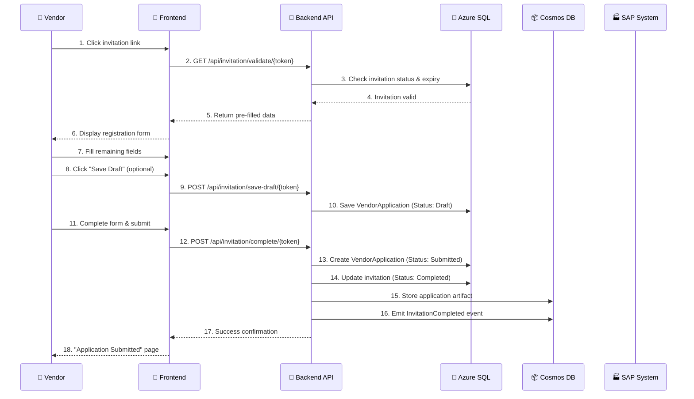
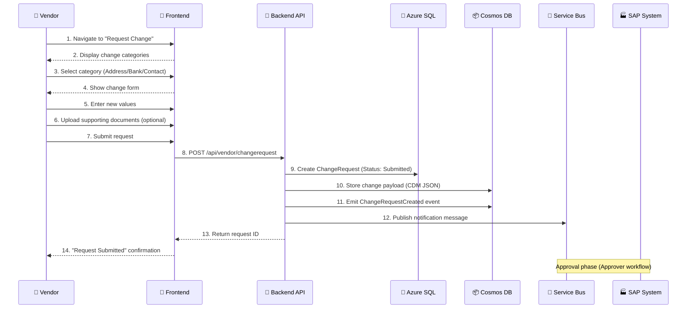
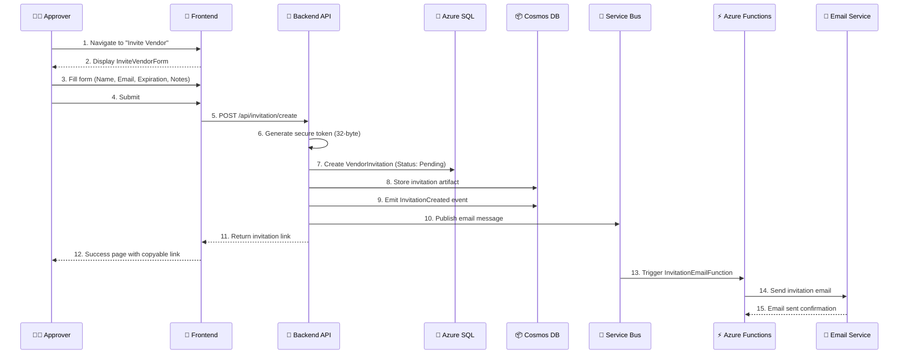
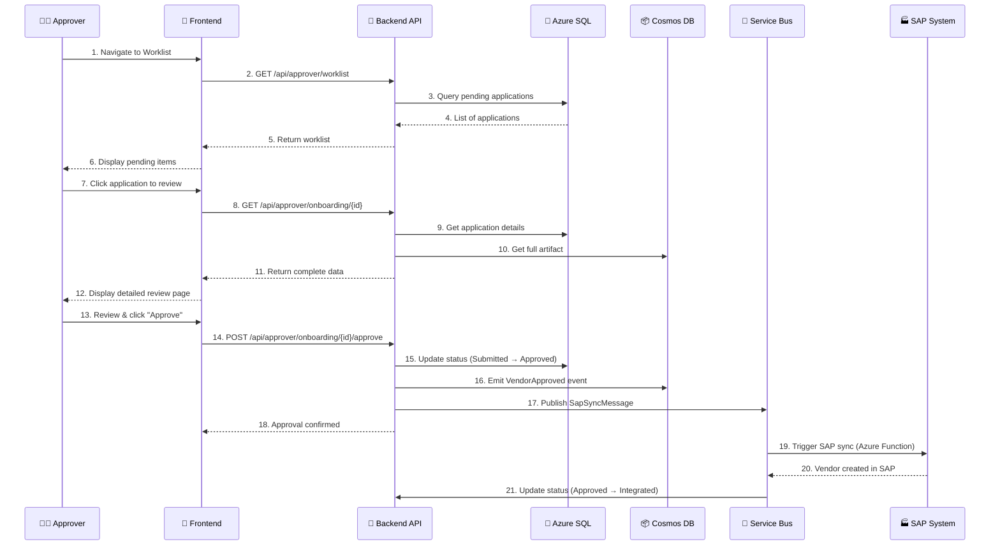
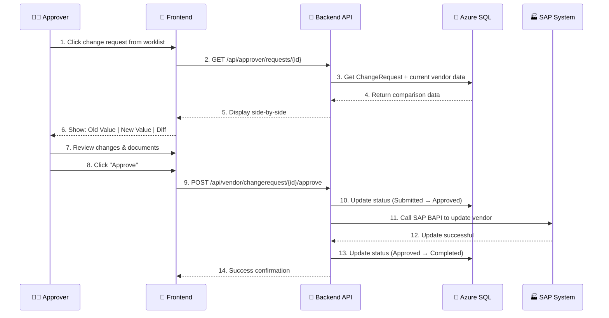
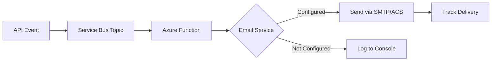
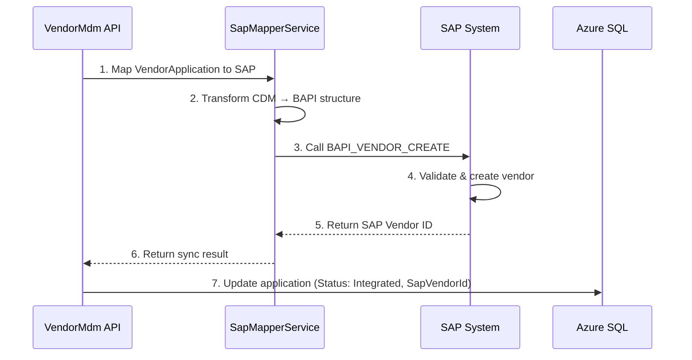
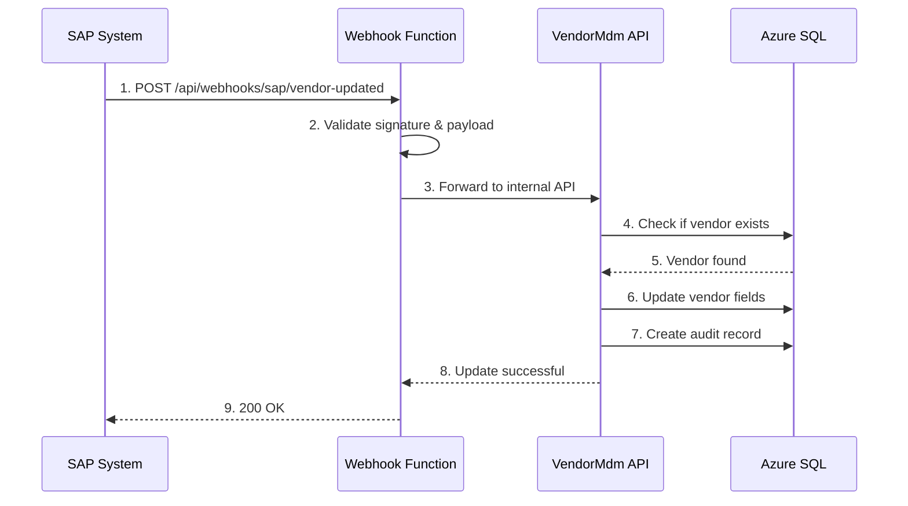

# 📋 Canonical Workflows - Vendor MDM Portal

**Document Version**: 1.0  
**Last Updated**: 2025-12-19  
**Purpose**: Reference guide for all implemented application workflows

---

## 📑 Table of Contents

- [Overview](#overview)
- [Role-Based Workflows](#role-based-workflows)
  - [Vendor Workflows](#vendor-workflows)
  - [Approver Workflows](#approver-workflows)
  - [Admin Workflows](#admin-workflows)
- [System Workflows](#system-workflows)
- [Integration Workflows](#integration-workflows)
- [Technical Architecture Patterns](#technical-architecture-patterns)

---

## 🎯 Overview

This document defines the **canonical workflows** (standard, authoritative process flows) for all implemented features in the Vendor MDM Portal. Each workflow follows the **Hybrid Relational-Document Model** architecture and adheres to the **Hexagonal/Serverless Pattern**.

### Workflow Structure

Each workflow is documented with:
- **Trigger**: What initiates the workflow
- **Actors**: Who is involved (User roles, Systems)
- **Steps**: Sequential process steps
- **Data Flow**: SQL → Cosmos → Service Bus → Azure Functions
- **Status Transitions**: State changes throughout the workflow
- **API Endpoints**: Backend endpoints involved
- **Frontend Pages**: UI components used

---

## 👥 Role-Based Workflows

### 🏢 Vendor Workflows

#### **WORKFLOW 1: Invitation-Based Vendor Registration**

**Canonical Path**: `Invitation → Validation → Registration → Submission → Approval → SAP Integration`



**Detailed Steps**:

1. **Trigger**: Vendor receives email with invitation link
2. **Validation Phase**:
   - System validates token authenticity
   - Checks expiration date (7/14/30 days)
   - Verifies invitation status is "Pending"
3. **Registration Phase**:
   - Pre-filled fields: Company Name (read-only), Email (read-only)
   - Vendor completes: Tax ID, Contact Person, Additional Info
4. **Draft Mode** (Optional):
   - Status: `Draft`
   - Validation: Lenient (only critical fields required)
   - Can save and return via same token link
5. **Submission Phase**:
   - Status: `Draft` → `Submitted`
   - Validation: Strict (all required fields)
   - Creates `VendorApplication` entity
   - Updates `VendorInvitation` status to `Completed`
6. **Persistence**:
   - **SQL**: VendorApplication metadata, InvitationId reference
   - **Cosmos**: Full application payload (InvitationArtifacts container)
   - **Cosmos**: Domain events (DomainEvents container)
7. **Notification**: Approvers notified of new application

**API Endpoints**:
- `GET /api/invitation/validate/{token}`
- `GET /api/invitation/details/{token}`
- `POST /api/invitation/save-draft/{token}`
- `POST /api/invitation/complete/{token}`

**Frontend Pages**:
- `/invitation/register/:token` - InvitationRegistration.tsx

**Database Tables**:
- `VendorInvitations`: Token, Status, ExpiresAt
- `VendorApplications`: CompanyName, TaxId, Status, InvitationId

**Status Lifecycle**:
```
Invitation: Pending → Accepted → Completed
Application: Draft → Submitted → Under Review → Approved → Integrated
```

---

#### **WORKFLOW 2: Vendor Profile Self-Service**

**Canonical Path**: `Login → View Profile → Request Changes`

**Trigger**: Vendor logs in to portal

**Steps**:
1. Vendor authenticates via Azure AD B2C
2. Navigate to Dashboard (`/dashboard`)
3. View profile status card:
   - **Incomplete**: Application in draft
   - **Submitted**: Awaiting approval
   - **Under Review**: Being reviewed
   - **Integrated**: Active in SAP
4. Click "View Profile" → Navigate to `/profile`
5. View current master data (read-only)
6. Click "Request Change" → Navigate to `/requests/new`

**API Endpoints**:
- `GET /api/vendor/{id}` - Get effective vendor state
- `GET /api/vendor/profile` - Get current user's profile

**Frontend Pages**:
- `/dashboard` - Dashboard.tsx
- `/profile` - VendorProfile.tsx

---

#### **WORKFLOW 3: Change Request Submission**

**Canonical Path**: `Select Category → Enter Changes → Upload Proof → Submit → Approval`



**Detailed Steps**:

1. **Category Selection**:
   - Address Update
   - Bank Details Update
   - Contact Person Update
   - Tax Information Update
2. **Data Entry**:
   - System displays side-by-side: Current Value | New Value
   - Vendor enters new information
3. **Document Upload** (if required):
   - Address: Utility bill, Certificate of incorporation
   - Bank: Bank statement, Void cheque
   - Store in Azure Blob Storage
4. **Validation**:
   - Format validation (e.g., IBAN format for bank account)
   - Mandatory fields check
5. **Submission**:
   - Creates `ChangeRequest` entity
   - Stores flexible CDM JSON payload in Cosmos
   - Status: `Submitted`
6. **Notification**: Approver receives email/system notification

**API Endpoints**:
- `POST /api/vendor/changerequest` - Create change request
- `GET /api/vendor/changerequest/{id}` - Get specific request
- `GET /api/vendor/{id}` - Get effective vendor state (current + pending changes)

**Frontend Pages**:
- `/requests/new` - ChangeRequestForm.tsx
- `/requests/history` - RequestHistory.tsx

**Database Tables**:
- `ChangeRequests`: RequesterId, SapVendorId, Status, Payload (JSONB)
- `Attachments`: BlobUrl, ChangeRequestId (FK)

**Canonical Data Model (CDM)**:
```json
{
  "requestType": "BankDetailsUpdate",
  "vendorId": "10001",
  "changes": {
    "bankName": { "old": "Bank A", "new": "Bank B" },
    "accountNumber": { "old": "****1234", "new": "****5678" },
    "iban": { "old": "DE891...", "new": "DE892..." }
  },
  "attachments": [
    { "type": "BankStatement", "blobUrl": "https://..." }
  ],
  "reason": "Company changed primary bank"
}
```

---

### 👨‍💼 Approver Workflows

#### **WORKFLOW 4: Invitation Creation & Management**

**Canonical Path**: `Create Invitation → Generate Token → Send Email → Track Status`



**Detailed Steps**:

1. **Form Input**:
   - Vendor Legal Name (required)
   - Primary Contact Email (required)
   - Expiration Period: 7/14/30 days (default: 14)
   - Internal Notes (optional)
2. **Token Generation**:
   - Cryptographically secure random token
   - 32-byte length, Base64URL encoded
   - Guaranteed uniqueness
3. **Persistence**:
   - **SQL**: VendorInvitation with metadata
   - **Cosmos**: Full invitation payload
   - **Cosmos**: InvitationCreated domain event
4. **Email Dispatch**:
   - Service Bus message published
   - Azure Function processes asynchronously
   - Email sent via Azure Communication Services
5. **Link Delivery**:
   - Invitation link: `https://portal.company.com/invitation/register/{token}`
   - Approver can copy link to clipboard
   - Can send via external email if needed

**API Endpoints**:
- `POST /api/invitation/create` - Create new invitation
- `GET /api/invitation/list?status={status}` - List all invitations
- `POST /api/invitation/resend/{id}` - Resend invitation

**Frontend Pages**:
- `/admin/invite-vendor` - InviteVendorForm.tsx
- `/admin/invitations` - InvitationManagement.tsx

**Security Features**:
- Only Admin/Approver roles can create invitations
- Tokens are single-use
- Expiration validation on every access
- Audit trail: InvitedBy, InvitedByName, CreatedAt

---

#### **WORKFLOW 5: Vendor Onboarding Review & Approval**

**Canonical Path**: `View Worklist → Review Application → Approve/Reject → SAP Sync`



**Detailed Steps**:

1. **Worklist Display**:
   - Pending Onboardings count
   - Pending Change Requests count
   - Combined table sorted by SLA Due Date
2. **Application Review**:
   - View all submitted information
   - View linked invitation details
   - View uploaded documents
   - Check data completeness
3. **Decision Actions**:
   - **Approve**: 
     - Status: `Submitted` → `Approved`
     - Add approval comments (optional)
     - Trigger SAP sync workflow
   - **Reject**:
     - Status: `Submitted` → `Rejected`
     - Add rejection reason (required)
     - Vendor can resubmit after corrections
4. **SAP Integration**:
   - Approved applications queued for SAP sync
   - SapMapperService transforms CDM → SAP BAPI structure
   - BAPI call creates vendor in SAP
   - Status: `Approved` → `Integrated` on success
   - Status: `Approved` → `Failed` on error (manual retry)

**API Endpoints**:
- `GET /api/approver/worklist` - Get pending items
- `GET /api/approver/onboarding/{id}` - Get application details
- `POST /api/approver/onboarding/{id}/approve` - Approve application
- `POST /api/approver/onboarding/{id}/reject` - Reject application

**Frontend Pages**:
- `/approver/worklist` - ApproverDashboard.tsx
- `/approver/onboarding/:id` - OnboardingReview.tsx

**Business Rules**:
- Only 1 approver needed for onboarding (configurable)
- Approver cannot approve own invitation
- Rejected applications can be resubmitted by vendor

---

#### **WORKFLOW 6: Change Request Review & Approval**

**Canonical Path**: `View Request → Side-by-Side Comparison → Approve/Reject → SAP Update`



**Detailed Steps**:

1. **Request Display**:
   - Change category badge
   - Submitted by (vendor name)
   - Submitted date
   - SLA indicator (due in X days)
2. **Comparison View**:
   ```
   Field Name       | Current Value    | New Value        | Action
   ----------------|------------------|------------------|--------
   Bank Name       | Bank A           | Bank B           | Update
   IBAN            | DE89...1234      | DE89...5678      | Update
   Account Number  | ****1234         | ****5678         | Update
   ```
3. **Document Review**:
   - Click to view uploaded documents
   - Verify authenticity
4. **Decision**:
   - **Approve**: Update SAP immediately
   - **Reject**: Send back to vendor with reason
5. **SAP Update**:
   - SapMapperService transforms changes
   - BAPI call updates specific fields
   - Status: `Approved` → `Completed`

**API Endpoints**:
- `GET /api/approver/requests` - List all change requests
- `GET /api/approver/requests/{id}` - Get request details
- `POST /api/vendor/changerequest/{id}/approve` - Approve request
- `POST /api/vendor/changerequest/{id}/reject` - Reject request

**Frontend Pages**:
- `/approver/requests/:id` - RequestReview.tsx

---

### 🔧 Admin Workflows

#### **WORKFLOW 7: System Administration & Monitoring**

**Canonical Path**: `Monitor Health → View Metrics → Configure Settings`

**Features**:

1. **System Health Dashboard**:
   - SAP connectivity status (D01/Q01/P01)
   - Email service status
   - Database connection status
   - Azure services health

2. **Invitation Management**:
   - View all invitations (filter by status)
   - Resend expired invitations
   - Revoke pending invitations
   - Statistics: acceptance rate, average time

3. **User & Role Management**:
   - Create users
   - Assign roles (Vendor/Approver/Admin)
   - View audit logs

**API Endpoints**:
- `GET /api/admin/system-status` - System health
- `GET /api/admin/sap-environment/available` - SAP environments
- `POST /api/admin/sap-environment/switch` - Switch SAP target (Dev/Staging only)
- `GET /api/health` - Health check

**Frontend Pages**:
- `/admin/dashboard` - AdminDashboard.tsx
- `/admin/system-status` - SystemStatus.tsx
- `/admin/invitations` - InvitationManagement.tsx

---

#### **WORKFLOW 8: SAP Environment Management** (Dev/Staging Only)

**Canonical Path**: `View Active Environment → Select Target → Switch Connection`

**Multi-Environment Strategy**:

| Platform Env | Default SAP | Secondary Targets | Use Case |
|--------------|-------------|-------------------|----------|
| **DEV** | D01 | Q01 (testing), P01 (read-only debug) | Development |
| **STAGING** | Q01 | D01 (fallback) | Pre-production UAT |
| **PRODUCTION** | P01 | None (locked) | Production operations |

**Steps**:
1. Admin navigates to System Status
2. View current SAP environment (e.g., "Active: D01")
3. View available environments (e.g., [D01, Q01, P01])
4. Click "Switch to Q01"
5. Confirmation dialog with warning
6. System updates runtime configuration
7. All subsequent SAP calls use new target
8. **Production restriction**: Switch UI disabled in PROD

**API Endpoints**:
- `GET /api/admin/sap-environment/available`
- `POST /api/admin/sap-environment/switch`

**Frontend Components**:
- SapEnvironmentSelector.tsx (in SystemStatus page)

---

## 🔄 System Workflows

### **WORKFLOW 9: Email Service Integration**

**Canonical Path**: `Event Triggered → Service Bus → Azure Function → Email Sent`



**Email Types**:
1. **Invitation Email**:
   - Trigger: InvitationCreated event
   - Template: invitation-welcome.html
   - Contains: Vendor name, invitation link, expiration date
2. **Application Confirmation**:
   - Trigger: InvitationCompleted event
   - Template: application-received.html
3. **Approval Notification**:
   - Trigger: VendorApproved event
   - Template: approval-success.html
4. **Rejection Notification**:
   - Trigger: VendorRejected event
   - Template: rejection-notice.html

**Azure Components**:
- **Service Bus Topic**: `vendor-events`
- **Subscriptions**: `email-notifications`
- **Azure Function**: `InvitationEmailFunction`
- **Email Service**: Azure Communication Services or SMTP

---

### **WORKFLOW 10: Audit Trail & Event Sourcing**

**Canonical Path**: `Business Action → Domain Event → Cosmos Storage`

**Event Types Stored**:
```json
{
  "eventType": "InvitationCreated",
  "aggregateId": "inv-12345",
  "aggregateType": "VendorInvitation",
  "timestamp": "2025-12-19T18:00:00Z",
  "actor": {
    "userId": "usr-001",
    "name": "Admin User",
    "role": "Approver"
  },
  "payload": {
    "vendorName": "Acme Corp",
    "email": "contact@acme.com",
    "expiresAt": "2026-01-02T18:00:00Z"
  },
  "metadata": {
    "ipAddress": "192.168.1.1",
    "userAgent": "Mozilla/5.0..."
  }
}
```

**Cosmos DB Containers**:
- **DomainEvents**: All business events (append-only)
- **InvitationArtifacts**: Complete invitation payloads
- **ApplicationArtifacts**: Complete application submissions

**Query Capabilities**:
- Reconstruct entity state at any point in time
- Audit: Who did what and when
- Analytics: Conversion rates, time-to-complete

---

## 🔗 Integration Workflows

### **WORKFLOW 11: SAP Vendor Synchronization**

**Canonical Path**: `Approval → CDM Mapping → BAPI Call → Status Update`



**Mapping Details**:

| CDM Field (Portal) | SAP Table | SAP Field | BAPI Parameter |
|-------------------|-----------|-----------|----------------|
| CompanyName | LFA1 | NAME1 | VENDOR_DATA-NAME |
| TaxId | LFA1 | STCD1 | VENDOR_DATA-TAX_NUMBER |
| Email | ADR6 | SMTP_ADDR | ADDRESS_DATA-EMAIL |
| BankAccount | LFBK | BANKN | BANK_DATA-ACCOUNT_NUMBER |
| Address | ADRC | STREET | ADDRESS_DATA-STREET |

**Error Handling**:
- Validation errors → Reject with details
- Connection errors → Retry with exponential backoff
- Partial success → Log and alert for manual intervention

---

### **WORKFLOW 12: SAP Webhook Integration** (Incoming Changes)

**Canonical Path**: `SAP Change → Webhook → Validate → Update Portal`

**Scenario**: Vendor data modified in SAP by other systems



**Webhook Endpoint**:
- `POST /api/webhooks/sap/vendor-updated`
- Authentication: Shared secret or Azure AD service principal
- Payload: SAP vendor ID + changed fields
- Response: 200 OK or 4xx/5xx with error details

---

## 🏗️ Technical Architecture Patterns

### **Hexagonal Pattern Implementation**

All workflows follow this structure:

```
┌─────────────────────────────────────────────┐
│           Frontend (React)                  │
│  ┌─────────────────────────────────────┐   │
│  │      UI Components (tsx)            │   │
│  └─────────────────────────────────────┘   │
└─────────────────────────────────────────────┘
                    ↓ HTTP/REST
┌─────────────────────────────────────────────┐
│         API Layer (Controllers)             │
│  ┌─────────────────────────────────────┐   │
│  │  InvitationController                │   │
│  │  VendorController                    │   │
│  │  ChangeRequestController             │   │
│  └─────────────────────────────────────┘   │
└─────────────────────────────────────────────┘
                    ↓
┌─────────────────────────────────────────────┐
│      Business Logic (Services)              │
│  ┌─────────────────────────────────────┐   │
│  │  InvitationService                   │   │
│  │  VendorService                       │   │
│  │  SapMapperService                    │   │
│  └─────────────────────────────────────┘   │
└─────────────────────────────────────────────┘
          ↓                    ↓
┌──────────────────┐  ┌──────────────────────┐
│  Persistence     │  │   External Systems   │
│  ┌────────────┐  │  │  ┌─────────────────┐ │
│  │ Azure SQL  │  │  │  │ SAP (BAPI)      │ │
│  │ Cosmos DB  │  │  │  │ Service Bus     │ │
│  │ Blob Storage│  │  │  │ Email Service   │ │
│  └────────────┘  │  │  └─────────────────┘ │
└──────────────────┘  └──────────────────────┘
```

### **Data Flow Pattern (Hybrid Architecture)**

**Every mutation operation follows**:
1. ✅ **SQL Database** - Metadata & transactional state
2. ✅ **Cosmos DB Artifacts** - Complete payload (immutable)
3. ✅ **Cosmos DB Events** - Domain events (event sourcing)
4. ✅ **Service Bus** - Asynchronous processing triggers

**Example: Create Invitation**
```csharp
// 1. SQL - State
var invitation = new VendorInvitation { ... };
await _sqlContext.VendorInvitations.AddAsync(invitation);
await _sqlContext.SaveChangesAsync();

// 2. Cosmos - Artifact
await _cosmosRepo.StoreArtifactAsync("InvitationArtifacts", artifact);

// 3. Cosmos - Event
await _cosmosRepo.EmitEventAsync(new InvitationCreatedEvent { ... });

// 4. Service Bus - Notification
await _serviceBus.PublishAsync("invitation-created", message);
```

---

## 📊 Status Lifecycle Reference

### Vendor Invitation
```
Pending → Accepted → Completed
   ↓         ↓
Expired   Expired
   ↓
Cancelled
```

### Vendor Application
```
Draft → Submitted → Under Review → Approved → Integrated
           ↓              ↓           ↓
       Rejected       Rejected    Failed (retry)
```

### Change Request
```
Draft → Submitted → Approved → Completed
           ↓           ↓
       Rejected    Failed (retry)
```

---

## 🔒 Security & Authorization Matrix

| Workflow | Vendor | Approver | Admin | Public |
|----------|--------|----------|-------|--------|
| Registration (with token) | ✅ | ✅ | ✅ | ✅ |
| View Own Profile | ✅ | ❌ | ❌ | ❌ |
| Submit Change Request | ✅ | ❌ | ❌ | ❌ |
| Create Invitation | ❌ | ✅ | ✅ | ❌ |
| Approve Onboarding | ❌ | ✅ | ✅ | ❌ |
| Approve Change Request | ❌ | ✅ | ✅ | ❌ |
| System Administration | ❌ | ❌ | ✅ | ❌ |
| SAP Environment Switch | ❌ | ❌ | ✅ (Dev/Staging) | ❌ |

---

## 📚 References

- **Detailed Invitation Flow**: [docs/features/invitations.md](features/invitations.md)
- **Functional Brief**: [docs/functional_brief.md](functional_brief.md)
- **SAP Integration Strategy**: [docs/integration/sap-environment-strategy.md](integration/sap-environment-strategy.md)
- **Architecture Design**: [docs/architecture_design.md](architecture_design.md)
- **Email Configuration**: [docs/features/email-configuration.md](features/email-configuration.md)

---

**Document Maintenance**:
- Update this document when new workflows are implemented
- Version control: Increment version on major changes
- Review quarterly for accuracy

