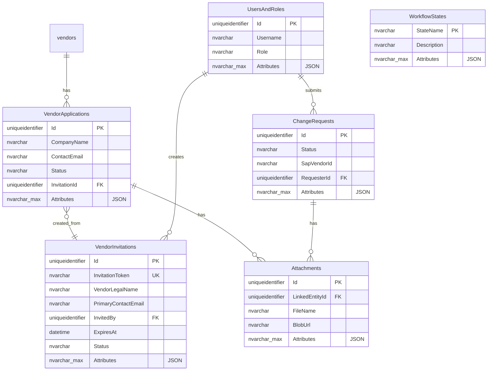

# Database Schema Documentation

## Overview

The Vendor MDM Portal uses a **Hybrid Relational-Document Model** that combines:
- **Azure SQL Database** - Structured, transactional data with relational integrity
- **Azure Cosmos DB** - Flexible document storage for payloads and events
- **SQL JSON Columns** - Semi-structured data within SQL for schema flexibility

This architecture provides:
✅ ACID compliance for critical transactions  
✅ Schema evolution without migrations  
✅ Complete audit trail and event sourcing  
✅ Optimal query performance

---

## SQL Server Database Schema

### Entity Relationship Diagram



---

## Table Specifications

### VendorInvitations

**Purpose**: Track invitation-based vendor onboarding process.

#### Structured Columns

| Column | Type | Constraints | Purpose |
|--------|------|-------------|---------|
| `Id` | UNIQUEIDENTIFIER | PRIMARY KEY | Unique invitation identifier |
| `InvitationToken` | NVARCHAR(100) | UNIQUE, NOT NULL | URL-safe token for invitation link |
| `VendorLegalName` | NVARCHAR(200) | NOT NULL | Company legal name |
| `PrimaryContactEmail` | NVARCHAR(255) | NOT NULL | Contact email for invitation |
| `InvitedBy` | UNIQUEIDENTIFIER | NOT NULL | FK to UsersAndRoles |
| `InvitedByName` | NVARCHAR(200) | NOT NULL | Cached inviter name |
| `CreatedAt` | DATETIME2 | DEFAULT GETUTCDATE() | Timestamp created |
| `ExpiresAt` | DATETIME2 | NOT NULL | Invitation expiry |
| `Status` | NVARCHAR(20) | DEFAULT 'Pending' | Pending/Accepted/Expired/Completed/Cancelled |
| `CompletedAt` | DATETIME2 | NULL | Timestamp when completed |
| `VendorApplicationId` | UNIQUEIDENTIFIER | NULL, FK | Created application |
| `Notes` | NVARCHAR(1000) | NULL, **DEPRECATED** | Use Attributes instead |
| `Attributes` | NVARCHAR(MAX) | DEFAULT '{}' | JSON semi-structured data |

#### Attributes JSON Schema

```typescript
interface VendorInvitationAttributes {
  notes?: string;
  customFields?: Record<string, string>;
  metadata?: {
    campaignId?: string;
    source?: string;
    tags?: Record<string, string>;
  };
}
```

**Example**:
```json
{
  "notes": "VIP vendor - fast-track approval",
  "customFields": {
    "referralCode": "PARTNER2024",
    "accountManager": "John Doe"
  },
  "metadata": {
    "campaignId": "Q1-2025",
    "source": "trade-show",
    "tags": {
      "priority": "high",
      "region": "EMEA"
    }
  }
}
```

#### Indexes
- `IX_VendorInvitations_Token` - invitation validation lookups
- `IX_VendorInvitations_Email` - search by email
- `IX_VendorInvitations_Status` - filter by status
- `IX_VendorInvitations_ExpiresAt` - cleanup expired invitations

---

### VendorApplications

**Purpose**: Store vendor onboarding application data.

#### Structured Columns

| Column | Type | Constraints | Purpose |
|--------|------|-------------|---------|
| `Id` | UNIQUEIDENTIFIER | PRIMARY KEY | Application ID |
| `CompanyName` | NVARCHAR(200) | NOT NULL | Company name |
| `TaxId` | NVARCHAR(100) | NULL | Tax/VAT ID |
| `ContactName` | NVARCHAR(200) | NOT NULL | Primary contact |
| `ContactEmail` | NVARCHAR(255) | NOT NULL | Contact email |
| `Status` | NVARCHAR(20) | DEFAULT 'Pending' | Application status |
| `RegistrationType` | NVARCHAR(20) | DEFAULT 'SelfRegistration' | SelfRegistration/Invitation |
| `InvitationId` | UNIQUEIDENTIFIER | NULL, FK | Linked invitation |
| `CreatedAt` | DATETIME2 | DEFAULT GETUTCDATE() | Created timestamp |
| `UpdatedAt` | DATETIME2 | NULL | Last updated |
| `Attributes` | NVARCHAR(MAX) | DEFAULT '{}' | JSON semi-structured data |

#### Attributes JSON Schema

```typescript
interface VendorApplicationAttributes {
  industryCode?: string;
  certifications?: string[];
  additionalContacts?: Array<{
    name: string;
    email: string;
    phone?: string;
    role: string;
  }>;
  customFields?: Record<string, any>;
  applicationNotes?: string;
}
```

**Example**:
```json
{
  "industryCode": "TECH-SOFTWARE",
  "certifications": ["ISO9001", "SOC2", "GDPR-Compliant"],
  "additionalContacts": [
    {
      "name": "Jane Smith",
      "email": "jane@vendor.com",
      "phone": "+1-555-0123",
      "role": "Compliance Officer"
    }
  ],
  "customFields": {
    "annualRevenue": "10M-50M",
    "employeeCount": "50-200"
  },
  "applicationNotes": "Requires expedited review for Q1 project"
}
```

---

### ChangeRequests

**Purpose**: Track vendor data modification requests.

#### Structured Columns

| Column | Type | Constraints | Purpose |
|--------|------|-------------|---------|
| `Id` | UNIQUEIDENTIFIER | PRIMARY KEY | Request ID |
| `Status` | NVARCHAR(20) | DEFAULT 'Draft' | Draft/Submitted/Approved/Integrated |
| `SapVendorId` | NVARCHAR(50) | NULL | SAP vendor reference |
| `RequesterId` | UNIQUEIDENTIFIER | NOT NULL, FK | Requester user |
| `CreatedAt` | DATETIME2 | DEFAULT GETUTCDATE() | Created timestamp |
| `UpdatedAt` | DATETIME2 | NULL | Last updated |
| `Attributes` | NVARCHAR(MAX) | DEFAULT '{}' | JSON semi-structured data |

#### Attributes JSON Schema

```typescript
interface ChangeRequestAttributes {
  approvalHistory?: Array<{
    approverId: string;
    approverName: string;
    action: 'Approved' | 'Rejected' | 'Requested Changes';
    comment?: string;
    timestamp: string;
  }>;
  rejectionReason?: string;
  impactAssessment?: {
    severity: 'Low' | 'Medium' | 'High';
    affectedSystems?: string[];
    riskMitigation?: string;
  };
  notificationsSent?: string[];
}
```

---

### Attachments

**Purpose**: Store metadata for uploaded files.

#### Structured Columns

| Column | Type | Constraints | Purpose |
|--------|------|-------------|---------|
| `Id` | UNIQUEIDENTIFIER | PRIMARY KEY | Attachment ID |
| `LinkedEntityId` | UNIQUEIDENTIFIER | NOT NULL | Parent entity ID |
| `FileName` | NVARCHAR(255) | NOT NULL | Original filename |
| `BlobUrl` | NVARCHAR(500) | NOT NULL | Azure Blob Storage URL |
| `UploadedAt` | DATETIME2 | DEFAULT GETUTCDATE() | Upload timestamp |
| `Attributes` | NVARCHAR(MAX) | DEFAULT '{}' | JSON semi-structured data |

#### Attributes JSON Schema

```typescript
interface AttachmentAttributes {
  fileSizeBytes?: number;
  mimeType?: string;
  uploadedByName?: string;
  virusScan?: {
    isClean: boolean;
    scannedAt: string;
    threatName?: string;
  };
  thumbnailUrl?: string;
  ocrText?: string;
}
```

---

### UsersAndRoles

**Purpose**: User authentication and authorization.

#### Structured Columns

| Column | Type | Constraints | Purpose |
|--------|------|-------------|---------|
| `Id` | UNIQUEIDENTIFIER | PRIMARY KEY | User ID |
| `Username` | NVARCHAR(255) | NOT NULL | Username/email |
| `Role` | NVARCHAR(50) | DEFAULT 'User' | User/Admin/Requester/Approver |
| `Attributes` | NVARCHAR(MAX) | DEFAULT '{}' | JSON semi-structured data |

#### Attributes JSON Schema

```typescript
interface UserRoleAttributes {
  fullName?: string;
  email?: string;
  phoneNumber?: string;
  department?: string;
  uiPreferences?: {
    theme: 'light' | 'dark' | 'auto';
    language: string;
    timezone: string;
    dashboardConfig?: Record<string, any>;
  };
  notificationSettings?: {
    emailEnabled: boolean;
    smsEnabled: boolean;
    subscribedEvents?: string[];
  };
}
```

---

### WorkflowStates

**Purpose**: Reference data for valid workflow states.

#### Structured Columns

| Column | Type | Constraints | Purpose |
|--------|------|-------------|---------|
| `StateName` | NVARCHAR(20) | PRIMARY KEY | State name |
| `Description` | NVARCHAR(255) | NOT NULL | Human-readable description |
| `Attributes` | NVARCHAR(MAX) | DEFAULT '{}' | JSON semi-structured data |

#### Attributes JSON Schema

```typescript
interface WorkflowStateAttributes {
  displayOrder?: number;
  colorCode?: string;
  iconName?: string;
  transitionsAllowed?: string[];
}
```

---

## Cosmos DB Collections

### DomainEvents Container

**Purpose**: Event sourcing and audit trail.

**Partition Key**: `eventType`

#### Schema

```typescript
interface DomainEvent {
  id: string;
  eventType: string; // Partition key
  entityId: string;
  timestamp: string; // ISO-8601
  data: Record<string, any>;
}
```

**Example**:
```json
{
  "id": "evt_12345",
  "eventType": "InvitationCreated",
  "entityId": "guid-invitation-id",
  "timestamp": "2025-12-14T10:30:00Z",
  "data": {
    "invitationId": "guid-invitation-id",
    "vendorName": "Acme Corp",
    "email": "contact@acme.com"
  }
}
```

### ChangeRequestData Container

**Purpose**: Store complete change request payloads.

**Partition Key**: `requestId`

#### Schema

```typescript
interface ChangeRequestData {
  id: string;
  requestId: string; // Partition key
  payload: any;
  oldValue?: any;
  newValue?: any;
}
```

### InvitationArtifacts Container

**Purpose**: Complete invitation payload storage.

**Partition Key**: `invitationId`

#### Schema

```typescript
interface InvitationArtifact {
  id: string;
  invitationId: string; // Partition key
  vendorLegalName: string;
  primaryContactEmail: string;
  fullPayload?: any;
  status: string;
  createdAt: string;
}
```

---

## Working with JSON Attributes

### Reading Attributes

```csharp
using VendorMdm.Shared.Helpers;
using VendorMdm.Shared.Models;

// Deserialize full attributes
var attrs = JsonAttributeHelper.DeserializeAttributes<VendorInvitationAttributes>(
    invitation.Attributes
);
Console.WriteLine(attrs?.Notes);

// Get single key
var notes = JsonAttributeHelper.GetAttribute<string>(invitation.Attributes, "notes");
```

### Writing Attributes

```csharp
// Serialize full object
var attrs = new VendorApplicationAttributes
{
    IndustryCode = "TECH",
    Certifications = new List<string> { "ISO9001" }
};
application.Attributes = JsonAttributeHelper.SerializeAttributes(attrs);

// Set single key
invitation.Attributes = JsonAttributeHelper.SetAttribute(
    invitation.Attributes,
    "notes",
    "Updated notes here"
);
```

### Querying JSON in SQL

```sql
-- Filter by JSON attribute
SELECT * FROM VendorApplications
WHERE JSON_VALUE(Attributes, '$.industryCode') = 'TECH';

-- Extract JSON value
SELECT 
    Id,
    CompanyName,
    JSON_VALUE(Attributes, '$.industryCode') as Industry
FROM VendorApplications;
```

### Performance Optimization

If frequently querying a JSON key, create a computed column:

```sql
-- Add computed column
ALTER TABLE VendorApplications
ADD IndustryCode AS JSON_VALUE(Attributes, '$.industryCode') PERSISTED;

-- Add index
CREATE INDEX IX_VendorApplications_Industry 
ON VendorApplications(IndustryCode);

-- Now query normally
SELECT * FROM VendorApplications WHERE IndustryCode = 'TECH';
```

---

## Schema Evolution Guidelines

### When to Use SQL Columns

✅ Foreign key relationships  
✅ Frequently indexed/searched fields  
✅ ACID-compliant transactions  
✅ Universal presence (all records have it)

### When to Use JSON Attributes

✅ Volatile business requirements  
✅ Context-specific data  
✅ Presentation/UI preferences  
✅ Nested structures

### Migration Example

**Before** (rigid schema):
```sql
ALTER TABLE VendorInvitations ADD Notes NVARCHAR(1000);
-- Every change requires migration!
```

**After** (flexible schema):
```csharp
// No migration needed - just update code
invitation.Attributes = JsonAttributeHelper.SetAttribute(
    invitation.Attributes,
    "newField",
    "value"
);
```

---

## References

- [Hybrid Relational-Document Model Strategy](/Users/jplopez/.gemini/GEMINI.md)
- [Schema Compliance Workflow](/.agent/workflows/schema-compliance-check.md)
- [Implementation Walkthrough](/Users/jplopez/.gemini/antigravity/brain/4a8d045d-58d9-49cd-b2cb-f1b8f7efcdfd/walkthrough.md)
- [SQL Server JSON Functions](https://learn.microsoft.com/en-us/sql/relational-databases/json/json-data-sql-server)

---

**Last Updated**: 2025-12-14  
**Schema Version**: 2.0 (Hybrid Model)
