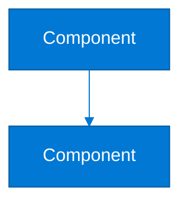

# 🎨 Generar Imágenes Profesionales de los Diagramas

Esta guía explica cómo generar imágenes de alta calidad (PNG/SVG) de los diagramas Mermaid para usar en documentación, presentaciones o cualquier contexto visual.

---

## 🚀 Método Rápido: Mermaid Live Editor

### Paso a Paso

1. **Abre el editor online**: https://mermaid.live/

2. **Abre el archivo de diagrama**:
   ```bash
   code docs/features/invitations.md
   ```

3. **Encuentra el diagrama** que quieres exportar:
   - Busca ````mermaid` en el archivo
   - Copia TODO el código entre ` ```mermaid ` y ` ``` `

4. **Pega en Mermaid Live Editor**:
   - El diagrama se renderiza automáticamente
   - Ajusta el zoom si es necesario

5. **Exportar como imagen**:
   - Click en el menú **"Actions"** (arriba a la derecha)
   - Selecciona **"Download PNG"** o **"Download SVG"**
   - La imagen se descargará con alta calidad

6. **Guardar en el proyecto** (opcional):
   ```bash
   # Mover la imagen descargada a la carpeta de documentación
   mv ~/Downloads/diagram.png docs/images/diagrams/invitation-architecture.png
   ```

---

## 🔧 Método Avanzado: Usando Herramientas de Línea de Comandos

### Opción 1: Mermaid CLI (Recomendado)

#### Instalación

```bash
# Instalar Node.js y npm (si no los tienes)
# Luego instalar Mermaid CLI globalmente
npm install -g @mermaid-js/mermaid-cli
```

#### Generar Imágenes

```bash
# Generar imagen PNG desde archivo .mmd
mmdc -i docs/diagrams/invitation-architecture.mmd -o docs/images/diagrams/invitation-architecture.png

# Generar SVG (mejor calidad, escalable)
mmdc -i docs/diagrams/invitation-architecture.mmd -o docs/images/diagrams/invitation-architecture.svg

# Con tema personalizado
mmdc -i diagram.mmd -o diagram.png -t dark -b transparent
```

### Opción 2: Usando Puppeteer (Más Control)

```bash
# Instalar dependencias
npm install -D @mermaid-js/mermaid-cli puppeteer

# Generar con configuraciones personalizadas
mmdc -i diagram.mmd -o diagram.png -w 1920 -H 1080
```

---

## 📋 Script Automatizado

Crearemos un script para generar todas las imágenes automáticamente:

```bash
#!/bin/bash
# generate-diagrams.sh

# Directorios
DIAGRAMS_DIR="docs/diagrams"
IMAGES_DIR="docs/images/diagrams"
SOURCE_FILE="docs/features/invitations.md"

# Crear directorios si no existen
mkdir -p "$DIAGRAMS_DIR"
mkdir -p "$IMAGES_DIR"

# Extraer diagramas del archivo Markdown y generar imágenes
# (Este script requiere que tengas mmdc instalado)
```

---

## 🎨 Mejorar la Estética de los Diagramas

### Estilos Profesionales para Mermaid

Puedes mejorar los diagramas agregando estilos personalizados:



### Temas Disponibles

- `default` - Tema por defecto
- `dark` - Tema oscuro
- `forest` - Tema verde/natural
- `neutral` - Tema neutral profesional

---

## 📸 Proceso Recomendado para Documentación

### Para cada diagrama:

1. **Copiar código Mermaid** del archivo `.md`
2. **Pegar en Mermaid Live Editor**
3. **Ajustar zoom y vista** para mejor composición
4. **Exportar como PNG** (1920px o mayor para calidad)
5. **Guardar en** `docs/images/diagrams/`
6. **Agregar referencia en el Markdown**:

```markdown

```

---

## 🖼️ Usar Imágenes en Documentación

Una vez generadas las imágenes, puedes incluirlas en el Markdown:

```markdown
## Diagrama de Arquitectura


*Diagrama mostrando todos los componentes y sus interacciones*
```

### Ventajas de Usar Imágenes

- ✅ Se ven igual en todas las plataformas
- ✅ Se pueden incluir en presentaciones
- ✅ Mejor control de calidad y resolución
- ✅ Funcionan sin necesidad de renderizar Mermaid
- ✅ Más rápido de cargar en algunos casos

---

## 🔄 Workflow Recomendado

### Desarrollo

1. **Mantén diagramas Mermaid** en el archivo `.md` (fácil de editar)
2. **Usa preview de Mermaid** para ver mientras editas
3. **Genera imágenes** solo cuando necesites publicar o compartir

### Publicación

1. **Exporta todos los diagramas** como imágenes
2. **Guarda en** `docs/images/diagrams/`
3. **Actualiza referencias** en el Markdown si es necesario
4. **Commit ambas versiones** (Mermaid + imágenes)

---

## 📐 Resoluciones Recomendadas

| Uso | Resolución | Formato |
|-----|-----------|---------|
| **Documentación Web** | 1920x1080 | PNG/SVG |
| **Presentaciones** | 1920x1080 o 3840x2160 | PNG |
| **Impresión** | 300 DPI mínimo | PNG/PDF |
| **Iconos/Thumbnails** | 400x300 | PNG |

---

## 🎯 Generar Todas las Imágenes de Una Vez

### Script Completo

```bash
#!/bin/bash
# generate-all-diagrams.sh

SOURCE="docs/features/invitations.md"
OUTPUT_DIR="docs/images/diagrams"
DIAGRAM_NAMES=(
  "architecture"
  "sequence-flow"
  "admin-flow"
  "vendor-flow"
  "state-diagram"
  "security-flow"
  "hybrid-architecture"
)

mkdir -p "$OUTPUT_DIR"

# Este script requeriría extraer cada diagrama del archivo
# y generar la imagen correspondiente
# Se puede automatizar con herramientas como yq o scripts Python
```

---

## 🔗 Herramientas Adicionales

### Visualización y Edición

- **Mermaid Live Editor**: https://mermaid.live/ (mejor para exportar)
- **Draw.io**: https://app.diagrams.net/ (puede importar Mermaid)
- **Excalidraw**: https://excalidraw.com/ (dibujo a mano alzada)

### Conversión

- **Mermaid CLI**: Para automatización
- **GitHub Actions**: Para generar automáticamente en CI/CD

---

## ✅ Checklist para Imágenes Profesionales

- [ ] Diagrama renderizado correctamente
- [ ] Resolución suficiente (mínimo 1920px ancho)
- [ ] Colores contrastan bien
- [ ] Texto legible
- [ ] Bordes y espaciado consistentes
- [ ] Guardado en formato PNG o SVG
- [ ] Nombre descriptivo del archivo
- [ ] Referencia agregada en documentación

---

## 📚 Recursos

- **Mermaid Live Editor**: https://mermaid.live/
- **Mermaid CLI Docs**: https://github.com/mermaid-js/mermaid-cli
- **Mermaid Themes**: https://mermaid.js.org/config/theming.html

---

*Usa imágenes renderizadas para documentación profesional y presentaciones de alta calidad.* 🎨

