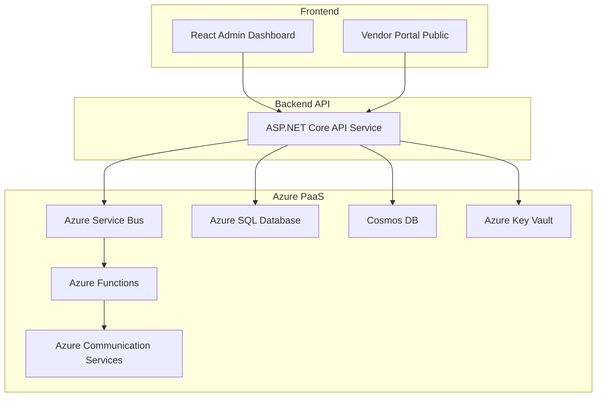
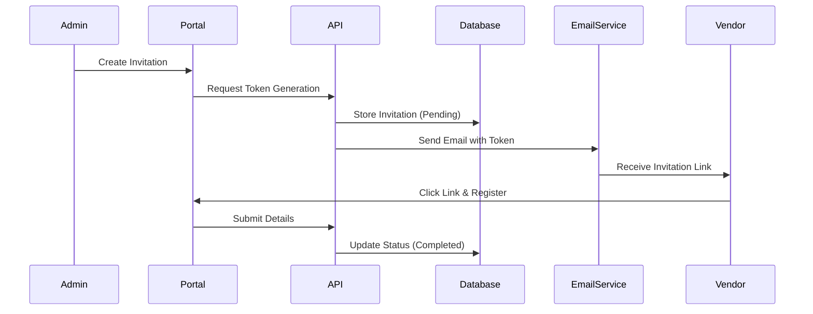
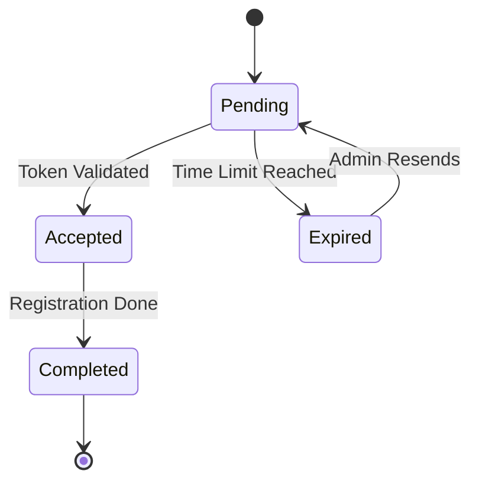

# 🤖 Super Prompts para Generación de Diagramas (Modelo Nano Banana)

Este documento contiene la información estructurada (Mermaid) y los "Super Prompts" diseñados para generar diagramas visuales de alta calidad profesional usando modelos de IA generativa.

---

## 1. Diagrama de Arquitectura del Sistema

### 📄 Información Estructurada (Mermaid)

### 🎨 Super Prompt (Para Generación de Imagen)

> **Prompt:**
>
> "Create a professional high-fidelity software architecture diagram for a Microsoft Azure cloud solution. **Style:** Modern corporate, clean flat design with subtle shadows, white background. **Color Palette:** Official Microsoft Azure Blue (#0078D4) as primary accent, dark grey for text, light grey for container boxes.
>
> **Visual Components & Layout (Top to Bottom):**
> 1.  **Top Layer (Frontend):** Two distinct sleek web browser frames or screen icons representing 'Admin Dashboard' and 'Vendor Portal'.
> 2.  **Middle Layer (Backend):** A central hexagon or gear icon representing 'ASP.NET Core API', labeled clearly.
> 3.  **Bottom Layer (Data & Services):** A row of official-style 3D or flat icons for Azure services:
>     *   **Azure SQL Database:** A blue cylinder with SQL logo.
>     *   **Cosmos DB:** A planet/orbit icon.
>     *   **Service Bus:** An envelope or messaging queue icon.
>     *   **Azure Functions:** A lightning bolt icon inside brackets.
>     *   **Key Vault:** A secure key or padlock icon.
>
> **Connections:** Use smooth, curved directional lines (arrows) connecting Frontend down to Backend, and Backend branching out to the Data/Services icons. The lines should be thin and grey.
>
> **Overall Vibe:** Technical, precise, easy to understand, suitable for a CTO presentation. High resolution, 4k."

---

## 2. Flujo End-to-End (Secuencia de Invitación)

### 📄 Información Estructurada (Mermaid)

### 🎨 Super Prompt (Para Generación de Imagen)

> **Prompt:**
>
> "Generate a clean, modern infographic timeline or process flow diagram illustrating a 'Vendor Invitation Process'. **Style:** Isometric vector illustration, professional tech aesthetic.
>
> **Steps to visualize from Left to Right:**
> 1.  **Step 1 (Admin):** An isometric avatar of a business user (Admin) clicking a button on a dashboard.
> 2.  **Step 2 (Processing):** An icon of a server or gear processing data, generating a secure digital key/token.
> 3.  **Step 3 (Email):** An envelope icon flying towards a user, representing the email delivery.
> 4.  **Step 4 (Vendor):** An isometric avatar of a different user (Vendor) opening an email on a laptop.
> 5.  **Step 5 (Registration):** The Vendor filling out a digital form.
> 6.  **Step 6 (Success):** A green checkmark or database icon showing 'Completed'.
>
> **Design Elements:** Connect steps with a thick, flowing Azure Blue timeline line. Use numbered circles (1-6) for each step. Background should be clean white. Use Microsoft-style fluent icons. High detail, professional infographics."

---

## 3. Diagrama de Estados de Invitación

### 📄 Información Estructurada (Mermaid)

### 🎨 Super Prompt (Para Generación de Imagen)

> **Prompt:**
>
> "Create a sleek, professional lifecycle or state machine diagram for a document status workflow. **Style:** Minimalist, UI/UX flow chart style.
>
> **Visual Nodes (States):**
> 1.  **Pending:** A yellow or amber rounded rectangle or pill shape.
> 2.  **Accepted:** A blue rounded rectangle.
> 3.  **Completed:** A solid green rounded rectangle with a check icon.
> 4.  **Expired:** A red rounded rectangle with a clock/warning icon.
>
> **Flow/Arrows:**
> *   Start with 'Pending'.
> *   Draw an arrow from 'Pending' to 'Accepted' labeled 'Validate'.
> *   Draw an arrow from 'Pending' to 'Expired' labeled 'Time Limit'.
> *   Draw an arrow from 'Accepted' to 'Completed'.
> *   Draw a looped arrow from 'Expired' back to 'Pending' labeled 'Resend'.
>
> **Aesthetic:** Use a layout that flows naturally from left to right or top to bottom. Use a subtle grid background. Typography should be sans-serif, modern, and legible (like Segoe UI). Professional business presentation style."

---

## 💡 Consejos para el Modelo (Nano Banana / Midjourney / DALL-E)

1.  **Aspect Ratio:** Usa `--ar 16:9` para diagramas de arquitectura amplios.
2.  **Estilo:** Si el resultado es muy "artístico", agrega "schematic, blueprint, diagram, technical drawing" al prompt.
3.  **Texto:** Los modelos de imagen fallan con el texto específico. Usa estos prompts para generar la **base visual** y luego agrega las etiquetas de texto (nombres de servicios) usando una herramienta de edición simple o PowerPoint.

