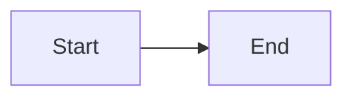

# 👁️ Cómo Ver los Diagramas - Resumen Ejecutivo

## 🚀 Ver Ahora Mismo (30 segundos)

### Opción 1: Editor Online (Más Rápido)

1. **Abre**: https://mermaid.live/
2. **Abre en tu editor**: `docs/features/invitations.md`
3. **Busca cualquier diagrama** (busca "```mermaid")
4. **Copia** todo el código entre ` ```mermaid ` y ` ``` `
5. **Pega** en mermaid.live
6. **¡Listo!** Verás el diagrama renderizado

### Opción 2: VS Code (Para Desarrollo)

1. **Instala extensión** (si no la tienes):
   - VS Code → Extensions (Cmd+Shift+X)
   - Busca: **"Markdown Preview Mermaid Support"**
   - Click Install

2. **Abre el archivo**:
   ```bash
   code docs/features/invitations.md
   ```

3. **Abre preview**:
   - Presiona: `Cmd+Shift+V` (Mac) o `Ctrl+Shift+V` (Windows)
   - O: Click derecho → "Open Preview"

4. **¡Listo!** Todos los diagramas se renderizan automáticamente

### Opción 3: GitHub (Automático)

1. **Sube el archivo** al repositorio
2. **Abre en GitHub** el archivo `.md`
3. **GitHub renderiza automáticamente** todos los diagramas Mermaid

---

## 📊 Diagramas Incluidos

En `docs/features/invitations.md` encontrarás **7 diagramas profesionales**:

1. **🏗️ Diagrama de Arquitectura** (línea ~36)
   - Muestra todos los componentes del sistema
   - Frontend, Backend, Azure Services

2. **🔄 Flujo End-to-End** (línea ~90)
   - Proceso completo desde creación hasta registro
   - 27 pasos detallados

3. **👨‍💼 Flujo Admin/Approver** (línea ~150)
   - Proceso para crear y gestionar invitaciones

4. **🏢 Flujo Vendor** (línea ~190)
   - Proceso desde recepción de email hasta registro

5. **📊 Diagrama de Estados** (línea ~230)
   - Estados de invitación y transiciones

6. **🔒 Flujo de Seguridad** (línea ~280)
   - Validación y protección de tokens

7. **🔗 Integración Arquitectura Híbrida** (línea ~320)
   - Patrón SQL → Cosmos → Service Bus

---

## 🔍 Encontrar un Diagrama Específico

### En VS Code:

1. Presiona `Cmd+F` (Mac) o `Ctrl+F` (Windows)
2. Busca: `mermaid`
3. Navega entre los diagramas con las flechas

### Líneas exactas de los diagramas:

```bash
# Para ver las líneas donde están los diagramas:
grep -n "```mermaid" docs/features/invitations.md
```

---

## ✅ Verificar que Funciona

### Test Rápido:

Copia este código en https://mermaid.live/:



Si ves un diagrama simple, ¡todo funciona! ✅

---

## 📚 Más Información

- **Guía Completa**: [`docs/VIEW_DIAGRAMS.md`](./VIEW_DIAGRAMS.md)
- **Guía Rápida**: [`docs/features/QUICK_VIEW_DIAGRAMS.md`](./features/QUICK_VIEW_DIAGRAMS.md)
- **Mermaid Docs**: https://mermaid.js.org/

---

## 🎯 Recomendación

- **Para ver ahora**: https://mermaid.live/ (sin instalar nada)
- **Para desarrollo**: Instala extensión en VS Code
- **Para compartir**: Sube a GitHub (renderizado automático)

---

*¡Disfruta de los diagramas visuales profesionales! 🎨*

