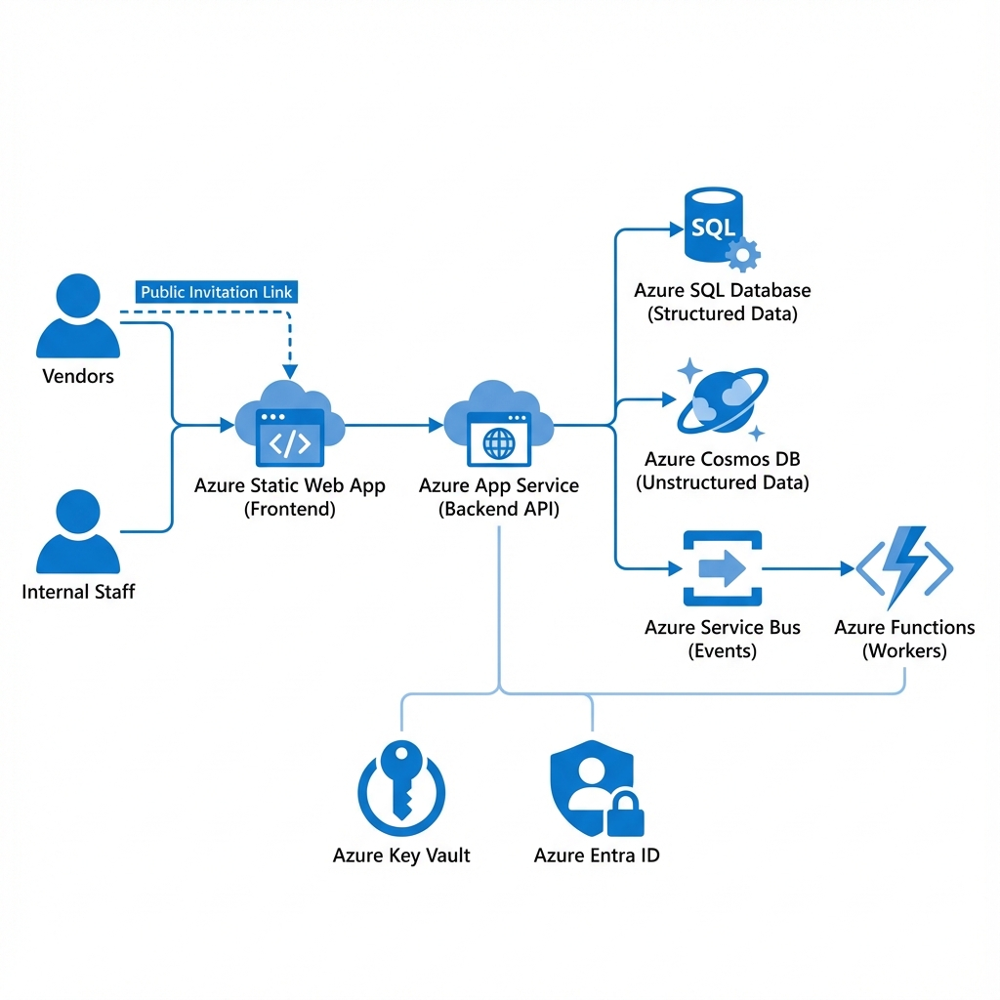
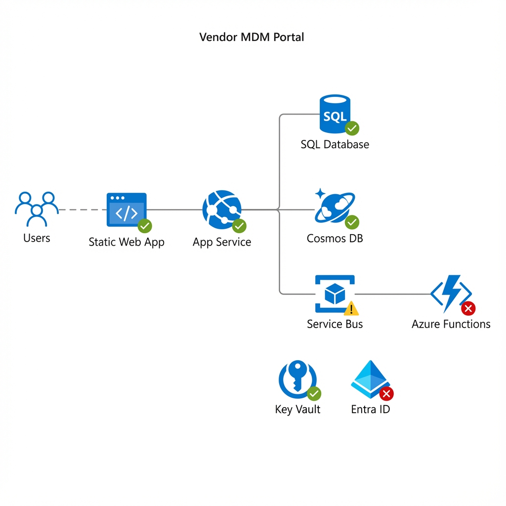

# Vendor MDM Portal - Architectural Design
> **Generated On**: December 12, 2025


## Overview
This document outlines the architectural design for the Vendor MDM Portal, aligned with the **Azure Well-Architected Framework** and based on the **Basic Web App** pattern. It incorporates specific architectural principles defined by the solution requirements: **Event-Driven Architecture**, **Hybrid Authentication**, and **Hybrid Database** strategies.

## Architectural Principles

### 1. Event-Driven Architecture
The system utilizes an asynchronous, event-driven communication model to decouple components and ensure scalability.
- **Implementation**: Azure Service Bus (Queues/Topics).
- **Flow**:
    1.  User actions (e.g., "Invite Vendor") trigger commands in the Backend API.
    2.  The API publishes an event (e.g., `InvitationCreated`) to the Service Bus.
    3.  Background workers (Azure Functions or WebJobs) subscribe to these events to perform asynchronous processing (e.g., sending emails, creating SAP records, initializing Cosmos documents).
- **Benefit**: Improved responsiveness for the user and resilience for backend processes.

### 2. Hybrid Authentication
The solution supports distinct authentication flows for different user personas, ensuring secure and appropriate access.
- **Internal Users (Employees)**:
    -   **Mechanism**: Azure Active Directory (Entra ID) with Single Sign-On (SSO).
    -   **Policy**: Enforced via App Service Authentication or MSAL in the frontend, leveraging existing corporate identities.
- **External Users (Vendors)**:
    -   **Mechanism**: Custom Authentication / "Special Plans".
    -   **Implementation**: Likely handled via a localized identity solution (e.g., ASP.NET Core Identity stored in SQL) or Azure External Identities (B2B), allowing vendors to access specific portals without requiring corporate AD credentials.
    -   **Access Control**: Role-Based Access Control (RBAC) specifically scoped to the Vendor's artifacts.

### 3. Hybrid Database Strategy (Polyglot Persistence)
The system leverages the best-fit database technology for different types of data.
- **Structured Relational Data (SQL)**:
    -   **Store**: Azure SQL Database.
    -   **Data**: "Salesforce Keys", transactional relationships, core identity mappings, and rigid schema data.
    -   **Rationale**: High integrity, complex joins, and transactional consistency.
-   **Unstructured/Semi-Structured Data (NoSQL)**:
    -   **Store**: Azure Cosmos DB.
    -   **Data**: Forms data, documents, metadata, dynamic schemas, and audit logs.
    -   **Rationale**: Flexibility for evolving forms, high-speed ingestion, and schema-agnostic storage.

### 4. Logs and Monitoring
Comprehensive observability across the entire stack.
-   **Implementation**: Azure Application Insights & Azure Monitor.
-   **Scope**: Distributed tracing from Frontend -> API -> Service Bus -> Background Workers -> Databases.

---

## Architectural Diagram

The following diagram illustrates the component interactions, data flows, and security boundaries.



> [!TIP]
> **Why is this image here?**
> Ideally, architecture diagrams should be committed to the repository (in `docs/images`) to prevent loss. This file is stored in `docs/images/vendor_mdm_architecture_v3_status.png`.

### Logic Flow (Mermaid)

```mermaid
graph TD
    subgraph "Clients"
        VendorPC[Vendor Browser]
        StaffPC[Internal Staff Browser]
    end

    subgraph "Azure PaaS Infrastructure"
        
        subgraph "Frontend Layer"
            SWA[Azure Static Web Apps<br/>(React/SPA)]
        end
        
        subgraph "API & Compute Layer"
            LB[Load Balancer]
            API[App Service / API<br/>(DotNet Core)]
            Worker[Background Worker<br/>(Functions/WebJobs)]
        end
        
        subgraph "Event Bus"
            SB[Azure Service Bus<br/>(Queues/Topics)]
        end

        subgraph "Data Layer (Hybrid)"
            SQL[(Azure SQL Database<br/>Structured Data/Keys)]
            Cosmos[(Azure Cosmos DB<br/>Forms/Docs/Metadata)]
        end

        subgraph "Security & Identity"
            AAD[Azure Entra ID<br/>(Internal SSO)]
            KV[Azure Key Vault<br/>(Secrets & Config)]
        end
        
        subgraph "Observability"
            AppInsights[Application Insights]
        end
    end

    %% Flows
    VendorPC -->|HTTPS| SWA
    StaffPC -->|HTTPS| SWA
    
    %% Public Flow
    VendorPC -.->|Public Link /invitation/register| SWA
    
    SWA -->|API Calls (HTTPS)| API
    
    %% Auth Flows
    StaffPC -.->|SSO Auth| AAD
    API -.->|Validate Token| AAD
    
    %% Application Flow
    API -->|Read/Write| SQL
    API -->|Read/Write| Cosmos
    API -->|Publish Event| SB
    
    %% Async Flow
    SB -->|Trigger| Worker
    Worker -->|Process| SQL
    Worker -->|Archive/Log| Cosmos
    
    %% Config & Monitoring
    API -.->|Get Secrets| KV
    Worker -.->|Get Secrets| KV
    API -.->|Logs| AppInsights
    Worker -.->|Logs| AppInsights
    SWA -.->|Logs| AppInsights

    classDef azure fill:#0072C6,stroke:#fff,stroke-width:2px,color:#fff;
    class SWA,API,Worker,SB,SQL,Cosmos,AAD,KV,AppInsights,LB azure;
```

## Vendor Entry Flow (Form Connection)

The architecture supports a specific "Invitation-Based" entry for external vendors:
1.  **Invitation**: Admin generates a secure token via the API.
2.  **Public Entry**: Vendor receives a link (e.g., via email) pointing to `/invitation/register/:token`.
3.  **Form Access**: The SWA validates the token via Public API (no login required initially).
4.  **Submission**: Vendor fills the secure form; data is saved to **Cosmos DB** (Unstructured artifact) and **SQL** (Vendor record).


## Alignment with Microsoft Basic Web App Pattern
This design extends the standard [Basic Web App Architecture](https://learn.microsoft.com/en-us/azure/architecture/web-apps/app-service/architectures/basic-web-app) by:
-   **Decoupling**: Introducing Service Bus for async processing (Event Driven).
-   **Specializing Storage**: Using both SQL and Cosmos DB instead of a single store (Hybrid DB).
-   **Securing**: Implementing distinct auth paths for internal vs external users (Hybrid Auth).

## Component Roles & Implementation Status

Based on codebase analysis (as of Dec 12, 2025):

Based on codebase analysis (as of Dec 12, 2025):



| Component | Role in Solution | Status | Details |
| :--- | :--- | :--- | :--- |
| **Frontend**<br/>(Static Web App) | **Entry Point**: Hosts the React SPA for Vendors and Staff. Handles public invitation links. | ✅ **Active** | defined in `main.bicep` |
| **Backend API**<br/>(App Service) | **Core Logic**: Processes HTTP requests, validates tokens, and publishes events. | ✅ **Active** | `VendorMdm.Api` running on F1 Free Tier |
| **SQL Database** | **Relational Store**: Stores structured "Salesforce Keys", vendor profiles, and identity relations. | ✅ **Active** | Basic Tier connected via EF Core |
| **Cosmos DB** | **Document Store**: Stores dynamic forms, unstructured metadata, and audit logs. | ✅ **Active** | Serverless tier, container `InvitationArtifacts` |
| **Service Bus** | **Event Broker**: Decouples API from background processing. Stores messages until consumed. | ⚠️ **Partial** | Namespace/Queue exists, but passing messages into void |
| **Workers**<br/>(Azure Functions) | **Async Processor**: *Should* consume events to send emails/sync SAP. | ❌ **Missing** | **CRITICAL GAP**: No Function App deployed |
| **Key Vault** | **Secret Store**: Securely holds connection strings and API keys. | ✅ **Active** | Integrated with App Service Identity |
| **Entra ID** | **Identity Provider**: Authenticates internal staff. | ❌ **Missing** | Code (`Program.cs`) has integration, but **Infra** (`main.bicep`) lacks `authSettings` and Cloud Resource is unprovisioned. |

> [!IMPORTANT]
> **Status Legend**:
> *   ✅ **Active**: Implemented in Code & Infrastructure.
> *   ⚠️ **Partial**: Resource exists but logic is incomplete.
> *   ❌ **Missing**: Component is architecturally defined but currently non-existent.


> [!IMPORTANT]
> **Gap Identified**:
> 1. The "Event Driven" principle is currently incomplete (No Workers).
> 2. The "Hybrid Auth" principle is incomplete (No Identity/Entra ID implementation).

