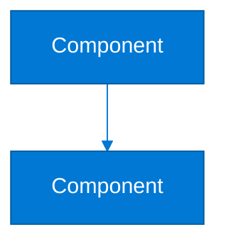

# 🎨 Crear Imágenes Profesionales de Diagramas

Guía paso a paso para crear imágenes de alta calidad y estética profesional a partir de los diagramas Mermaid.

---

## 🚀 Proceso Rápido (3 minutos)

### Paso 1: Abre Mermaid Live Editor

👉 **Abre**: https://mermaid.live/

### Paso 2: Copia el Código del Diagrama

1. Abre en tu editor: `docs/features/invitations.md`
2. Busca el diagrama que quieres (busca ````mermaid`)
3. **Copia TODO** el código entre:
   ```
   ```mermaid
   [código del diagrama]
   ```
   ```

### Paso 3: Pega y Ajusta

1. **Pega** el código en mermaid.live
2. El diagrama se renderiza automáticamente
3. **Ajusta el zoom** para ver mejor (zoom out si es muy grande)

### Paso 4: Exporta como Imagen

1. Click en **"Actions"** (menú arriba a la derecha)
2. Selecciona:
   - **"Download PNG"** - Para uso general (mejor compatibilidad)
   - **"Download SVG"** - Para mejor calidad (escalable sin perder calidad)

3. La imagen se descarga automáticamente

### Paso 5: Guarda en el Proyecto (Opcional)

```bash
# Mover la imagen descargada
mv ~/Downloads/diagram.png docs/images/diagrams/invitations/architecture.png
```

---

## 🎯 Mejorar la Calidad Visual

### Antes de Exportar:

1. **Zoom Out** para ver todo el diagrama completo
2. **Ajusta el viewport** para mejor composición
3. **Verifica colores** y contraste
4. **Revisa que todo el texto sea legible**

### Configuraciones Recomendadas:

- **Formato**: SVG para mejor calidad, PNG para compatibilidad
- **Resolución**: Exporta en tamaño completo (no reduzcas antes de exportar)
- **Fondo**: Transparente o blanco según el uso

---

## 📊 Diagramas Disponibles

En `docs/features/invitations.md`:

1. **Diagrama de Arquitectura** (línea ~36)
   - Nombre sugerido: `invitation-architecture.png`
   
2. **Flujo End-to-End** (línea ~90)
   - Nombre sugerido: `invitation-sequence-flow.png`
   
3. **Flujo Admin/Approver** (línea ~150)
   - Nombre sugerido: `invitation-admin-flow.png`
   
4. **Flujo Vendor** (línea ~190)
   - Nombre sugerido: `invitation-vendor-flow.png`
   
5. **Diagrama de Estados** (línea ~230)
   - Nombre sugerido: `invitation-state-diagram.png`
   
6. **Flujo de Seguridad** (línea ~280)
   - Nombre sugerido: `invitation-security-flow.png`
   
7. **Integración Arquitectura Híbrida** (línea ~320)
   - Nombre sugerido: `invitation-hybrid-architecture.png`

---

## 💡 Consejos Profesionales

### Para Presentaciones:

- Exporta en **1920x1080px** o mayor
- Usa **PNG con fondo blanco** para mejor contraste
- Verifica que los colores de Azure (#0078d4) se vean bien

### Para Documentación Web:

- Usa **SVG** cuando sea posible (mejor calidad, menor tamaño)
- O **PNG** con resolución adecuada (1920px ancho mínimo)
- Asegúrate de que sea legible en diferentes tamaños de pantalla

### Para Impresión:

- Exporta en **alta resolución** (300 DPI mínimo)
- Usa **PNG o PDF**
- Verifica que los colores funcionen en blanco y negro también

---

## 📁 Estructura de Archivos Recomendada

```
docs/
├── images/
│   └── diagrams/
│       └── invitations/
│           ├── architecture.png
│           ├── sequence-flow.png
│           ├── admin-flow.png
│           ├── vendor-flow.png
│           ├── state-diagram.png
│           ├── security-flow.png
│           └── hybrid-architecture.png
└── features/
    └── invitations.md
```

---

## 🔄 Workflow Recomendado

### Durante el Desarrollo:

1. Mantén los diagramas como código Mermaid en el `.md`
2. Usa preview para ver mientras editas
3. No necesitas generar imágenes hasta que publiques

### Para Publicación/Compartir:

1. Exporta todos los diagramas como imágenes
2. Guarda en `docs/images/diagrams/`
3. (Opcional) Actualiza el Markdown para incluir las imágenes

---

## 🎨 Personalización Avanzada

### Mejorar Colores y Estilos:

Puedes mejorar los diagramas agregando estilos personalizados antes de exportar:



### Temas Disponibles:

- `default` - Estándar
- `dark` - Tema oscuro
- `forest` - Verde/natural
- `neutral` - Profesional neutral

---

## ✅ Checklist de Calidad

Antes de usar las imágenes, verifica:

- [ ] Diagrama completo visible (sin cortes)
- [ ] Texto legible en todos los tamaños
- [ ] Colores contrastan bien
- [ ] Resolución suficiente (1920px+ ancho)
- [ ] Formato apropiado (SVG o PNG)
- [ ] Nombre de archivo descriptivo
- [ ] Guardado en ubicación correcta

---

## 🔗 Recursos

- **Mermaid Live Editor**: https://mermaid.live/
- **Guía Completa de Exportación**: [`../GENERATE_DIAGRAM_IMAGES.md`](../GENERATE_DIAGRAM_IMAGES.md)
- **Ver Diagramas**: [`../VIEW_DIAGRAMS.md`](../VIEW_DIAGRAMS.md)

---

## 🎯 Resumen

1. **Copia** el código Mermaid del archivo `.md`
2. **Pega** en https://mermaid.live/
3. **Ajusta** zoom y vista
4. **Exporta** como PNG o SVG
5. **Guarda** en `docs/images/diagrams/`

¡Así de fácil! 🎨

---

*Con este proceso puedes crear imágenes profesionales de alta calidad para documentación, presentaciones o cualquier uso visual.*

