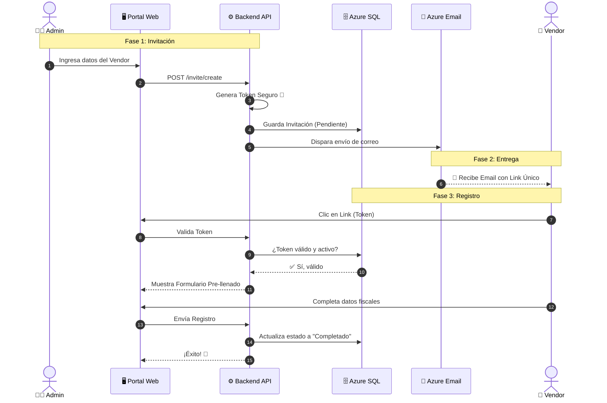

# 📨 Proceso de Invitaciones: Explicación Visual y Flujo

Este documento detalla la narrativa visual del proceso de invitaciones, diseñado para acompañar a los diagramas de arquitectura.

---

## 📖 La Historia del Proceso (Narrativa Visual)

Imagina el flujo de datos como una historia en 6 pasos claros, tal como se describiría para una infografía profesional:

### 1. El Inicio: La Acción del Administrador
Todo comienza en el **Admin Dashboard**. Un usuario con rol de 'Administrador' o 'Aprobador' accede a la herramienta segura.
*   **Acción Visual:** El admin hace clic en "Crear Invitación".
*   **Dato Clave:** Se ingresa el email del proveedor (`vendor@empresa.com`) y la fecha de expiración.

### 2. El Proceso: Generación del Token Seguro
La solicitud viaja al **Backend API**. Aquí ocurre la "magia" de seguridad.
*   **Acción Visual:** Un engranaje procesando datos.
*   **Lógica:** El sistema genera un **Token Criptográfico Único**. No es un simple ID, es una llave digital segura que solo funciona para ese email específico y por tiempo limitado.
*   **Almacenamiento:** Este token se guarda en **Azure SQL** con estado "Pendiente".

### 3. La Entrega: El Viaje del Email
El API dispara un evento a través de **Azure Service Bus** hacia **Azure Functions**.
*   **Acción Visual:** Un sobre digital volando desde la nube de Azure hacia el mundo exterior.
*   **Tecnología:** Azure Communication Services entrega el correo garantizando que no caiga en spam.

### 4. La Recepción: El Proveedor
El proveedor recibe el correo en su bandeja de entrada.
*   **Acción Visual:** Un usuario externo (el Vendor) abriendo un sobre en su laptop.
*   **Interacción:** Ve un botón claro: **"Completar Registro"**. Al hacer clic, es redirigido al Portal Público.

### 5. El Registro: Validación y Formulario
Al llegar al portal, el **Token es Validado** instantáneamente por el API.
*   **Acción Visual:** Un candado abriéndose (validación exitosa).
*   **Experiencia:** El formulario se carga con los datos pre-llenados (Nombre Empresa, Email). El proveedor solo completa los datos fiscales y bancarios faltantes.

### 6. El Éxito: Completado
El proveedor envía el formulario.
*   **Acción Visual:** Un checkmark verde ✅ grande.
*   **Resultado:** El estado en la base de datos cambia a "Completado" y se crea oficialmente la aplicación del proveedor en el sistema.

---

## 📊 Representación Visual (Diagrama Generado)

Este es el diagrama técnico exacto que representa la narrativa anterior. Tu editor (VS Code/Cursor) renderizará esto como una imagen visual.

---

## 🎨 Instrucciones para Generar la Imagen Artística

Para obtener la imagen "estilo Nano Banana" (diseño gráfico de alta calidad), usa el siguiente prompt en tu generador de imágenes favorito (DALL-E 3, Midjourney, Bing Image Creator):

> **Prompt para Copiar:**
>
> "Create a modern isometric infographic illustration of a 'Vendor Onboarding Process' on a white background. Use Microsoft Azure color palette (Blue #0078D4).
>
> **Steps to illustrate:**
> 1.  **Left:** An admin user on a dashboard creating a request.
> 2.  **Middle:** A cloud server generating a golden digital key (token).
> 3.  **Path:** An envelope icon traveling along a blue connecting line.
> 4.  **Right:** A vendor user opening the email and filling a digital form on a laptop.
> 5.  **End:** A large green success checkmark.
>
> **Style:** Clean, corporate tech, vector art, 3D isometric icons, high resolution."

---

*Este documento combina la explicación lógica con la representación visual técnica.*

