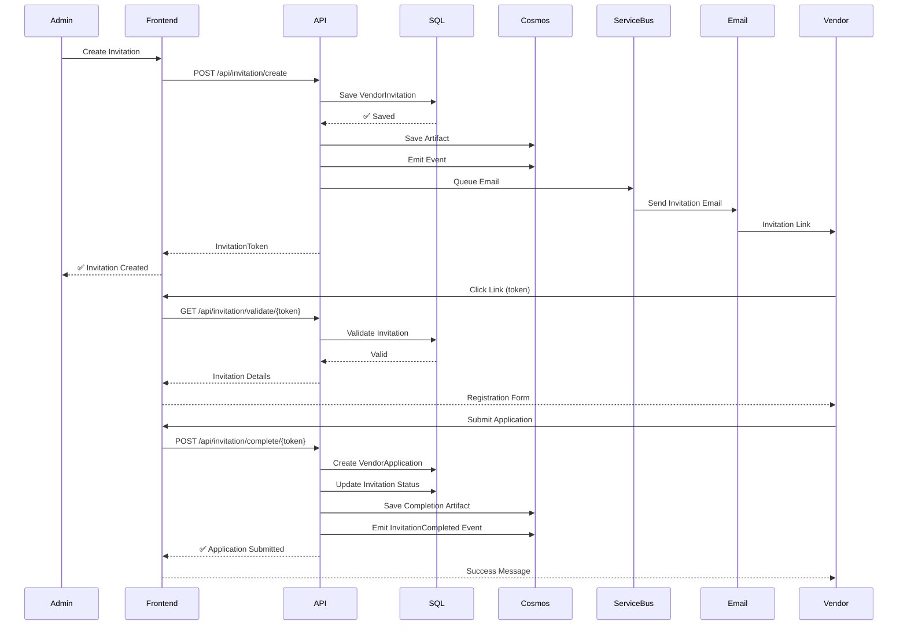

# Invitation Flow - End-to-End Documentation

**Feature:** Invitation-Based Vendor Onboarding  
**Status:** ✅ Production-Ready  
**Last Updated:** 2025-12-08

---

## Overview

The Invitation Flow enables administrators to invite vendors to the platform by sending them a secure, time-limited registration link. This flow implements the mandatory **A→B→C→D hybrid architecture pattern**.

---

## Architecture Pattern

### Hybrid Data Pattern (Mandatory)

```
A. SQL Database (State & Metadata)
   ↓
B. Cosmos DB Artifacts (Full Payload for Audit)
   ↓
C. Cosmos DB Events (Event Sourcing)
   ↓
D. Service Bus (Async Integration)
```

### Implementation

**Service:** [InvitationService.cs](file:///Users/jplopez/projects/vendor-mdm-portal/backend/VendorMdm.Api/Services/InvitationService.cs)

```csharp
// A. SQL: State & metadata
var invitation = new VendorInvitation { /* ... */ };
_context.VendorInvitations.Add(invitation);
await _context.SaveChangesAsync();

// B. Cosmos Artifacts: Full payload
await SaveInvitationArtifactAsync(invitation.Id.ToString(), fullPayload);

// C. Cosmos Events: Domain event
await EmitDomainEventAsync("InvitationCreated", invitation.Id.ToString(), eventData);

// D. Service Bus: Email notification
await _serviceBusService.PublishEventAsync("invitation-created", emailMessage);
```

---

## Flow Sequence



---

## API Endpoints

### 1. Create Invitation (Admin/Approver Only)

**Endpoint:** `POST /api/invitation/create`

**Request:**
```json
{
  "vendorLegalName": "Acme Corporation",
  "primaryContactEmail": "contact@acme.com",
  "expirationDays": 14,
  "notes": "New vendor for procurement"
}
```

**Response:**
```json
{
  "invitationId": "guid",
  "invitationToken": "secure-token",
  "invitationLink": "/invitation/register/secure-token",
  "expiresAt": "2025-12-22T00:00:00Z"
}
```

### 2. Validate Invitation (Public)

**Endpoint:** `GET /api/invitation/validate/{token}`

**Response:**
```json
{
  "isValid": true,
  "vendorLegalName": "Acme Corporation",
  "primaryContactEmail": "contact@acme.com",
  "expiresAt": "2025-12-22T00:00:00Z"
}
```

### 3. Get Invitation Details (Public)

**Endpoint:** `GET /api/invitation/details/{token}`

**Response:**
```json
{
  "vendorLegalName": "Acme Corporation",
  "primaryContactEmail": "contact@acme.com",
  "expiresAt": "2025-12-22T00:00:00Z",
  "status": "Pending"
}
```

### 4. Complete Registration (Public)

**Endpoint:** `POST /api/invitation/complete/{token}`

**Request:**
```json
{
  "companyName": "Acme Corporation",
  "taxId": "12-3456789",
  "contactName": "John Doe",
  "email": "contact@acme.com"
}
```

**Response:**
```json
{
  "applicationId": "guid",
  "status": "Submitted",
  "message": "Your application has been submitted successfully!"
}
```

### 5. List Invitations (Admin/Approver Only)

**Endpoint:** `GET /api/invitation/list?page=1&pageSize=20&status=Pending`

**Response:**
```json
{
  "invitations": [
    {
      "id": "guid",
      "vendorLegalName": "Acme Corporation",
      "primaryContactEmail": "contact@acme.com",
      "status": "Pending",
      "invitedByName": "Admin User",
      "createdAt": "2025-12-08T00:00:00Z",
      "expiresAt": "2025-12-22T00:00:00Z",
      "vendorApplicationId": null
    }
  ],
  "totalCount": 5,
  "page": 1,
  "pageSize": 20
}
```

### 6. Resend Invitation (Admin/Approver Only)

**Endpoint:** `POST /api/invitation/resend/{id}`

**Response:**
```json
{
  "message": "Invitation has been resent successfully"
}
```

---

## Database Schema

### SQL Database

**Table:** `VendorInvitations`

| Column | Type | Description |
|--------|------|-------------|
| Id | GUID (PK) | Unique identifier |
| InvitationToken | string(100) | Secure random token |
| VendorLegalName | string(200) | Vendor's legal name |
| PrimaryContactEmail | string(255) | Contact email |
| InvitedBy | GUID | User who created invitation |
| InvitedByName | string(200) | User's display name |
| CreatedAt | DateTime | Creation timestamp |
| ExpiresAt | DateTime | Expiration timestamp |
| Status | string(20) | Pending/Completed/Expired |
| CompletedAt | DateTime? | Completion timestamp |
| VendorApplicationId | GUID? | Link to VendorApplication |
| Notes | string(1000)? | Internal notes |

**Statuses:** `Pending`, `Accepted`, `Expired`, `Completed`, `Cancelled`

### Cosmos DB

**Container:** `InvitationArtifacts`  
**Partition Key:** `/invitationId`

```json
{
  "id": "invitation-guid",
  "invitationId": "invitation-guid",
  "vendorLegalName": "Acme Corporation",
  "primaryContactEmail": "contact@acme.com",
  "invitedBy": "user-guid",
  "invitedByName": "Admin User",
  "token": "secure-token",
  "expiresAt": "2025-12-22T00:00:00Z",
  "notes": "New vendor",
  "createdAt": "2025-12-08T00:00:00Z",
  "fullPayload": { /* complete request data */ },
  "status": "Pending"
}
```

**Container:** `DomainEvents`  
**Partition Key:** `/eventType`

```json
{
  "id": "event-guid",
  "eventType": "InvitationCreated",
  "entityId": "invitation-guid",
  "timestamp": "2025-12-08T00:00:00Z",
  "data": {
    "invitationId": "guid",
    "vendorName": "Acme Corporation",
    "email": "contact@acme.com",
    "invitedBy": "user-guid",
    "expiresAt": "2025-12-22T00:00:00Z"
  }
}
```

---

## Frontend Integration

### Pages

1. **[InviteVendorForm.tsx](file:///Users/jplopez/projects/vendor-mdm-portal/frontend/src/pages/admin/InviteVendorForm.tsx)**  
   Admin page to create new invitations

2. **[InvitationManagement.tsx](file:///Users/jplopez/projects/vendor-mdm-portal/frontend/src/pages/admin/InvitationManagement.tsx)**  
   List and manage existing invitations

3. **[InvitationRegistration.tsx](file:///Users/jplopez/projects/vendor-mdm-portal/frontend/src/pages/InvitationRegistration.tsx)**  
   Public registration page for vendors

### Example Usage

```typescript
// Create invitation
const response = await fetch('/api/invitation/create', {
  method: 'POST',
  headers: { 'Content-Type': 'application/json' },
  body: JSON.stringify({
    vendorLegalName: 'Acme Corp',
    primaryContactEmail: 'contact@acme.com',
    expirationDays: 14
  })
});

// Validate invitation
const validation = await fetch(`/api/invitation/validate/${token}`);
const { isValid, vendorLegalName } = await validation.json();
```

---

## Infrastructure

### Cosmos DB Container

**Configuration:** [modules/cosmos.bicep:116-128](file:///Users/jplopez/projects/vendor-mdm-portal/infrastructure/modules/cosmos.bicep#L116-L128)

```bicep
resource containerInvitationArtifacts 'Microsoft.DocumentDB/databaseAccounts/sqlDatabases/containers@2023-04-15' = {
  name: 'InvitationArtifacts'
  properties: {
    resource: {
      id: 'InvitationArtifacts'
      partitionKey: {
        paths: ['/invitationId']
        kind: 'Hash'
      }
    }
  }
}
```

### Service Bus Queue

**Configuration:** [invitation-infrastructure.bicep:40-54](file:///Users/jplopez/projects/vendor-mdm-portal/infrastructure/invitation-infrastructure.bicep#L40-L54)

```bicep
resource invitationEmailQueue 'Microsoft.ServiceBus/namespaces/queues@2021-11-01' = {
  name: 'invitation-emails'
  properties: {
    maxSizeInMegabytes: 1024
    defaultMessageTimeToLive: 'P14D'
    maxDeliveryCount: 10
    deadLetteringOnMessageExpiration: true
  }
}
```

---

## Testing Locally

### 1. Start Backend API

```bash
cd backend/VendorMdm.Api
dotnet run
```

API available at: `https://localhost:7001`

### 2. Create Test Invitation

```bash
curl -X POST https://localhost:7001/api/invitation/create \
  -H "Content-Type: application/json" \
  -d '{
    "vendorLegalName": "Test Vendor",
    "primaryContactEmail": "test@vendor.com",
    "expirationDays": 14
  }'
```

### 3. Get Invitation Link

Response will include `invitationToken`. Use it to access:
```
http://localhost:3002/invitation/register/{token}
```

### 4. Check Database

```bash
# SQLite (local dev)
sqlite3 backend/VendorMdm.Api/vendormdm.db
> SELECT * FROM VendorInvitations;
```

---

## Troubleshooting

### Invitation Not Found

**Symptom:** `GET /api/invitation/validate/{token}` returns `isValid: false`

**Solutions:**
- Verify token is correct (case-sensitive)
- Check if invitation expired
- Verify invitation exists in database

### Email Not Sent

**Symptom:** Invitation created but no email received

**Solutions:**
- Check `UseLocalEmulators` configuration (local dev logs to console)
- Verify Service Bus connection string
- Check email service configuration
- Review logs for email sending errors

### Expired Invitation

**Symptom:** Valid token but validation fails with "expired"

**Solutions:**
- Resend invitation via `POST /api/invitation/resend/{id}`
- Creates new token and extends expiration

---

## Related Documentation

- **Architecture:** [principles.md](file:///Users/jplopez/projects/vendor-mdm-portal/docs/architecture/principles.md) - Hybrid pattern details
- **Review:** [reviews/invitation-flow-review.md](file:///Users/jplopez/projects/vendor-mdm-portal/reviews/invitation-flow-review.md) - Architecture compliance review
- **Setup:** [getting-started/local-development.md](file:///Users/jplopez/projects/vendor-mdm-portal/docs/getting-started/local-development.md)
