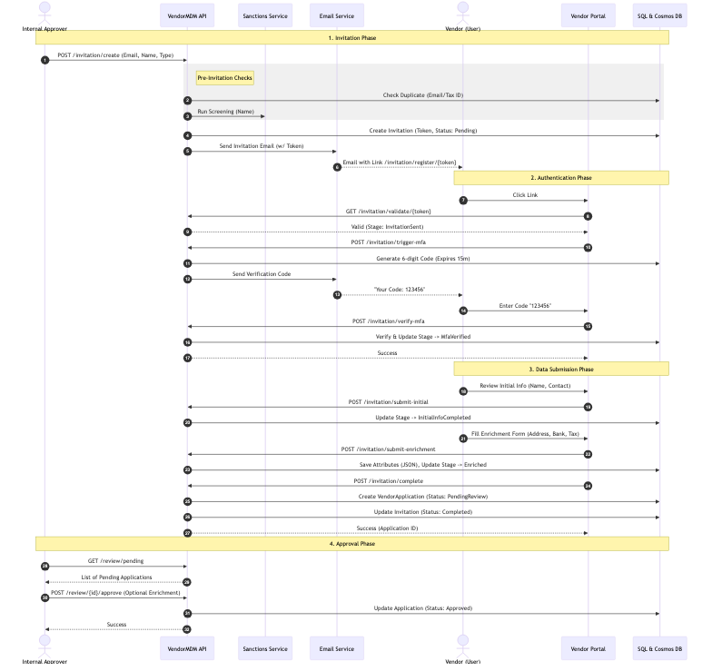
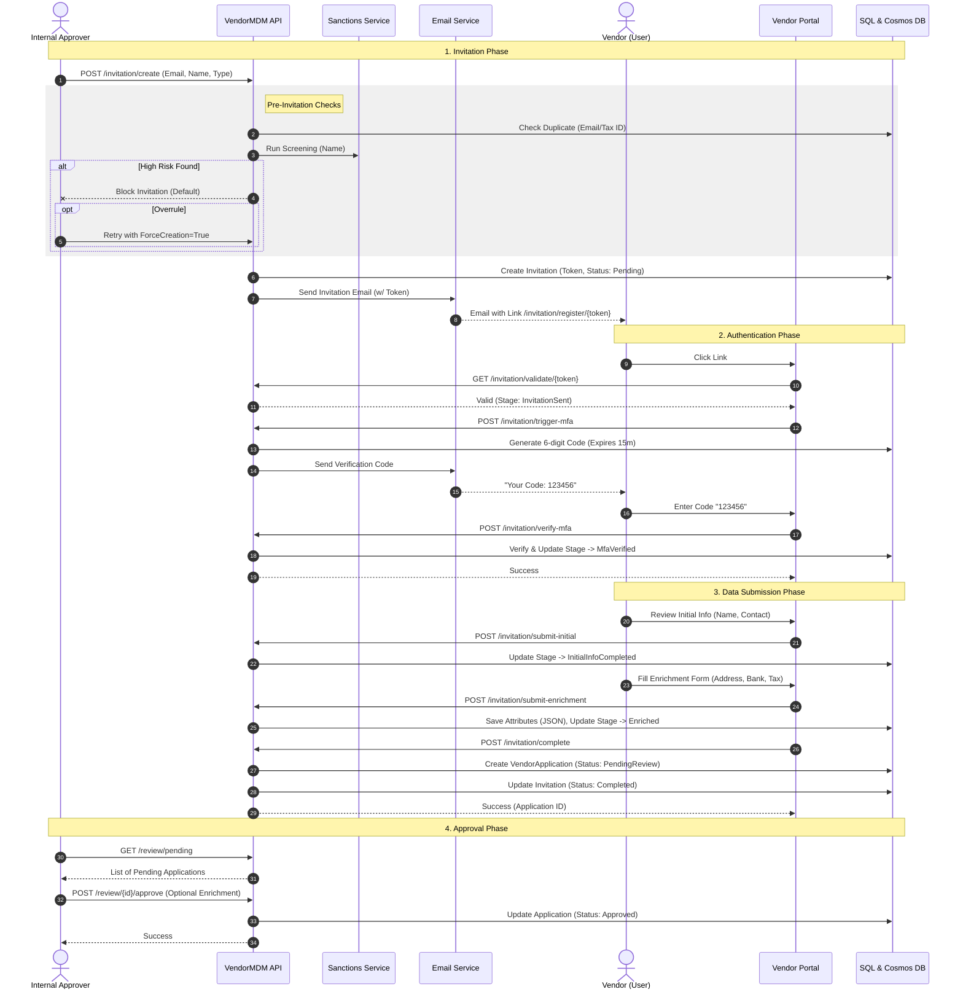
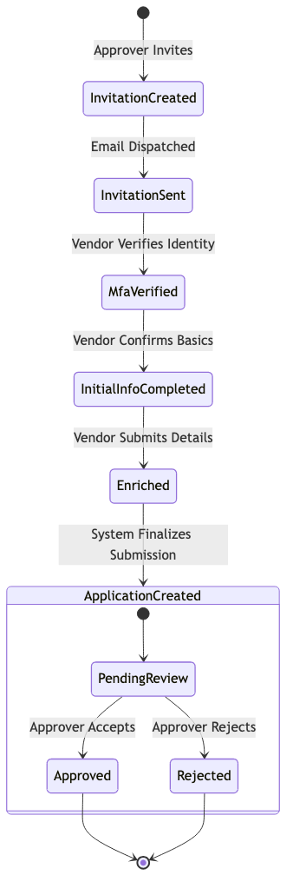
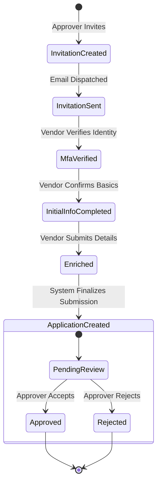
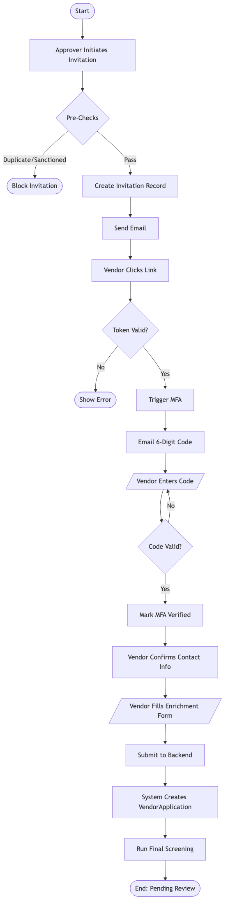
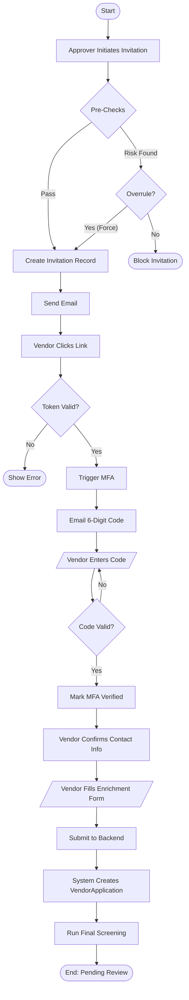

# Vendor Invitation & Onboarding Flow

This document outlines the end-to-end flow for inviting and onboarding new vendors, including email dispatch, multi-factor authentication (MFA), data submission, and internal approval.

## Mermaid Diagram

To view this diagram in a Mermaid-compatible viewer (e.g., GitHub, VS Code), or to edit it in **Draw.io**:

**How to open in Draw.io:**
1. Open [draw.io](https://app.diagrams.net/).
2. Go to `Arrange` > `Insert` > `Advanced` > `Mermaid`.
3. Paste the code block below.

### Source Code (Sequence)

## State Transition Diagram

### Source Code (State)

## Activity Diagram

This diagram visualizes the **system logic and control flow**, highlighting decisions and parallel processes (e.g., Validation, MFA loop).

### Source Code (Activity)

## Diagram Explanations & Reference

| Feature | User Flow / Sequence Diagram | Activity Diagram | State Diagram |
| :--- | :--- | :--- | :--- |
| **Primary Goal** | **User Experience (UX)**   Focuses on the path the user takes through screens and interactions. | **System Logic & Algorithms**   Focuses on the flow of control, decisions, loops, and data processing. | **Object Lifecycle**   Focuses on the condition (state) of a specific object at any given time. |
| **Key Question** | *"What does the user see next?"* | *"What does the system do next?"* | *"What is the status of this object now?"* |
| **Best For** | Visualizing navigation and API interactions between User, Frontend, and Backend. | Complex business logic, validation loops (like MFA), and parallel processing steps. | Objects with complex statuses (e.g., Invitation: `Pending` → `Sent` → `MfaVerified` → `Completed`). |
