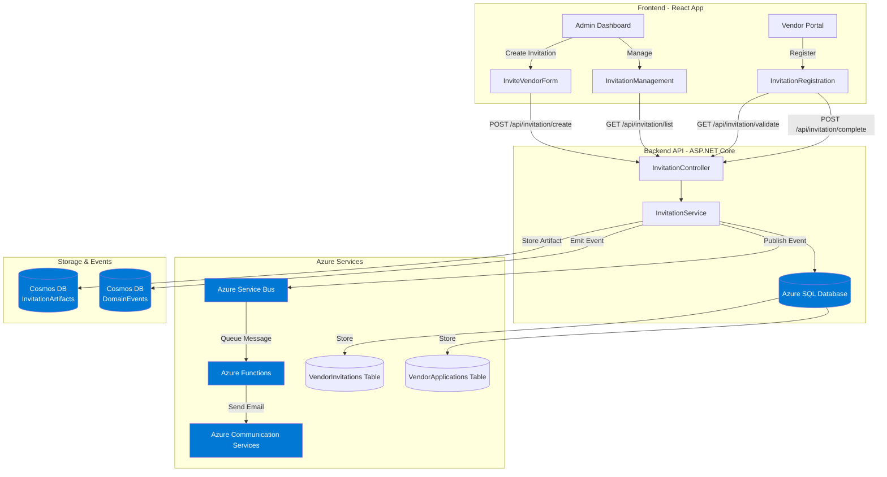
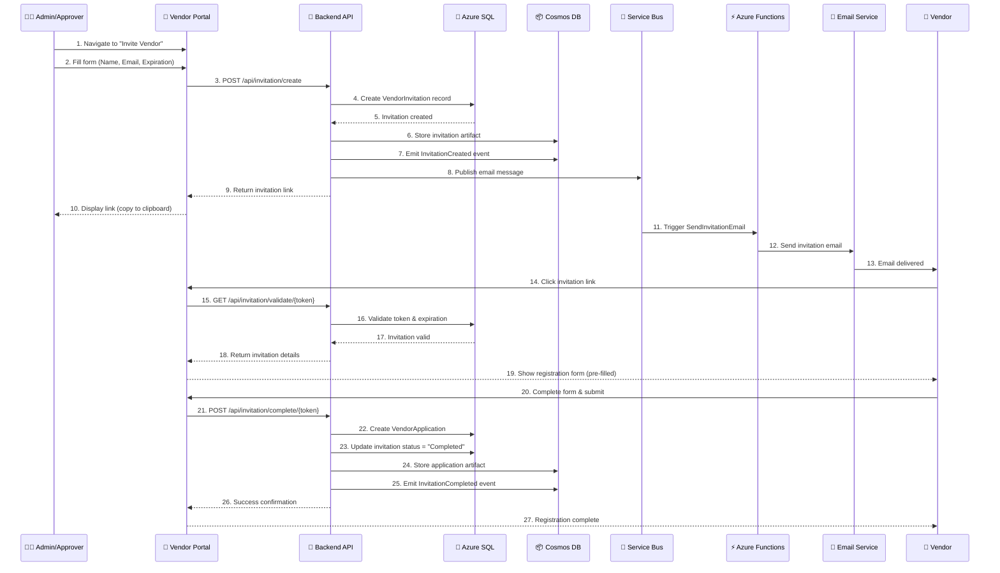
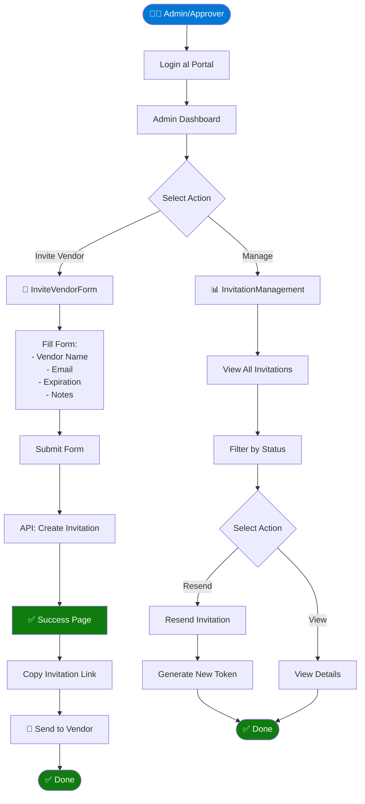
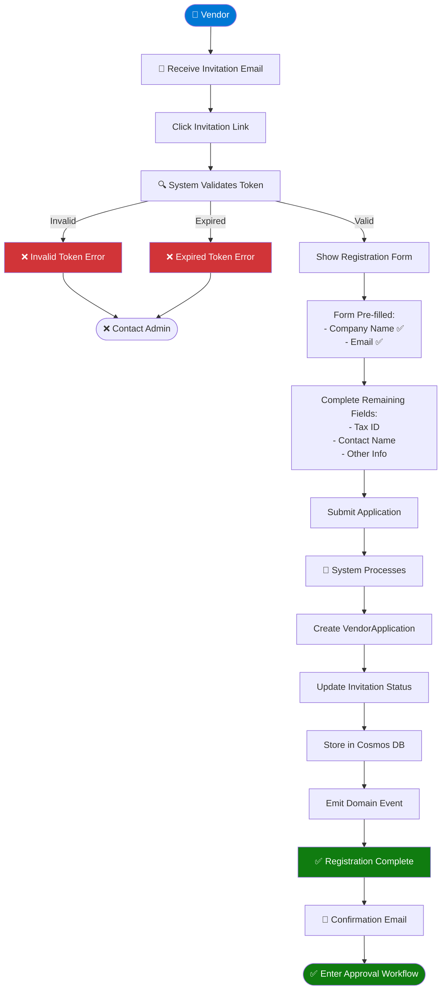
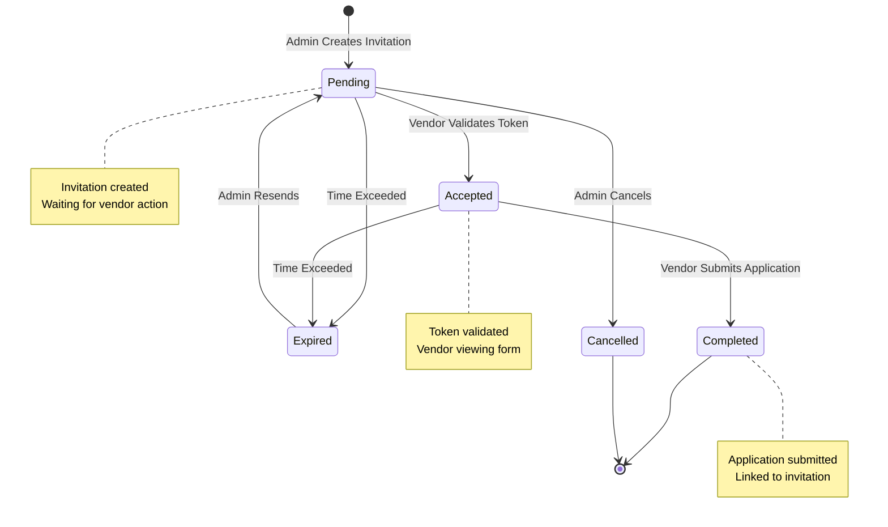
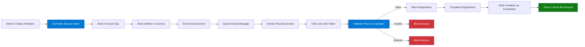
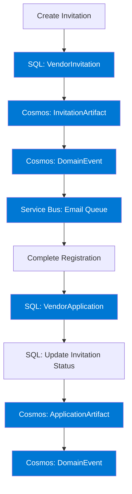
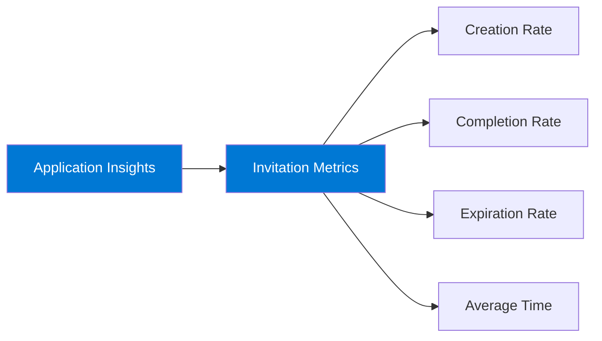

# 🎫 Sistema de Invitaciones de Vendors

Sistema completo de invitación basado en tokens para onboarding de vendors pre-autorizados.

> 👁️ **¿Cómo ver los diagramas?** 
> - **Ver online**: [Guía Rápida](./QUICK_VIEW_DIAGRAMS.md) 
> - **Exportar como imágenes profesionales**: [Exportar Diagramas](../EXPORT_DIAGRAMS_AS_IMAGES.md)
> - **Guía completa**: [Ver Diagramas](../VIEW_DIAGRAMS.md)

## 📋 Tabla de Contenidos

- [Visión General](#visión-general)
- [Arquitectura del Sistema](#arquitectura-del-sistema)
- [Flujo de Proceso Completo](#flujo-de-proceso-completo)
- [Componentes Implementados](#componentes-implementados)
- [Seguridad](#seguridad)
- [Guías de Uso](#guías-de-uso)
- [API Reference](#api-reference)

---

## 🎯 Visión General

El sistema de invitaciones permite a administradores y aprobadores invitar vendors pre-veteados al portal mediante enlaces únicos y temporales. Este flujo asegura que solo vendors autorizados puedan registrarse, manteniendo la calidad y seguridad del proceso de onboarding.

### Características Principales

- ✅ **Tokens seguros** - Tokens criptográficamente seguros y únicos
- ✅ **Expiración configurable** - 7, 14 o 30 días
- ✅ **Trazabilidad completa** - Auditoría de quién invitó y cuándo
- ✅ **Envío automático de emails** - Integrado con Azure Functions
- ✅ **Gestión centralizada** - Dashboard para administrar invitaciones
- ✅ **Reenvío de invitaciones** - Para invitaciones expiradas o pendientes

---

## 🏗️ Arquitectura del Sistema

### Diagrama de Arquitectura



### Componentes Azure Utilizados

| Componente Azure | Función |
|-----------------|---------|
| **Azure SQL Database** | Almacenamiento de metadata de invitaciones y aplicaciones |
| **Azure Cosmos DB** | Artifacts completos y eventos de dominio |
| **Azure Service Bus** | Cola asíncrona para procesamiento de emails |
| **Azure Functions** | Procesamiento serverless de emails |
| **Azure Communication Services** | Envío de emails transaccionales |

---

## 🔄 Flujo de Proceso Completo

### Flujo End-to-End



### Flujo de Usuario (Admin/Approver)



### Flujo de Usuario (Vendor)



---

## 📊 Estados de Invitación

### Diagrama de Estados



### Descripción de Estados

| Estado | Descripción | Acciones Permitidas |
|--------|-------------|---------------------|
| **Pending** | Invitación creada, esperando uso del vendor | Resend, Cancel, View |
| **Accepted** | Token validado, vendor está completando el formulario | View, Wait |
| **Completed** | Vendor completó el registro, aplicación creada | View Application |
| **Expired** | Invitación expiró sin ser completada | Resend, Cancel |
| **Cancelled** | Administrador canceló la invitación | View (read-only) |

---

## 🛠️ Componentes Implementados

### Backend Components

#### 1. Database Models

**VendorInvitation Entity**:
```csharp
- Id (Guid, PK)
- InvitationToken (string, unique, indexed)
- VendorLegalName (string, required)
- PrimaryContactEmail (string, required, indexed)
- InvitedBy (Guid, FK to UserRole)
- InvitedByName (string)
- CreatedAt (DateTime)
- ExpiresAt (DateTime)
- Status (enum: Pending, Accepted, Expired, Completed, Cancelled)
- CompletedAt (DateTime, nullable)
- VendorApplicationId (Guid, nullable, FK)
- Notes (string, nullable)
```

**Extended VendorApplication**:
```csharp
- TaxId (string, nullable)
- ContactName (string, nullable)
- RegistrationType (enum: SelfRegistration, Invitation)
- InvitationId (Guid, nullable, FK)
```

#### 2. Service Layer

**InvitationService** implementa:
- `CreateInvitationAsync` - Crear invitación con token único
- `ValidateInvitationAsync` - Validar token y expiración
- `CompleteInvitationAsync` - Completar registro del vendor
- `ResendInvitationAsync` - Generar nuevo token y extender expiración
- `GetInvitationsAsync` - Listar invitaciones con filtros
- `ExpireOldInvitationsAsync` - Tarea en background para expirar invitaciones antiguas

#### 3. API Endpoints

| Método | Endpoint | Descripción | Auth |
|--------|----------|-------------|------|
| POST | `/api/invitation/create` | Crear nueva invitación | Admin/Approver |
| GET | `/api/invitation/validate/{token}` | Validar token de invitación | Public |
| GET | `/api/invitation/details/{token}` | Obtener detalles de invitación | Public |
| POST | `/api/invitation/complete/{token}` | Completar registro del vendor | Public |
| GET | `/api/invitation/list` | Listar todas las invitaciones | Admin/Approver |
| POST | `/api/invitation/resend/{id}` | Reenviar invitación | Admin/Approver |

### Frontend Components

#### 1. Admin/Approver Tools

**InviteVendorForm** (`/admin/invite-vendor`):
- Formulario para crear invitaciones
- Campos: Vendor Legal Name, Contact Email, Expiration Period, Notes
- Funcionalidad de copiar link al portapapeles
- Confirmación de éxito con próximos pasos

**InvitationManagement** (`/admin/invitations`):
- Vista de tabla de todas las invitaciones
- Badges de estado (Pending, Accepted, Completed, Expired)
- Filtrado por estado
- Funcionalidad de resend/reactivar
- Estadísticas resumidas
- Indicadores de "Expiring Soon"

#### 2. Vendor-Facing Flow

**InvitationRegistration** (`/invitation/register/:token`):
- Validación de token al cargar la página
- Información pre-llenada (company name y email en read-only)
- Formulario de registro completo
- Manejo de errores para tokens inválidos/expirados
- Página de confirmación de éxito

---

## 🔒 Seguridad

### Características de Seguridad

1. **Tokens Criptográficamente Seguros**
   - 32-byte tokens aleatorios
   - Codificación Base64URL
   - Unicidad garantizada

2. **Expiración Limitada por Tiempo**
   - Configurable: 7, 14 o 30 días
   - Validación automática de expiración
   - No se puede usar después de expirar

3. **Prevención de Duplicados**
   - Verificación de invitaciones existentes
   - Verificación de aplicaciones existentes
   - No permite múltiples invitaciones activas para mismo email

4. **Validación de Estado**
   - Previene reutilización de invitaciones completadas
   - Solo un uso por invitación

5. **Control de Acceso Basado en Roles**
   - Solo Admin/Approver pueden crear invitaciones
   - Solo Admin/Approver pueden ver lista completa
   - Rutas públicas solo para validación y registro

6. **Auditoría Completa**
   - Rastrea quién invitó (InvitedBy, InvitedByName)
   - Timestamps de creación, expiración y completado
   - Eventos de dominio almacenados en Cosmos DB

### Flujo de Seguridad



---

## 📖 Guías de Uso

### Para Administradores/Aprobadores

#### Crear una Invitación

1. **Navegar** a "Invite Vendor" en el sidebar
2. **Completar el formulario**:
   - **Vendor Legal Name**: Nombre oficial de la compañía
   - **Primary Contact Email**: Email del contacto que completará el registro
   - **Expiration Period**: 7, 14 o 30 días (recomendado: 14 días)
   - **Internal Notes** (opcional): Razón de onboarding
3. **Enviar** el formulario
4. **Copiar el link** de invitación de la página de éxito
5. **Enviar el link** al vendor via email

#### Gestionar Invitaciones

1. **Navegar** a "Manage Invitations"
2. **Ver todas las invitaciones** en la tabla con:
   - Badges de estado
   - Fechas de creación y expiración
   - Links a aplicaciones completadas
3. **Filtrar por estado** usando el dropdown
4. **Reenviar invitaciones** para invitaciones Pending o Expired
5. **Monitorear** indicadores de "Expiring Soon"

### Para Vendors

#### Completar el Registro

1. **Recibir email** de invitación con link único
2. **Hacer click en el link** de invitación
3. **Verificar información pre-llenada**:
   - Nombre de la compañía (read-only)
   - Email (read-only)
4. **Completar campos requeridos**:
   - Tax ID / VAT Number
   - Contact Person
   - Otra información requerida
5. **Enviar aplicación**
6. **Recibir confirmación** y entrar al flujo de aprobación

---

## 📡 API Reference

### Create Invitation

```http
POST /api/invitation/create
Content-Type: application/json
Authorization: Bearer {token}

{
  "vendorLegalName": "Acme Corporation",
  "primaryContactEmail": "contact@acme.com",
  "expirationDays": 14,
  "notes": "New supplier for Project X"
}
```

**Response**:
```json
{
  "invitationId": "guid",
  "invitationToken": "secure-token",
  "invitationLink": "/invitation/register/{token}",
  "expiresAt": "2025-12-21T..."
}
```

### Validate Invitation

```http
GET /api/invitation/validate/{token}
```

**Response**:
```json
{
  "isValid": true,
  "invitation": {
    "vendorLegalName": "Acme Corporation",
    "primaryContactEmail": "contact@acme.com",
    "expiresAt": "2025-12-21T...",
    "status": "Pending"
  }
}
```

### Complete Registration

```http
POST /api/invitation/complete/{token}
Content-Type: application/json

{
  "taxId": "US-123456789",
  "contactName": "John Doe",
  "additionalFields": { ... }
}
```

**Response**:
```json
{
  "applicationId": "guid",
  "status": "Submitted",
  "message": "Registration completed successfully"
}
```

---

## 🔄 Integración con Arquitectura Híbrida

El sistema de invitaciones sigue el patrón de arquitectura híbrida obligatorio:



**Pasos del Patrón**:
1. ✅ **SQL Database** - Metadata y estado de invitación
2. ✅ **Cosmos DB Artifacts** - Payload completo de invitación
3. ✅ **Cosmos DB Events** - Eventos de dominio (InvitationCreated, InvitationCompleted)
4. ✅ **Service Bus** - Cola asíncrona para emails

---

## 📈 Métricas y Monitoreo

### Métricas Recomendadas

- **Total Invitations**: Conteo de todas las invitaciones
- **Pending**: Esperando acción del vendor
- **Completed**: Registrados exitosamente
- **Expired**: No usadas a tiempo
- **Acceptance Rate**: Completed / Total
- **Average Time to Complete**: Tiempo desde creación hasta submission

### Dashboard de Monitoreo



---

## 🔮 Futuras Mejoras

### Próximas Features

- 📧 **Envío Automático de Emails** - Ya implementado con Azure Functions
- 🔔 **Emails de Recordatorio** - Recordatorios automáticos antes de expirar
- 📊 **Dashboard de Analytics** - Métricas detalladas y gráficos
- 📝 **Templates de Email Personalizables** - Templates HTML personalizados
- 🌐 **Soporte Multi-idioma** - Emails localizados
- 📤 **Invitaciones Masivas** - Carga CSV para múltiples vendors
- 🔄 **Workflow de Aprobación** - Integración completa con approval workflow

---

## 📚 Referencias

- [Arquitectura del Proyecto](../architecture/principles.md) - Principios arquitectónicos
- [Configuración de Email](./email-configuration.md) - Setup de email
- [Azure Infrastructure](../azure/infrastructure.md) - Componentes Azure
- [Guía de Deployment](../azure/deployment/README.md) - Despliegue en Azure

---

*Para más detalles sobre implementación técnica, consulta los comentarios en el código fuente.*

