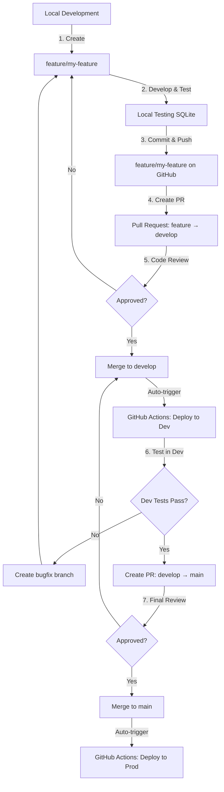

# Git Workflow & Branching Strategy - MANDATORY

**Version**: 1.0  
**Last Updated**: 2024-12-18  
**Status**: **ACTIVE**

---

## Overview

This document defines the **mandatory Git workflow** for all development work. It aligns with industry best practices (GitFlow) and integrates with our GitHub Actions CI/CD pipelines.

---

## Branch Structure

### Permanent Branches

**`main`** (Production)
- **Purpose**: Production-ready code only
- **Protected**: ✅ Yes
- **Deploys to**: Azure Production environment
- **Direct commits**: ❌ **FORBIDDEN**
- **Merge from**: `dev` via Pull Request only

**`develop`** (Integration/Staging)
- **Purpose**: Integration branch for features, deployed to Dev environment
- **Protected**: ✅ Yes (recommended)
- **Deploys to**: Azure Dev environment (`rg-vendor-mdm-dev-v3`)
- **Direct commits**: ❌ **FORBIDDEN**
- **Merge from**: Feature branches via Pull Request

### Temporary Branches

**`feature/*`** (Feature Development)
- **Purpose**: New features, enhancements
- **Naming**: `feature/description-of-work`
- **Examples**: `feature/cdm-canonical-model`, `feature/sap-integration`
- **Created from**: `develop`
- **Merged to**: `develop` via Pull Request
- **Deleted after**: Merge is complete

**`bugfix/*`** (Bug Fixes)
- **Purpose**: Non-urgent bug fixes
- **Naming**: `bugfix/issue-description`
- **Examples**: `bugfix/invitation-email-error`
- **Created from**: `develop`
- **Merged to**: `develop` via Pull Request

**`hotfix/*`** (Production Hotfixes)
- **Purpose**: Urgent production fixes
- **Naming**: `hotfix/critical-issue`
- **Created from**: `main`
- **Merged to**: `main` AND `develop` (both)
- **Requires**: Immediate approval

---

## Workflow Diagram



---

## Step-by-Step Process

### Phase 1: Feature Development

#### 1.1 Create Feature Branch
```bash
# Ensure develop is up-to-date
git checkout develop
git pull origin develop

# Create feature branch
git checkout -b feature/your-feature-name

# Examples:
# git checkout -b feature/user-authentication
# git checkout -b feature/sap-vendor-sync
```

#### 1.2 Develop & Test Locally
- Write code
- Test locally (local SQLite database)
- Commit regularly with meaningful messages

```bash
# Stage changes
git add .

# Commit with conventional commit format
git commit -m "feat: add canonical entity for employees"
```

**Commit Message Format** (Conventional Commits):
- `feat:` - New feature
- `fix:` - Bug fix
- `docs:` - Documentation only
- `refactor:` - Code refactoring
- `test:` - Adding tests
- `chore:` - Maintenance tasks

#### 1.3 Push Feature Branch
```bash
# Push to GitHub
git push origin feature/your-feature-name
```

---

### Phase 2: Integration to Dev

#### 2.1 Create Pull Request (Feature → Develop)
1. Go to: https://github.com/jplopezinnohunt/vendor-mdm-portal/pulls
2. Click "New Pull Request"
3. Base: `develop` ← Compare: `feature/your-feature-name`
4. Fill in PR template (see below)
5. Assign reviewers
6. Add labels (e.g., `enhancement`, `bug`, `database`)

**PR Title Format**:
```
[TYPE] Brief description (max 72 chars)

Examples:
[FEAT] Implement CDM canonical entities
[FIX] Resolve invitation email sending error
[REFACTOR] Extract service layer from controllers
```

**PR Description Template**:
```markdown
## What
Briefly describe what this PR does

## Why
Explain the business case or problem being solved

## How
Technical approach and key changes

## Testing
- [ ] Local tests pass
- [ ] Manual testing completed
- [ ] Database migration tested (if applicable)

## Checklist
- [ ] Code follows project conventions
- [ ] No linting errors
- [ ] Documentation updated
- [ ] Breaking changes documented (if any)

## Screenshots/Recordings
(if UI changes)
```

#### 2.2 Code Review
**Reviewer responsibilities**:
- ✅ Code quality and conventions
- ✅ Architecture alignment (Hexagonal, CDM rules)
- ✅ Security concerns
- ✅ Performance implications
- ✅ Test coverage

**Required approvals**: Minimum 1 (configurable)

#### 2.3 Merge to Develop
Once approved:
1. **Squash and merge** (preferred) OR **Merge commit**
2. Delete feature branch (automatic via GitHub settings)
3. **GitHub Actions auto-deploys to Dev environment**

---

### Phase 3: Deployment to Dev Environment

#### 3.1 Automatic Deployment (GitHub Actions)
After merge to `develop`:
- ✅ Backend API auto-deploys to `app-vendor-mdm-api-dev`
- ✅ Frontend auto-deploys to `swa-vendor-mdm-dev`

#### 3.2 Manual Deployment (Critical Operations)
**Database Migrations**:
1. Go to: https://github.com/jplopezinnohunt/vendor-mdm-portal/actions
2. Trigger "Deploy Database Migrations" → Select "dev"
3. Monitor execution
4. Verify in Azure Portal

#### 3.3 Validation in Dev
Test in Azure Dev environment:
- ✅ API health check
- ✅ End-to-end feature testing
- ✅ Database verification
- ✅ Integration tests
- ✅ Performance checks

**Dev Environment URLs**:
- Backend: https://app-vendor-mdm-api-dev.azurewebsites.net
- Frontend: https://swa-vendor-mdm-dev.azurestaticapps.net
- Swagger: https://app-vendor-mdm-api-dev.azurewebsites.net/swagger

---

### Phase 4: Production Release

#### 4.1 Create Pull Request (Develop → Main)
**When to create**:
- After successful Dev testing
- Sprint/release cycle completion
- Critical hotfix approval

**Process**:
1. Go to: https://github.com/jplopezinnohunt/vendor-mdm-portal/pulls
2. Base: `main` ← Compare: `develop`
3. Title: `Release v{version} - {date}`
4. Description: List all features/fixes included
5. Assign **lead reviewer** (tech lead/architect)

**Release PR Template**:
```markdown
# Release {version} - {date}

## Features
- [FEAT] Canonical Data Model implementation
- [FEAT] SAP integration Phase 1

## Bug Fixes
- [FIX] Invitation email delivery
- [FIX] Vendor validation rules

## Database Changes
- ⚠️ Migration: Add Employees, Projects, Funds tables
- ⚠️ **REQUIRES MANUAL MIGRATION TRIGGER IN PROD**

## Infrastructure Changes
- ✅ None

## Breaking Changes
- ❌ None
- OR: List breaking changes

## Validation Checklist
- [ ] All features tested in Dev
- [ ] Performance acceptable
- [ ] Security review passed
- [ ] Documentation updated
- [ ] Database backup confirmed
```

#### 4.2 Final Review & Approval
**Required approvals**: 2 (recommended for production)

**Checklist**:
- [ ] All Dev tests passed
- [ ] No open critical bugs
- [ ] Database migration plan ready
- [ ] Rollback plan prepared
- [ ] Stakeholders notified

#### 4.3 Merge to Main
**Merge strategy**: **Merge commit** (preserve history for production releases)

**Post-merge actions**:
1. GitHub Actions auto-deploys code to Production
2. **Manually trigger database migration** (if needed)
3. Verify deployment
4. Tag release: `git tag -a v1.0.0 -m "Release 1.0.0"`
5. Update changelog

---

## Hotfix Process (Production Emergencies)

### When to Use Hotfix
- ✅ Critical production bug
- ✅ Security vulnerability
- ✅ Data corruption risk
- ❌ Not for features or enhancements

### Hotfix Workflow
```bash
# 1. Create hotfix from main
git checkout main
git pull origin main
git checkout -b hotfix/critical-issue-description

# 2. Fix the issue
# ... make changes ...

# 3. Commit and push
git commit -m "hotfix: resolve critical issue"
git push origin hotfix/critical-issue-description

# 4. Create PR: hotfix → main (urgent approval)
# 5. After merge to main, also merge to develop:
git checkout develop
git merge hotfix/critical-issue-description
git push origin develop
```

---

## Branch Protection Rules

Configure on GitHub: Settings → Branches → Add rule

### For `main`:
- [x] Require pull request before merging
- [x] Require approvals: 2
- [x] Dismiss stale PR approvals when new commits pushed
- [x] Require status checks to pass (GitHub Actions)
- [x] Require branches to be up to date
- [x] Include administrators (enforce for everyone)

### For `develop`:
- [x] Require pull request before merging
- [x] Require approvals: 1
- [x] Require status checks to pass
- [x] Require branches to be up to date

---

## Deployment Gates

### Automatic Deployment (Code)
**Triggers**: Push to `develop` or `main`
- ✅ Backend API deploys automatically
- ✅ Frontend SWA deploys automatically

**Gates**:
- ✅ Build must pass (0 errors)
- ✅ GitHub Actions workflow succeeds
- ✅ Tests pass (when implemented)

### Manual Deployment (Critical Operations)
**Requires manual trigger**:
- ⚠️ Database migrations
- ⚠️ Infrastructure changes (Bicep)
- ⚠️ Azure Functions updates

**Process**: Trigger via GitHub Actions UI → Select environment

---

## Best Practices

### DO
- ✅ Create feature branches from latest `develop`
- ✅ Commit frequently with meaningful messages
- ✅ Test locally before pushing
- ✅ Keep PRs focused and small (< 500 lines)
- ✅ Delete feature branches after merge
- ✅ Tag production releases
- ✅ Update documentation in same PR

### DON'T
- ❌ Commit directly to `main` or `develop`
- ❌ Push broken code to GitHub
- ❌ Create PRs with failing tests
- ❌ Merge your own PRs (require reviews)
- ❌ Force push to shared branches
- ❌ Skip PR description/checklist
- ❌ Ignore failed CI/CD workflows

---

## Quick Reference

### Common Commands
```bash
# Start new feature
git checkout develop && git pull origin develop
git checkout -b feature/my-feature

# Push changes
git add . && git commit -m "feat: description"
git push origin feature/my-feature

# Update feature branch with latest develop
git checkout develop && git pull origin develop
git checkout feature/my-feature
git merge develop

# Delete local feature branch after merge
git branch -d feature/my-feature

# Delete remote feature branch (if not auto-deleted)
git push origin --delete feature/my-feature
```

### Current CDM Deployment
You are on: `feature/cdm-canonical-model`

**Recommended path**:
1. Create PR: `feature/cdm-canonical-model` → `develop`
2. Get approval → Merge
3. Test in Dev environment
4. Create PR: `develop` → `main`
5. Final approval → Merge to production

---

## Enforcement

This workflow is **mandatory** for all development work.

**Violations**:
- Direct commits to `main`/`develop` → Reverted immediately
- PRs without reviews → Blocked by branch protection
- Skipping testing → PR rejected

**Monitoring**: GitHub Insights → Pulse/Network graph

---

**Questions or exceptions?** Discuss with tech lead before deviating from this workflow.
