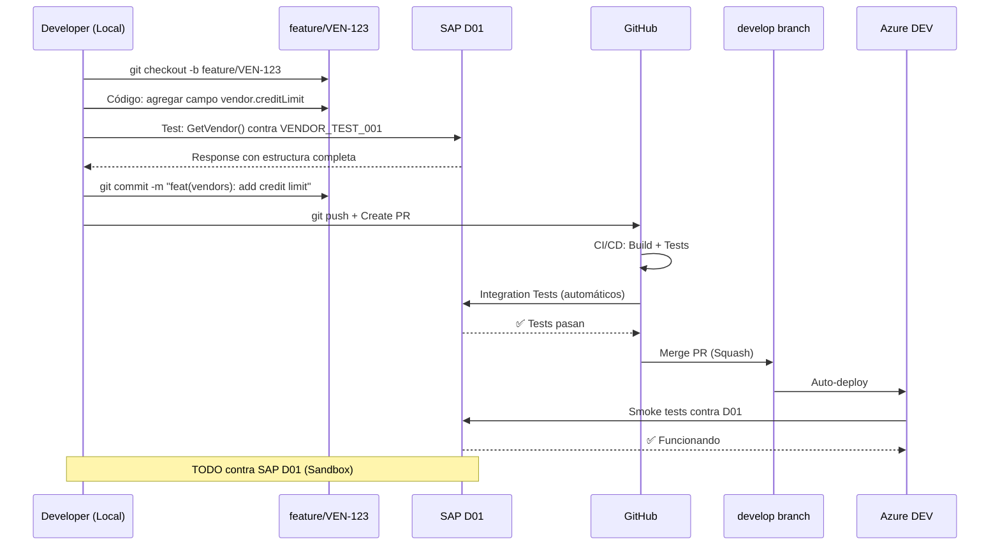
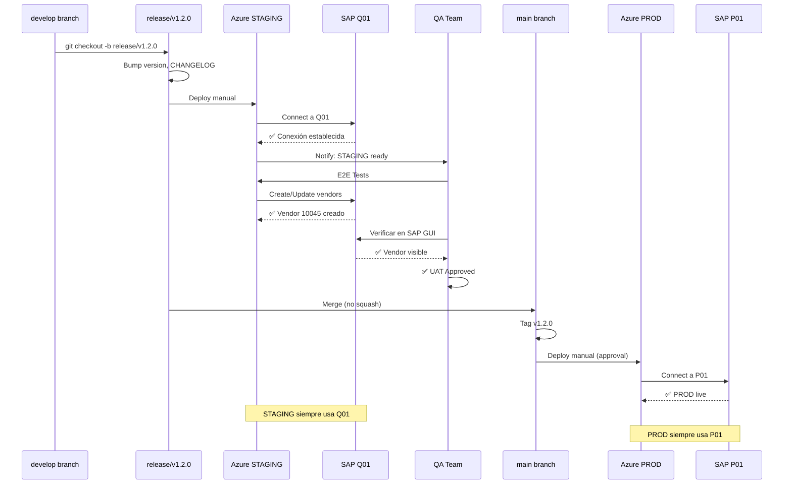
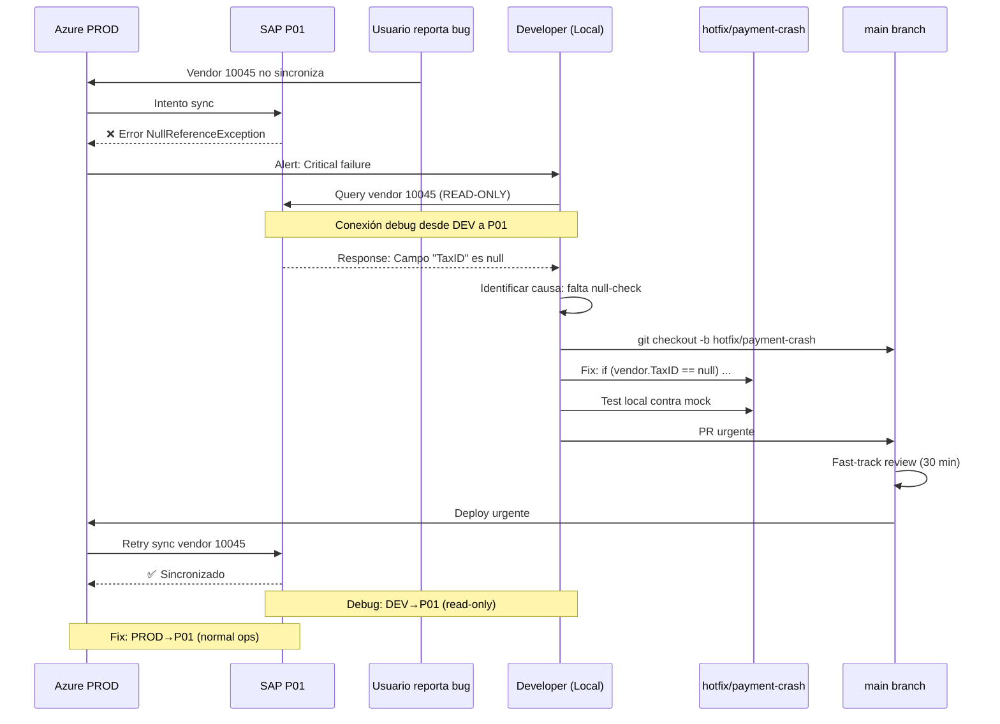

# Branching Strategy ↔ SAP Environment Integration Map

**Versión**: 1.0  
**Fecha**: 17 Diciembre 2025  
**Propósito**: Mapeo visual entre branches de código y ambientes SAP

---

## 🎨 Diagrama Integrado: Git Branches + SAP Landscapes

```
┌─────────────────────────────────────────────────────────────────────────────────┐
│                          PLATFORM GIT BRANCHES                                   │
└─────────────────────────────────────────────────────────────────────────────────┘

    feature/payment-ui
         ╱╲
        ╱  ╲               [DEVELOPMENT PHASE]
       ╱    ╲              👨‍💻 Local Dev
      ●──────●─────●────────────────────────────────────────────●
    Develop Branch (DEV Environment - Azure)                    │
      │                                                          │
      │ [Integration]                                           │ [Testing]
      │                                                          │
      ▼                                                          ▼
    ┌─────────────────────────────────┐              ┌────────────────────────┐
    │    SAP D01 (Development)        │              │  SAP Q01 (Quality)     │
    │  ━━━━━━━━━━━━━━━━━━━━━━━━━━━  │              │  ━━━━━━━━━━━━━━━━━━  │
    │  • Sandbox data                 │              │  • Read-only access    │
    │  • Full R/W/C permissions       │              │  • For validation      │
    │  • Integration tests            │              │  • Ad-hoc testing      │
    │  • Unit tests                   │              │                        │
    └─────────────────────────────────┘              └────────────────────────┘
           ▲                                                    
           │ Default                                            
           │ Connection                                         
           │                                                    

                                release/v1.2.0
                                      ╱│╲
                                     ╱ │ ╲         [PRE-PRODUCTION PHASE]
                                    ╱  │  ╲        🧪 QA & UAT
    ────────────────────────────────────●───────────────────────────────●
                                        │                                │
                           Staging Environment (Azure)                  │
                                        │                                │
                                        ▼                                │
                              ┌────────────────────────┐                │
                              │  SAP Q01 (Quality)     │                │
                              │  ━━━━━━━━━━━━━━━━━━  │                │
                              │  • Production-like data│                │
                              │  • Full R/W permissions│                │
                              │  • E2E testing         │                │
                              │  • UAT environment     │                │
                              │  • Performance tests   │                │
                              └────────────────────────┘                │
                                        │                                │
                                        │ [After QA Approval]           │
                                        ▼                                ▼

    ●───────────────────────────────●──────────────────────────────────●
  Main Branch (PRODUCTION Environment - Azure)      hotfix/critical-bug
      │                                                      │
      │ [PRODUCTION]                                        │ [Emergency only]
      │ 🚀 Live Operations                                  │
      ▼                                                      ▼
    ┌─────────────────────────────────┐              ┌─────────────────────────────────┐
    │    SAP P01 (Production)         │              │    SAP P01 (Production)         │
    │  ━━━━━━━━━━━━━━━━━━━━━━━━━━━  │              │  ━━━━━━━━━━━━━━━━━━━━━━━━━━━  │
    │  • Live business data           │              │  • Same as Main PROD            │
    │  • Controlled R/W permissions   │              │  • Immediate deployment         │
    │  • 24/7 monitoring              │              │  • Minimal change               │
    │  • Only from PROD platform      │              │  • Fast-track approval          │
    └─────────────────────────────────┘              └─────────────────────────────────┘
           ▲                                                    
           │ ONLY Connection                                   
           │ (No alternatives)                                 
           
           
    🔍 DEBUG SCENARIO (Dev environment connecting to PROD for investigation):
    
    Develop (Local) ────┐
                        │ [Read-Only]
                        │ [Only for debugging]
                        │ [Requires special creds]
                        ▼
                  ┌─────────────────────────────────┐
                  │    SAP P01 (Production)         │
                  │  ━━━━━━━━━━━━━━━━━━━━━━━━━━━  │
                  │  • READ ONLY                    │
                  │  • Credential: PORTALDEV_DEBUG  │
                  │  • For issue investigation      │
                  │  • Fully audited & logged       │
                  └─────────────────────────────────┘
```

---

## 📋 Matriz de Conexión: Branch → SAP Environment

| Git Branch | Platform Env | Primary SAP | Secondary SAP | Tertiary SAP | Cuándo y Por Qué |
|------------|--------------|-------------|---------------|--------------|------------------|
| **feature/*** | Local Dev | **D01** | Q01 (opcional) | P01 (read-only) | **Default**: D01 para desarrollo activo.<br/>**Q01**: Validación ad-hoc contra datos reales.<br/>**P01**: Solo para debugging issues reportados (read-only). |
| **develop** | Azure DEV | **D01** | Q01 (ocasional) | P01 (read-only) | **Default**: D01 para integration tests automáticos.<br/>**Q01**: Test suites específicos que requieren datos reales.<br/>**P01**: Investigación de bugs en producción. |
| **release/*** | Azure STAGING | **Q01** | D01 (fallback) | - | **Default**: Q01 para UAT y validación pre-prod.<br/>**D01**: Solo si Q01 no disponible o no actualizado. |
| **main** | Azure PRODUCTION | **P01** | ❌ NINGUNO | ❌ NINGUNO | **SOLO P01**. Sin excepciones. No hay fallback ni alternativas. |
| **hotfix/*** | Azure PRODUCTION | **P01** | ❌ NINGUNO | ❌ NINGUNO | **SOLO P01**. Deploy urgente directo a producción. |

---

## 🔄 Workflows Integrados: Git + SAP

### Workflow 1: Feature Development



**Conexión SAP**: `D01` (Development)  
**Duración típica**: 1-3 días  
**Datos SAP**: Ficticios (VENDOR_TEST_001, etc.)

---

### Workflow 2: Release Process



**STAGING Conexión SAP**: `Q01` (Quality/Pre-prod)  
**PROD Conexión SAP**: `P01` (Production)  
**Duración típica**: 1-2 semanas (freeze → QA → release)  
**Datos SAP Q01**: Copia de producción (refreshed mensualmente)  
**Datos SAP P01**: Datos reales de negocio

---

### Workflow 3: Hotfix Emergency



**Conexión SAP para Debug**: `P01` (read-only desde DEV)  
**Conexión SAP para Fix**: `P01` (desde PROD)  
**Duración**: Horas (urgente)  
**Datos SAP**: Reales (el vendor específico con problema)

---

## 🎯 Decisiones de Conexión por Escenario

### Escenario A: Desarrollando feature "Vendor Credit Rating"

```
┌──────────────────────────────────────────────┐
│ Developer workstation                        │
│  • Branch: feature/VEN-234-credit-rating    │
│  • Ambiente: Local DEV                      │
└─────────────────┬────────────────────────────┘
                  │
                  │ ¿A qué SAP conectar?
                  │
    ┌─────────────┼─────────────┐
    │             │             │
    ▼             ▼             ▼
┌─────────┐  ┌─────────┐  ┌─────────┐
│ SAP D01 │  │ SAP Q01 │  │ SAP P01 │
└─────────┘  └─────────┘  └─────────┘
    ✅            ⚠️           ❌
  DEFAULT     SOLO SI      PROHIBIDO
             NECESITAS     (excepto
             VALIDAR       debug
             ESTRUCTURA    read-only)
             REAL
```

**Decisión**: `D01` ✅  
**Razón**: Datos sandbox, R/W/C permitido, no afecta negocio

---

### Escenario B: QA validando release v1.3.0

```
┌──────────────────────────────────────────────┐
│ Azure STAGING                                │
│  • Branch: release/v1.3.0                   │
│  • Ambiente: STAGING                        │
└─────────────────┬────────────────────────────┘
                  │
                  │ ¿A qué SAP conectar?
                  │
    ┌─────────────┼─────────────┐
    │             │             │
    ▼             ▼             ▼
┌─────────┐  ┌─────────┐  ┌─────────┐
│ SAP D01 │  │ SAP Q01 │  │ SAP P01 │
└─────────┘  └─────────┘  └─────────┘
    ❌            ✅           ❌
 Solo para     DEFAULT     PROHIBIDO
 fallback
 técnico
```

**Decisión**: `Q01` ✅  
**Razón**: Datos realistas, UAT, última validación pre-PROD

---

### Escenario C: Producción operando normalmente

```
┌──────────────────────────────────────────────┐
│ Azure PRODUCTION                             │
│  • Branch: main                             │
│  • Ambiente: PRODUCTION                     │
└─────────────────┬────────────────────────────┘
                  │
                  │ ¿A qué SAP conectar?
                  │
                  ▼
              ┌─────────┐
              │ SAP P01 │
              └─────────┘
                  ✅
              ÚNICAMENTE

┌─────────┐  ┌─────────┐
│ SAP D01 │  │ SAP Q01 │
└─────────┘  └─────────┘
    ❌            ❌
IMPOSIBLE    IMPOSIBLE
(no hay      (no hay
credenciales credenciales
en Prod      en Prod
KeyVault)    KeyVault)
```

**Decisión**: `P01` ✅ (SOLO opción)  
**Razón**: Seguridad, no hay fallback para evitar errores

---

### Escenario D: Developer investigando bug reportado en PROD

```
┌──────────────────────────────────────────────┐
│ Developer workstation (Local)                │
│  • Branch: develop (o feature branch)       │
│  • Ambiente: DEV                            │
│  • Propósito: Investigación                 │
└─────────────────┬────────────────────────────┘
                  │
                  │ ¿A qué SAP conectar?
                  │
                  ▼
              ┌─────────┐
              │ SAP P01 │
              └─────────┘
                  ✅
            READ-ONLY
        (PORTALDEV_DEBUG)
        
        Query específico:
        SELECT * FROM vendor WHERE id = '10045'
        
        NO se puede:
        ❌ Modificar datos
        ❌ Crear vendors
        ❌ Ejecutar transacciones
        
        SÍ se puede:
        ✅ Leer cualquier vendor
        ✅ Ejecutar BAPIs de consulta
        ✅ Ver estructura de datos
```

**Decisión**: `P01` ✅ (read-only)  
**Razón**: Necesitas ver datos REALES para reproducir bug

---

## 🔐 Credentials por Branch/Ambiente

| Platform Env | Branch Pattern | SAP D01 User | SAP Q01 User | SAP P01 User |
|--------------|----------------|--------------|--------------|--------------|
| **Local DEV** | feature/*, develop | `PORTALDEV` (R/W/C) | `PORTALDEV_RO` (read-only) | `PORTALDEV_DEBUG` (read-only) |
| **Azure DEV** | develop | `PORTALDEV` (R/W/C) | `PORTALDEV_RO` (read-only) | `PORTALDEV_DEBUG` (read-only) |
| **Azure STAGING** | release/* | `PORTALQA_DEV` (fallback) | `PORTALQA` (R/W/C) | ❌ Sin acceso |
| **Azure PROD** | main, hotfix/* | ❌ Sin acceso | ❌ Sin acceso | `PORTALPRD` (R/W específico) |

### Azure Key Vault Organization

```
KeyVault: kv-vendormdm-dev
  ├─ SAP-D01-User          → "PORTALDEV"
  ├─ SAP-D01-Password      → "***"
  ├─ SAP-Q01-User-RO       → "PORTALDEV_RO"
  ├─ SAP-Q01-Password-RO   → "***"
  └─ SAP-P01-User-Debug    → "PORTALDEV_DEBUG"
      SAP-P01-Password-Debug → "***"

KeyVault: kv-vendormdm-staging
  ├─ SAP-Q01-User          → "PORTALQA"
  ├─ SAP-Q01-Password      → "***"
  └─ SAP-D01-User          → "PORTALQA_DEV" (fallback)
      SAP-D01-Password     → "***"

KeyVault: kv-vendormdm-prod
  ├─ SAP-P01-User          → "PORTALPRD"
  └─ SAP-P01-Password      → "***"
  # NO hay D01/Q01 credentials aquí
```

---

## 📊 Timeline: Branch Lifecycle + SAP Connections

```
Week 1: Feature Development
┌─────────────────────────────────────┐
│ feature/payment-ui                  │
│ ━━━━━━━━━━━━━━━━━━━━━━━━━━━━━━━  │
│ Developer local                     │
│   ↓ conecta a                       │
│ SAP D01 (sandbox)                   │
│   • Test VENDOR_001                 │
│   • Create/Update/Delete            │
│   • Integration tests               │
└─────────────────────────────────────┘

Week 1: Merge to Develop
┌─────────────────────────────────────┐
│ develop branch                      │
│ ━━━━━━━━━━━━━━━━━━━━━━━━━━━━━━━  │
│ Azure DEV environment               │
│   ↓ conecta a                       │
│ SAP D01 (sandbox)                   │
│   • Automated CI/CD tests           │
│   • Smoke tests                     │
└─────────────────────────────────────┘

Week 2-3: Release Preparation
┌─────────────────────────────────────┐
│ release/v1.2.0                      │
│ ━━━━━━━━━━━━━━━━━━━━━━━━━━━━━━━  │
│ Azure STAGING environment           │
│   ↓ conecta a                       │
│ SAP Q01 (quality)                   │
│   • QA full test suites             │
│   • UAT with business users         │
│   • Performance testing             │
│   • Real vendor data (anonymized)   │
└─────────────────────────────────────┘

Week 3: Production Release
┌─────────────────────────────────────┐
│ main branch                         │
│ ━━━━━━━━━━━━━━━━━━━━━━━━━━━━━━━  │
│ Azure PROD environment              │
│   ↓ conecta a                       │
│ SAP P01 (production)                │
│   • Live operations                 │
│   • Real business vendors           │
│   • 24/7 monitoring                 │
└─────────────────────────────────────┘

Emergency: Hotfix
┌─────────────────────────────────────┐
│ hotfix/critical-bug                 │
│ ━━━━━━━━━━━━━━━━━━━━━━━━━━━━━━━  │
│ Azure PROD environment (urgente)    │
│   ↓ conecta a                       │
│ SAP P01 (production)                │
│   • Immediate fix deployment        │
│   • Minimal change                  │
│   • Fast-track testing              │
└─────────────────────────────────────┘
```

---

## ✅ Reglas de Oro

### Regla 1: PROD solo toca P01
```
❌ NUNCA: Platform PROD → SAP D01
❌ NUNCA: Platform PROD → SAP Q01
✅ SIEMPRE: Platform PROD → SAP P01 únicamente
```

### Regla 2: DEV puede leer P01, pero solo para debug
```
✅ OK: Platform DEV → SAP P01 (read-only, para investigar)
❌ NO: Platform DEV → SAP P01 (write/create)
✅ DEFAULT: Platform DEV → SAP D01 (desarrollo normal)
```

### Regla 3: STAGING es el gatekeeper de calidad
```
✅ STAGING → SAP Q01 (validación con datos reales)
⚠️ STAGING → SAP D01 (solo fallback técnico)
❌ STAGING → SAP P01 (prohibido, usarías datos reales)
```

### Regla 4: Branch efímero = Conexión temporal
```
feature/* branch → SAP D01 (mientras dura el desarrollo)
release/* branch → SAP Q01 (mientras dura QA)
Después de merge → Las conexiones desaparecen con el branch
```

### Regla 5: Coordinación con SAP Basis
```
SAP Transport: D01 → Q01 → P01
Platform Release: DEV → STAGING → PROD

Ambos deben sincronizarse:
  • SAP agrega campo en D01 → Platform codifica feature
  • SAP transporta a Q01 → Platform valida en STAGING
  • SAP transporta a P01 → Platform deploya a PROD
```

---

## 🎓 Preguntas Comunes

### ¿Por qué DEV no usa Q01 por default?

**Porque Q01 tiene datos realistas que NO debes modificar libremente durante desarrollo.**

- D01 = Sandbox para "romper cosas"
- Q01 = Pre-prod para "validar cosas"

### ¿Puedo desarrollar features contra P01 directamente?

**❌ NO. Absolutamente prohibido.**

Incluso con read-only, no debes desarrollar contra P01 porque:
- Latencia real de producción (lento)
- Podrías saturar SAP con queries
- No tienes control de datos de prueba
- Es un riesgo de seguridad

### ¿Qué hago si SAP D01 está down?

**Opción 1**: Usar mocks locales (recomendado)  
**Opción 2**: Switch temporal a Q01 (read-only)  
**Opción 3**: Esperar a que D01 esté disponible

**NO usar P01 como alternativa.**

### ¿STAGING puede escribir a Q01?

**✅ SÍ, es el propósito.**

Q01 es para testing exhaustivo, incluido:
- Crear vendors de prueba
- Modificar datos
- Probar transacciones completas
- Ejecutar performance tests

Coordinación con SAP Basis para refresh periódico de Q01.

---

## 📝 Checklist de Implementación

### Para cada nuevo branch de feature:

- [ ] Verificar que `appsettings.Development.json` apunta a SAP D01
- [ ] Confirmar credenciales `PORTALDEV` en Key Vault
- [ ] Crear vendors de prueba en SAP D01 (ej: `VENDOR_TEST_XXX`)
- [ ] Escribir integration tests contra D01
- [ ] Documentar cualquier estructura de datos nueva en SAP

### Para cada release branch:

- [ ] Desplegar a Azure STAGING
- [ ] Confirmar conexión a SAP Q01
- [ ] Coordinar con SAP Basis: ¿Q01 tiene los cambios de D01?
- [ ] Ejecutar smoke tests
- [ ] QA ejecuta full test suite
- [ ] Business users ejecutan UAT
- [ ] Aprobar para PROD solo después de Q01 validation ✅

### Para cada deploy a PROD:

- [ ] Confirmar `appsettings.Production.json` SOLO tiene P01
- [ ] Verificar credenciales `PORTALPRD` en Key Vault PROD
- [ ] No hay credenciales D01/Q01 en PROD Key Vault
- [ ] Monitoreo activo post-deploy
- [ ] Alertas configuradas para fallos SAP P01

---

**Documento Mantenido Por**: Platform Architecture Team  
**Última Revisión**: 2025-12-17  
**Próxima Revisión**: Post-primera implementación
