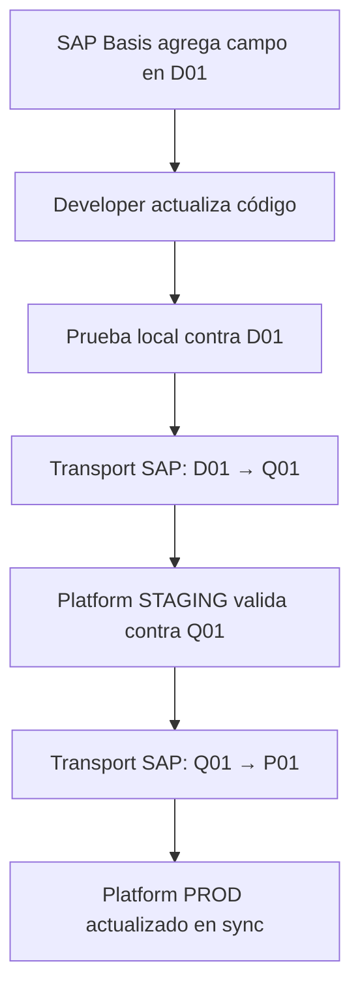

# Estrategia de Integración: Ambientes SAP ↔ Vendor MDM Platform

**Versión**: 1.0  
**Fecha**: 17 Diciembre 2025  
**Propósito**: Definir el mapeo estratégico entre ambientes SAP y Vendor MDM Platform

---

## 🎯 Resumen Ejecutivo

### El Problema

Ambos sistemas tienen ambientes con nombres **similares pero propósitos diferentes**:

| Vendor MDM Platform | SAP (Tu Landscape) |
|---------------------|-------------------|
| DEV | D01 (Desarrollo) |
| STAGING | Q01 (Quality) |
| PRODUCTION | P01 (Producción) |

**La pregunta crítica**: ¿Platform DEV → SAP D01? ¿Platform STAGING → SAP Q01? ¿Platform PROD → SAP P01?

### La Respuesta

❌ **NO hay mapeo 1:1 automático**  
✅ **La relación es FLEXIBLE y basada en el contexto de uso**

---

## 📊 Principios Fundamentales

### Principio 1: Los Ambientes NO Son Equivalentes

Los ambientes de una plataforma custom (Vendor MDM Portal) sirven para **desarrollo de la plataforma misma**. Los ambientes SAP sirven para **gestionar datos empresariales y procesos de negocio**.

```
Vendor MDM Platform DEV = Donde desarrollas EL CÓDIGO de tu portal
SAP D01 = Donde SAP desarrolla SUS configuraciones y BAPIs

Estos NO son el mismo concepto
```

### Principio 2: La Relación es de Configuración, No de Infraestructura

Cada ambiente de tu plataforma puede **conectarse a CUALQUIER ambiente SAP** mediante configuración:

```typescript
// Platform DEV puede conectarse a:
- SAP D01 (desarrollo de integraciones)
- SAP Q01 (validar contra datos reales)
- SAP P01 (debugging en producción, con credenciales read-only)
```

### Principio 3: Multi-Tenancy de Configuración SAP

Tu plataforma debe soportar **múltiples conexiones SAP simultáneamente**:

```json
{
  "sapConnections": {
    "development": { "host": "sap-dev", "client": "100", "env": "D01" },
    "quality": { "host": "sap-qas", "client": "200", "env": "Q01" },
    "production": { "host": "sap-prd", "client": "300", "env": "P01" }
  },
  "activeConnection": "development" // Configurable por ambiente
}
```

---

## 🏗️ Estrategia de Mapeo Recomendada

### Modelo: **Multi-Target Connection Strategy**

Cada ambiente de Vendor MDM Platform tiene **configuraciones para TODOS** los ambientes SAP, pero usa uno por defecto:

| Platform Environment | Default SAP Target | Secondary Targets | Rationale |
|----------------------|-------------------|-------------------|-----------|
| **DEV (Local/Azure)** | SAP D01 | Q01 (testing), P01 (debugging read-only) | Integración activa en desarrollo. Necesitas probar contra D01 para no afectar datos reales. |
| **STAGING (Azure)** | SAP Q01 | D01 (fallback), P01 (smoke tests) | Pre-producción requiere validación end-to-end con datos de calidad. |
| **PRODUCTION (Azure)** | SAP P01 | - | Producción SOLO conecta a producción. Sin excepciones. |

---

## 🔧 Arquitectura Técnica

### Configuración por Ambiente

#### **Backend: `appsettings.{Environment}.json`**

```json
// appsettings.Development.json
{
  "SapEnvironments": {
    "Available": ["D01", "Q01", "P01"],
    "Active": "D01",
    "Connections": {
      "D01": {
        "Host": "sap-dev-server.company.com",
        "SystemNumber": "00",
        "Client": "100",
        "User": "{FROM_KEY_VAULT}",
        "Password": "{FROM_KEY_VAULT}",
        "Language": "ES",
        "Permissions": ["READ", "WRITE", "CREATE"]
      },
      "Q01": {
        "Host": "sap-qas-server.company.com",
        "SystemNumber": "01",
        "Client": "200",
        "User": "{FROM_KEY_VAULT}",
        "Password": "{FROM_KEY_VAULT}",
        "Language": "ES",
        "Permissions": ["READ", "WRITE"] // No CREATE en QA
      },
      "P01": {
        "Host": "sap-prd-server.company.com",
        "SystemNumber": "02",
        "Client": "300",
        "User": "{FROM_KEY_VAULT}",
        "Password": "{FROM_KEY_VAULT}",
        "Language": "ES",
        "Permissions": ["READ"] // Solo lectura para debugging
      }
    }
  }
}

// appsettings.Staging.json
{
  "SapEnvironments": {
    "Active": "Q01", // STAGING usa SAP QA
    "Connections": { /* ... */ }
  }
}

// appsettings.Production.json
{
  "SapEnvironments": {
    "Active": "P01", // PROD usa SAP PROD
    "Available": ["P01"], // SOLO P01, sin opciones
    "Connections": {
      "P01": { /* ... */ }
    }
  }
}
```

### Implementación C#

```csharp
// Services/SapConnectionService.cs
public class SapConnectionService : ISapConnectionService
{
    private readonly IConfiguration _configuration;
    private readonly IKeyVaultService _keyVault;
    private readonly ILogger<SapConnectionService> _logger;
    private readonly Dictionary<string, IRfcConnection> _connections;

    public SapConnectionService(IConfiguration config, IKeyVaultService keyVault, ILogger<SapConnectionService> logger)
    {
        _configuration = config;
        _keyVault = keyVault;
        _logger = logger;
        _connections = new Dictionary<string, IRfcConnection>();
    }

    public async Task<IRfcConnection> GetConnectionAsync(string environmentCode = null)
    {
        // Si no se especifica, usar el activo
        environmentCode ??= _configuration["SapEnvironments:Active"];
        
        // Validar que el ambiente está disponible
        var availableEnvs = _configuration.GetSection("SapEnvironments:Available").Get<string[]>();
        if (!availableEnvs.Contains(environmentCode))
        {
            throw new UnauthorizedAccessException(
                $"SAP environment '{environmentCode}' is not available in this platform environment.");
        }

        // Reutilizar conexión si existe
        if (_connections.TryGetValue(environmentCode, out var existingConn))
            return existingConn;

        // Crear nueva conexión
        var connConfig = _configuration.GetSection($"SapEnvironments:Connections:{environmentCode}");
        
        var sapConfig = new RfcConfigParameters
        {
            { RfcConfigParameters.AppServerHost, connConfig["Host"] },
            { RfcConfigParameters.SystemNumber, connConfig["SystemNumber"] },
            { RfcConfigParameters.Client, connConfig["Client"] },
            { RfcConfigParameters.User, await _keyVault.GetSecretAsync($"SAP-{environmentCode}-User") },
            { RfcConfigParameters.Password, await _keyVault.GetSecretAsync($"SAP-{environmentCode}-Password") },
            { RfcConfigParameters.Language, connConfig["Language"] }
        };

        var connection = RfcConnectionFactory.CreateConnection(sapConfig);
        _connections[environmentCode] = connection;

        _logger.LogInformation(
            "Established SAP connection to {Environment} ({Host})", 
            environmentCode, connConfig["Host"]);

        return connection;
    }

    public async Task<T> ExecuteBapiAsync<T>(
        string bapiName, 
        Dictionary<string, object> parameters, 
        string targetEnvironment = null)
    {
        var connection = await GetConnectionAsync(targetEnvironment);
        
        // Validar permisos
        var permissions = _configuration
            .GetSection($"SapEnvironments:Connections:{targetEnvironment ?? _configuration["SapEnvironments:Active"]}:Permissions")
            .Get<string[]>();

        if (IsWriteOperation(bapiName) && !permissions.Contains("WRITE"))
        {
            throw new UnauthorizedAccessException(
                $"Write operations not allowed on SAP {targetEnvironment ?? "active environment"}");
        }

        // Ejecutar BAPI
        using var function = connection.CreateFunction(bapiName);
        // ... lógica de ejecución ...
        
        return result;
    }
}
```

### Selector de Ambiente (Opcional para Dev/Staging)

```csharp
// Controllers/SapEnvironmentController.cs
[ApiController]
[Route("api/admin/sap-environment")]
[Authorize(Roles = "Administrator")]
public class SapEnvironmentController : ControllerBase
{
    [HttpGet("available")]
    public IActionResult GetAvailableEnvironments()
    {
        var available = _configuration.GetSection("SapEnvironments:Available").Get<string[]>();
        var active = _configuration["SapEnvironments:Active"];
        
        return Ok(new { available, active });
    }

    [HttpPost("switch")]
    public async Task<IActionResult> SwitchEnvironment([FromBody] string targetEnv)
    {
        // Solo permitido en DEV y STAGING, NUNCA en PROD
        if (_hostEnvironment.IsProduction())
        {
            return Forbid("Cannot switch SAP environment in production");
        }

        // Validar y cambiar
        var available = _configuration.GetSection("SapEnvironments:Available").Get<string[]>();
        if (!available.Contains(targetEnv))
        {
            return BadRequest($"Environment {targetEnv} not available");
        }

        // Actualizar runtime config (implementar con IOptionsSnapshot o similar)
        await _sapService.SwitchEnvironmentAsync(targetEnv);
        
        _logger.LogWarning(
            "SAP environment switched to {Target} by {User}", 
            targetEnv, User.Identity.Name);

        return Ok(new { message = $"Switched to {targetEnv}", active = targetEnv });
    }
}
```

---

## 🧪 Estrategia de Testing por Ambiente

### DEV (Local + Azure DEV)

**Objetivo**: Desarrollo de integraciones sin riesgo

```yaml
Conexión Default: SAP D01
Testing Pattern:
  - Unit Tests: Mocked SAP responses (sin conexión real)
  - Integration Tests: SAP D01 (sandbox data)
  - End-to-End Tests: SAP D01 → Platform DEV
  
Datos:
  - SAP D01 contiene vendors ficticios (VENDOR0001, TEST_VENDOR, etc.)
  - Sincronización cada vez que se ejecuta test suite
  
Workflow Típico:
  1. Desarrollador escribe código de integración
  2. Prueba localmente contra SAP D01
  3. Push a develop branch
  4. CI/CD deploys a Azure DEV
  5. Azure DEV también apunta a SAP D01
  6. Tests automáticos validan contra SAP D01
```

**Configuración de Testing**:

```csharp
// Tests/SapIntegrationTests.cs
[TestClass]
public class SapVendorSyncTests
{
    [TestMethod]
    [TestCategory("Integration")]
    public async Task Should_Sync_Vendor_From_SAP_D01()
    {
        // Arrange
        var sapService = new SapConnectionService(GetDevConfig());
        var testVendorId = "VENDOR_TEST_001";

        // Act
        var vendor = await sapService.GetVendorAsync(testVendorId, targetEnvironment: "D01");

        // Assert
        Assert.IsNotNull(vendor);
        Assert.AreEqual("Test Vendor Ltd", vendor.Name);
    }

    [TestMethod]
    [TestCategory("Integration")]
    [Ignore] // Solo ejecutar manualmente cuando se quiere validar contra QA
    public async Task Should_Validate_Against_SAP_Q01()
    {
        // Prueba ocasional contra datos de calidad
        var sapService = new SapConnectionService(GetDevConfig());
        var realVendorId = "10001"; // Vendor real en Q01

        var vendor = await sapService.GetVendorAsync(realVendorId, targetEnvironment: "Q01");

        Assert.IsNotNull(vendor);
        // Validaciones contra estructura real
    }
}
```

---

### STAGING (Azure STAGING)

**Objetivo**: Validación pre-producción con datos reales

```yaml
Conexión Default: SAP Q01
Testing Pattern:
  - Smoke Tests: Verificar conectividad básica
  - End-to-End Tests: Flujos completos con datos de calidad
  - UAT (User Acceptance Testing): Usuarios de negocio prueban aquí
  - Performance Tests: Volumen realista de datos

Datos:
  - SAP Q01 contiene copia de producción (anonymizada si hay PII)
  - Sincronización semanal o mensual desde P01
  
Workflow Típico:
  1. Release branch creado desde develop
  2. Deploy manual a Azure STAGING
  3. STAGING apunta a SAP Q01
  4. QA team ejecuta test suites completos
  5. Business users hacen UAT
  6. Si todo pasa → aprobación para PROD
```

**Tests en STAGING**:

```yaml
# Azure DevOps / GitHub Actions
- stage: StagingValidation
  dependsOn: DeployToStaging
  jobs:
    - job: SmokeTests
      steps:
        - task: RunPostmanCollection
          inputs:
            collection: 'smoke-tests.json'
            environment: 'staging' # Apunta a STAGING que usa SAP Q01
            
    - job: E2ETests
      steps:
        - task: RunPlaywrightTests
          inputs:
            testSuite: 'e2e-vendor-sync'
            # Valida flujo completo:
            # 1. Crear vendor en Platform STAGING
            # 2. Sincronizar a SAP Q01
            # 3. Verificar que aparece en SAP
            # 4. Modificar en SAP Q01
            # 5. Webhook notifica a Platform STAGING
            # 6. Verificar actualización en Platform
```

---

### PRODUCTION (Azure PRODUCTION)

**Objetivo**: Operación en vivo, estabilidad máxima

```yaml
Conexión: SAP P01 (ÚNICAMENTE)
Monitoring:
  - Application Insights: Todas las llamadas SAP
  - Alertas: Latencia > 2s, Errores > 1%
  - Logs: Auditoría completa de operaciones

Restricciones:
  - NO hay ambiente de "switch" (hardcoded P01)
  - Credenciales con permisos mínimos (READ/WRITE específicos)
  - Rate limiting estricto
  - Circuit breaker para fallos SAP

Workflow Típico:
  1. Release aprobado en STAGING
  2. Deploy a PRODUCTION (manual, aprobación doble)
  3. PROD conecta SOLO a SAP P01
  4. Monitoreo 24/7
  5. En caso de issues → rollback inmediato
```

---

## 🔒 Seguridad y Credenciales

### Estrategia de Credenciales por Ambiente

```yaml
Azure Key Vault Structure:
  development:
    - SAP-D01-User: "PORTALDEV"
    - SAP-D01-Password: "***"
    - SAP-Q01-User-ReadOnly: "PORTALDEV_RO" # Para consultas a QA
    - SAP-Q01-Password-ReadOnly: "***"
    - SAP-P01-User-ReadOnly: "PORTALDEV_DEBUG" # Solo debugging
    - SAP-P01-Password-ReadOnly: "***"
    
  staging:
    - SAP-Q01-User: "PORTALQA"
    - SAP-Q01-Password: "***"
    - SAP-D01-User: "PORTALQA_DEV" # Fallback
    - SAP-D01-Password: "***"
    
  production:
    - SAP-P01-User: "PORTALPRD"
    - SAP-P01-Password: "***"
    # NO hay credenciales para D01 o Q01 en PROD
```

### Permisos SAP por Cuenta

| Usuario SAP | Ambiente SAP | Permisos | Usado desde |
|-------------|--------------|----------|-------------|
| PORTALDEV | D01 | READ, WRITE, CREATE, DEBUG | Platform DEV |
| PORTALDEV_RO | Q01 | READ | Platform DEV (testing ad-hoc) |
| PORTALDEV_DEBUG | P01 | READ | Platform DEV (debugging producción) |
| PORTALQA | Q01 | READ, WRITE, CREATE | Platform STAGING |
| PORTALPRD | P01 | READ, WRITE, CREATE (BAPIs específicos) | Platform PRODUCTION |

---

## 📋 Casos de Uso y Decisiones

### Caso 1: Desarrollando Nueva Funcionalidad

**Escenario**: Agregar campo "Credit Limit" a vendor sync

```
Developer → Platform DEV (local)
            ↓ conecta a
          SAP D01

Pasos:
1. Crear campo en Platform DB (migration)
2. Actualizar BAPI call para leer "CREDIT_LIMIT"
3. Probar contra vendor ficticio "VENDOR_TEST_001" en SAP D01
4. Unit tests con mock
5. Integration test contra SAP D01 real
6. Push a develop
7. CI/CD → Azure DEV (también usa SAP D01)
8. Tests pasan ✅
```

**Decisión**: Platform DEV → SAP D01 ✅

---

### Caso 2: Debugging Issue Reportado en Producción

**Escenario**: Usuario reporta que vendor "10045" no sincroniza

```
Developer → Platform DEV (local)
            ↓ switch manual a
          SAP P01 (read-only)

Pasos:
1. Ejecutar query contra SAP P01 para vendor "10045"
2. Analizar estructura de datos real
3. Identificar que "P01" tiene campo adicional no mapeado
4. Reproducir localmente con datos copiados
5. Fix en Platform DEV contra SAP D01
6. Validar en STAGING contra SAP Q01
7. Deploy a PROD
```

**Decisión**: Platform DEV puede consultar SAP P01 (read-only) para debugging ✅

---

### Caso 3: Pre-Producción UAT

**Escenario**: Business quiere validar flujo completo antes de release

```
QA Team → Platform STAGING
          ↓ conecta a
        SAP Q01

Pasos:
1. QA crea vendor "UAT_VENDOR_001" en Platform STAGING
2. Platform STAGING sincroniza a SAP Q01
3. SAP Basis team confirma creación en Q01
4. QA modifica vendor en SAP Q01 manualmente
5. SAP Q01 envía webhook a Platform STAGING
6. QA verifica actualización en Platform STAGING
7. Aprobación para PROD ✅
```

**Decisión**: Platform STAGING → SAP Q01 ✅

---

### Caso 4: Producción en Vivo

**Escenario**: Operación diaria

```
End Users → Platform PRODUCTION
            ↓ conecta a
          SAP P01

Operaciones:
- Crear vendors → SAP P01
- Modificar vendors → SAP P01
- Consultar vendors → SAP P01
- Webhooks desde SAP P01 → Platform PROD

NO hay switches, NO hay fallbacks
```

**Decisión**: Platform PRODUCTION → SAP P01 **ÚNICAMENTE** ✅

---

## 🎛️ Gestión de Configuración

### Configuración Dinámica (Dev/Staging)

**Frontend UI para Admins**:

```typescript
// components/admin/SapEnvironmentSelector.tsx
export function SapEnvironmentSelector() {
  const [availableEnvs, setAvailableEnvs] = useState<string[]>([]);
  const [activeEnv, setActiveEnv] = useState<string>('');
  const [isProd, setIsProd] = useState(false);

  useEffect(() => {
    fetch('/api/admin/sap-environment/available')
      .then(res => res.json())
      .then(data => {
        setAvailableEnvs(data.available);
        setActiveEnv(data.active);
        setIsProd(data.available.length === 1 && data.available[0] === 'P01');
      });
  }, []);

  const handleSwitch = async (targetEnv: string) => {
    if (isProd) {
      alert('Cannot switch SAP environment in production!');
      return;
    }

    const confirmed = confirm(
      `Switch SAP connection from ${activeEnv} to ${targetEnv}?\n` +
      `This will affect all SAP operations immediately.`
    );

    if (!confirmed) return;

    try {
      const response = await fetch('/api/admin/sap-environment/switch', {
        method: 'POST',
        headers: { 'Content-Type': 'application/json' },
        body: JSON.stringify(targetEnv)
      });

      if (response.ok) {
        setActiveEnv(targetEnv);
        toast.success(`Switched to SAP ${targetEnv}`);
      }
    } catch (error) {
      toast.error('Failed to switch environment');
    }
  };

  if (isProd) {
    return (
      <div className="alert alert-info">
        <strong>SAP Environment:</strong> P01 (Production)
        <br />
        <small>Switching is disabled in production</small>
      </div>
    );
  }

  return (
    <div className="card">
      <h4>Active SAP Environment: {activeEnv}</h4>
      <div className="btn-group">
        {availableEnvs.map(env => (
          <button
            key={env}
            className={`btn ${env === activeEnv ? 'btn-primary' : 'btn-outline-secondary'}`}
            onClick={() => handleSwitch(env)}
            disabled={env === activeEnv}
          >
            {env}
          </button>
        ))}
      </div>
    </div>
  );
}
```

---

## 📊 Matriz de Decisión

### ¿Qué ambiente SAP usar en cada situación?

| Situación | Platform Env | SAP Target | Razón |
|-----------|-------------|------------|-------|
| Desarrollo de feature | DEV | **D01** | Aislamiento, datos de prueba |
| Debugging local | DEV | **D01** (default) o **P01** (read-only) | D01 para desarrollo, P01 para investigación |
| Unit tests | DEV | **Mock** | Velocidad, no requiere SAP real |
| Integration tests | DEV | **D01** | Validar contra SAP real sin riesgo |
| CI/CD automated tests | Azure DEV | **D01** | Consistencia con dev local |
| Pre-release validation | STAGING | **Q01** | Datos realistas, ambiente seguro |
| User Acceptance Testing | STAGING | **Q01** | Business users validan con datos reales |
| Performance testing | STAGING | **Q01** | Volumen realista de datos |
| Production operations | PRODUCTION | **P01** | Único ambiente válido |
| Production debugging | DEV | **P01** (read-only) | Investigar issues sin tocar PROD |
| Disaster recovery testing | STAGING | **Q01** → simula **P01** | DR siempre en pre-prod primero |

---

## ⚠️ Antipatrones a Evitar

### ❌ Antipatrón 1: Mapeo 1:1 Rígido

```
MAL:
Platform DEV → SOLO SAP D01 (bloqueado)
Platform STAGING → SOLO SAP Q01 (bloqueado)
Platform PROD → SOLO SAP P01 (bloqueado)

Problema: No puedes debuggear PROD, no puedes validar contra QA desde DEV
```

```
BIEN:
Platform DEV → Default D01, puede switch a Q01/P01 (con permisos apropiados)
Platform STAGING → Default Q01, puede acceder D01 (fallback)
Platform PROD → SOLO P01 (sin excepciones)
```

---

### ❌ Antipatrón 2: Credenciales Compartidas

```
MAL:
Todos los ambientes usan "PORTAL_USER" con password compartido

Problema: Si DEV se compromete, PROD también
```

```
BIEN:
DEV → PORTALDEV (permisos amplios en D01, read-only en Q01/P01)
STAGING → PORTALQA (permisos amplios en Q01)
PROD → PORTALPRD (permisos mínimos necesarios en P01)
```

---

### ❌ Antipatrón 3: Producción Escribe a SAP D01/Q01

```
MAL:
Platform PROD escribe vendors a SAP D01 "para testing en paralelo"

Problema: Contaminación de datos, confusión, riesgo de seguridad
```

```
BIEN:
Platform PROD SOLO puede conectarse a SAP P01
Imposible escribir a D01/Q01 desde código en PROD
```

---

### ❌ Antipatrón 4: Hardcodear Conexión SAP

```csharp
// MAL
public async Task<Vendor> GetVendorAsync(string id)
{
    var conn = RfcConnectionFactory.Create("sap-dev-server"); // Hardcoded!
    // ...
}
```

```csharp
// BIEN
public async Task<Vendor> GetVendorAsync(string id, string sapEnvironment = null)
{
    var conn = await _sapConnectionService.GetConnectionAsync(sapEnvironment);
    // Connection determinada por config y ambiente actual
}
```

---

## 🔄 Workflow de Cambios SAP

### Cuando SAP Cambia Estructura (Ej: Nuevo Campo en BAPI)



**Coordinación requerida**:
1. SAP Basis notifica cambios planeados
2. Platform team sincroniza releases
3. Testing en cascada (D01 → Q01 → P01)

---

## 📈 Monitoreo y Observabilidad

### Métricas Clave por Ambiente

```yaml
Application Insights Queries:

# Conexiones SAP por ambiente
customMetrics
| where name == "SapConnectionEstablished"
| extend sapEnv = tostring(customDimensions.SapEnvironment)
| extend platformEnv = tostring(customDimensions.PlatformEnvironment)
| summarize count() by sapEnv, platformEnv, bin(timestamp, 1h)

# Errores de integración
exceptions
| where customDimensions.Component == "SapIntegration"
| extend sapEnv = tostring(customDimensions.SapEnvironment)
| extend bapiName = tostring(customDimensions.BapiName)
| summarize count() by sapEnv, bapiName, bin(timestamp, 5m)

# Latencia por ambiente SAP
dependencies
| where name startswith "SAP_"
| extend sapEnv = tostring(customDimensions.SapEnvironment)
| summarize avg(duration), percentile(duration, 95), percentile(duration, 99) by sapEnv
```

### Alertas

```yaml
Alerts:
  - name: "SAP D01 Slow Response (Dev/Staging)"
    condition: Avg latency > 3s en D01
    severity: Warning
    action: Notify dev team
    
  - name: "SAP Q01 Connection Failure (Staging)"
    condition: >5 failures en 5min en Q01 desde STAGING
    severity: High
    action: Notify QA lead + Platform lead
    
  - name: "SAP P01 Connection Failure (Production)"
    condition: >3 failures en 1min en P01 desde PROD
    severity: Critical
    action: Page on-call + Auto-rollback if possible
    
  - name: "Unexpected SAP Environment Access"
    condition: PROD accede a D01 o Q01
    severity: Critical
    action: Page security team + Block immediately
```

---

## 🎓 FAQs

### ¿Platform DEV puede conectarse a SAP P01?

**Sí, pero con RESTRICCIONES**:
- Solo lectura (READ permissions)
- Solo para debugging de issues reportados
- Requiere credenciales específicas (PORTALDEV_DEBUG)
- Auditado y loggeado
- Nunca por default, solo manual

### ¿Platform STAGING debe usar SAP Q01 o SAP D01?

**SAP Q01** por default porque:
- Q01 tiene datos realistas (copia de PROD)
- Permite UAT con business users
- Valida performance con volumen real
- Es el último checkpoint antes de PROD

**SAP D01** como fallback solo si:
- Q01 está down
- Q01 aún no tiene los cambios transportados
- Testing de regresión rápida

### ¿Qué pasa si SAP D01 y Q01 tienen diferentes versiones de BAPI?

**Estrategia de Versionado**:

```csharp
public async Task<Vendor> GetVendorAsync(string id, string sapEnvironment = null)
{
    var env = sapEnvironment ?? _config["SapEnvironments:Active"];
    var bapiVersion = await DetectBapiVersion(env);

    return bapiVersion switch
    {
        "V1" => await GetVendorV1(id, env),
        "V2" => await GetVendorV2(id, env),
        _ => throw new NotSupportedException($"BAPI version {bapiVersion} not supported")
    };
}

private async Task<string> DetectBapiVersion(string sapEnvironment)
{
    // Query SAP metadata o usar config estática
    return _config[$"SapEnvironments:Connections:{sapEnvironment}:BapiVersion"];
}
```

### ¿Necesito sincronizar Platform DEV/STAGING/PROD con cambios SAP?

**No directamente**. Los cambios SAP deben ser **backward compatible** durante el período de transición:

```
Timeline de cambio SAP:
Week 1: SAP D01 actualizado (nuevo campo opcional)
Week 2: Platform DEV cod update → usa nuevo campo si presente
Week 3: SAP Q01 actualizado → Platform STAGING valida
Week 4: SAP P01 actualizado → Platform PROD ya compatible
```

**Coordinación mediante**:
- Change Advisory Board (CAB) meetings
- Shared release calendar
- Feature flags para cambios grandes

---

## 📝 Checklist de Implementación

### Fase 1: Configuración Básica

- [ ] Definir estructura de `appsettings.{Environment}.json` para SAP
- [ ] Crear conexiones en Azure Key Vault para cada ambiente SAP
- [ ] Solicitar usuarios SAP con permisos apropiados (PORTALDEV, PORTALQA, PORTALPRD)
- [ ] Implementar `SapConnectionService` con multi-target support
- [ ] Configurar Application Insights para tracking de conexiones SAP

### Fase 2: Desarrollo y Testing

- [ ] Platform DEV apunta a SAP D01 por default
- [ ] Crear datos de prueba en SAP D01 (vendors ficticios)
- [ ] Implementar integration tests contra SAP D01
- [ ] Documentar flujo de switch manual a Q01/P01 (solo en DEV)

### Fase 3: Staging

- [ ] Platform STAGING apunta a SAP Q01 por default
- [ ] Coordinar con SAP Basis para refresh de datos Q01 desde P01
- [ ] Implementar smoke tests automatizados
- [ ] Definir proceso de UAT con business users

### Fase 4: Producción

- [ ] Platform PROD configurado SOLO para SAP P01
- [ ] Validar que NO hay credenciales para D01/Q01 en PROD Key Vault
- [ ] Implementar alertas críticas para fallos en P01
- [ ] Documentar runbook de disaster recovery

### Fase 5: Monitoreo y Mejora

- [ ] Dashboards de Application Insights por ambiente SAP
- [ ] Alertas configuradas y probadas
- [ ] Documentación de troubleshooting
- [ ] Proceso de post-mortem para incidents

---

## 📚 Referencias

- [SAP Integration Best Practices](https://www.sap.com/products/technology-platform/integration-suite.html)
- [SAP Landscape Management](https://help.sap.com/docs/landscape-management)
- [Azure Key Vault Best Practices](https://learn.microsoft.com/en-us/azure/key-vault/general/best-practices)
- Vendor MDM Platform: `docs/architecture_design.md`
- SAP Function Development: `docs/integration/sap-integration-phase1.md`

---

**Última Actualización**: 2025-12-17  
**Próxima Revisión**: Post-implementación (Q1 2026)  
**Mantenido por**: Platform Architecture Team
