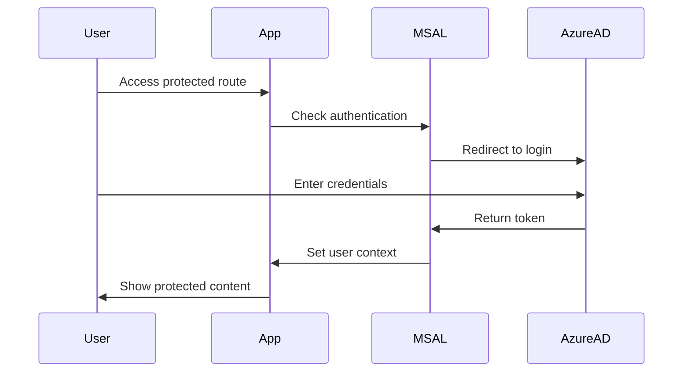
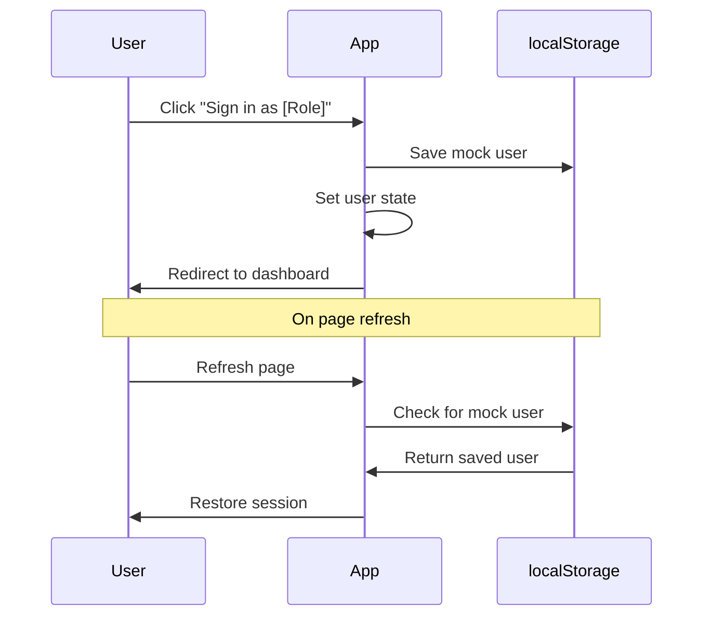

# Frontend Authentication Implementation

## Overview

The Vendor MDM Portal implements a dual authentication system:
- **Production**: Azure AD (Microsoft Entra ID) with SAML/OAuth 2.0
- **Development**: Mock authentication with localStorage persistence

This document covers the **frontend implementation** of authentication and authorization.

## Architecture

### AuthContext Provider

Location: [`frontend/src/context/AuthContext.tsx`](file:///Users/jplopez/projects/vendor-mdm-portal/frontend/src/context/AuthContext.tsx)

The `AuthContext` provides authentication state and methods throughout the application:

```tsx
interface AuthContextType {
  user: User | null;
  isAuthenticated: boolean;
  isLoading: boolean;
  login: (role?: UserRole) => Promise<void>;
  mockLogin: (role: UserRole) => Promise<void>;
  logout: () => void;
  getToken: () => Promise<string | null>;
  impersonate: (role: string, displayName?: string, email?: string) => Promise<void>;
  stopImpersonation: () => Promise<void>;
}
```

### User Roles

```typescript
export type UserRole = 'Vendor' | 'Requestor' | 'VendorUnit' | 'BFM' | 'Admin' | 'Approver';
```

| Role | Description | Primary Routes |
|------|-------------|----------------|
| **Vendor** | External vendor users | `/profile`, `/requests` |
| **Requestor** | Internal staff creating vendor requests | `/approver/worklist`, `/approver/history` |
| **VendorUnit** | Vendor unit approvers | `/approver/*` |
| **BFM** | Budget and Financial Management approvers | `/approver/*` |
| **Approver** | General approvers | `/approver/*` |
| **Admin** | System administrators | `/admin/*`, `/approver/*` |

## Authentication Flows

### 1. Production Authentication (Azure AD)



**Implementation:**
```tsx
const login = async () => {
  try {
    await instance.loginPopup(loginRequest);
  } catch (e) {
    console.error("Login failed", e);
  }
};
```

### 2. Mock Authentication (Development)



**Implementation:**
```tsx
const mockLogin = async (role: UserRole) => {
  const mockUser = mockUsers[role];
  setUser(mockUser);
  setIsLoading(false);
  // Persist to localStorage so refresh doesn't lose the session
  localStorage.setItem('mockUser', JSON.stringify(mockUser));
};
```

### 3. Session Persistence

**On Application Mount:**
```tsx
useEffect(() => {
  // Check for persisted mock user first
  const storedMockUser = localStorage.getItem('mockUser');
  if (storedMockUser) {
    try {
      const mockUser = JSON.parse(storedMockUser);
      setUser(mockUser);
      setIsLoading(false);
      return; // Skip Azure AD check if mock user exists
    } catch (e) {
      console.error('Failed to parse stored mock user', e);
      localStorage.removeItem('mockUser');
    }
  }
  
  // Otherwise, check Azure AD authentication
  fetchProfile();
}, [account, inProgress]);
```

**On Logout:**
```tsx
const logout = () => {
  localStorage.removeItem('mockUser'); // Clear mock user session
  instance.logoutRedirect();
  setUser(null);
};
```

## Route Protection

### ProtectedRoute Component

Location: [`frontend/src/App.tsx`](file:///Users/jplopez/projects/vendor-mdm-portal/frontend/src/App.tsx)

The `ProtectedRoute` component enforces role-based access control:

```tsx
const ProtectedRoute = ({ 
  children, 
  allowedRoles 
}: { 
  children?: React.ReactNode, 
  allowedRoles?: UserRole[] 
}) => {
  const { isAuthenticated, isLoading, user } = useAuth();

  // Show loading spinner while checking authentication
  if (isLoading) {
    return <LoadingSpinner />;
  }

  // Redirect to login if not authenticated
  if (!isAuthenticated) {
    return <Navigate to="/login" replace />;
  }

  // Check role-based access
  if (allowedRoles && user && !allowedRoles.includes(user.role)) {
    // Redirect to appropriate dashboard based on user's role
    if (user.role === 'Admin') return <Navigate to="/admin/dashboard" replace />;
    if (user.role === 'Requestor' || user.role === 'VendorUnit' || 
        user.role === 'BFM' || user.role === 'Approver') {
      return <Navigate to="/approver/worklist" replace />;
    }
    return <Navigate to="/profile" replace />;
  }

  return <>{children}</>;
};
```

### Route Configuration Examples

```tsx
// Public route - no authentication required
<Route path="/login" element={<Login />} />

// Protected route - authentication required
<Route path="/profile" element={
  <ProtectedRoute>
    <VendorProfile />
  </ProtectedRoute>
} />

// Role-restricted route - specific roles only
<Route path="/approver/worklist" element={
  <ProtectedRoute allowedRoles={['Requestor', 'VendorUnit', 'BFM', 'Approver', 'Admin']}>
    <ApproverDashboard mode="worklist" />
  </ProtectedRoute>
} />

// Admin-only route
<Route path="/admin/dashboard" element={
  <ProtectedRoute allowedRoles={['Admin']}>
    <AdminDashboard />
  </ProtectedRoute>
} />
```

## Direct Link Handling

### Security Behavior

When a user pastes a direct link to a protected route:

1. **Not Authenticated** → Redirect to `/login`
2. **Authenticated but Wrong Role** → Redirect to appropriate dashboard
3. **Authenticated with Correct Role** → Show requested page

### Example Scenarios

**Scenario 1: Vendor tries to access Admin dashboard**
```
User: Logged in as "Vendor"
Action: Paste http://localhost:3000/admin/dashboard
Result: Redirected to /profile (Vendor's default dashboard)
```

**Scenario 2: Requestor accesses worklist via direct link**
```
User: Logged in as "Requestor"
Action: Paste http://localhost:3000/approver/worklist
Result: Successfully loads worklist (authorized)
```

**Scenario 3: Not logged in**
```
User: Not authenticated
Action: Paste http://localhost:3000/approver/worklist
Result: Redirected to /login
```

### Page Refresh Behavior

**Before localStorage persistence:**
- ❌ Refresh → Lose authentication → Redirect to login

**After localStorage persistence:**
- ✅ Refresh → Restore session from localStorage → Stay on current page

## Testing Authentication

### Mock Login Options

Available in development mode via "Sign-in options" on login page:

```tsx
const mockUsers = {
  'Vendor': {
    id: 'mock-vendor-001',
    name: 'Test Vendor User',
    email: 'test.vendor@unesco.org',
    role: 'Vendor',
    sapId: 'VENDOR001'
  },
  'Requestor': {
    id: 'mock-requestor-001',
    name: 'Test Requestor User',
    email: 'test.requestor@unesco.org',
    role: 'Requestor'
  },
  // ... other roles
};
```

### Testing Role-Based Access

**Test Matrix:**

| User Role | Can Access | Cannot Access |
|-----------|-----------|---------------|
| Vendor | `/profile`, `/requests` | `/approver/*`, `/admin/*` |
| Requestor | `/approver/worklist`, `/approver/history`, `/approver/select-vendor` | `/admin/*` |
| VendorUnit | `/approver/*` | `/admin/*` |
| BFM | `/approver/*` | `/admin/*` |
| Approver | `/approver/*` | `/admin/*` |
| Admin | All routes | None |

**Test Procedure:**
1. Login with mock role
2. Try to access restricted routes via direct link
3. Verify proper redirect behavior
4. Refresh page and verify session persists

## Security Considerations

### Frontend Security Limitations

> [!WARNING]
> Frontend route protection is **NOT** a security boundary. It only controls UI visibility.

**Why this matters:**
- Users can bypass frontend restrictions using browser dev tools
- Authentication tokens can be inspected in localStorage
- API calls can be made directly without using the UI

### Backend Security Requirements

**All API endpoints MUST:**
1. Validate authentication token
2. Check user roles/permissions
3. Enforce authorization rules
4. Never trust frontend-provided role information

**Example backend authorization:**
```csharp
[Authorize(Roles = "VendorUnit,BFM,Admin")]
public IActionResult ApproveRequest(int id)
{
    // Backend validates token and role
    // Frontend protection is just UX improvement
}
```

## Troubleshooting

### Issue: Infinite redirect loop

**Cause:** User role doesn't match any route configuration

**Solution:** Ensure all roles have a default landing page in `ProtectedRoute` redirect logic

### Issue: Session lost on refresh

**Cause:** localStorage not being checked or cleared

**Solution:** Verify `localStorage.getItem('mockUser')` in `useEffect` runs before Azure AD check

### Issue: Can access restricted routes

**Cause:** Route missing `allowedRoles` prop

**Solution:** Add `allowedRoles` array to `ProtectedRoute` wrapper

## Related Documentation

- [Backend Authentication & Authorization](./PART%202%20AUTHENTICATION%20&%20AUTHORIZATION%202ddf4a4e989f80ca932ec55f6fefecb1.md)
- [Role-Based Access Control](../rbac/role-based-access-control.md)
- [Azure AD Configuration](../../azure/infrastructure.md)

## Code References

- [`AuthContext.tsx`](file:///Users/jplopez/projects/vendor-mdm-portal/frontend/src/context/AuthContext.tsx) - Authentication context and state management
- [`App.tsx`](file:///Users/jplopez/projects/vendor-mdm-portal/frontend/src/App.tsx) - ProtectedRoute component and route configuration
- [`Login.tsx`](file:///Users/jplopez/projects/vendor-mdm-portal/frontend/src/pages/Login.tsx) - Login page with mock authentication options
