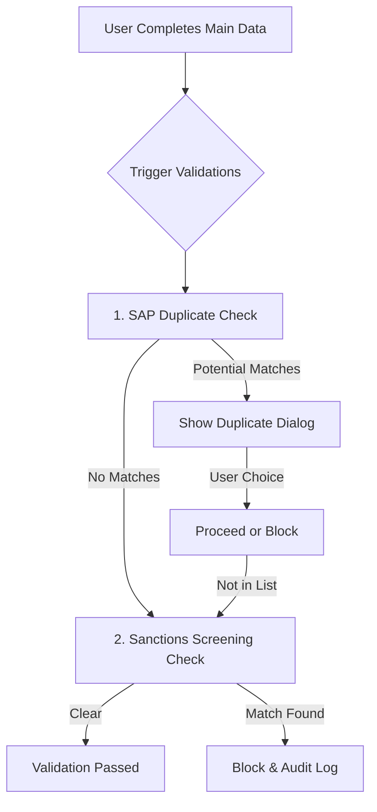

# Reference: Duplicate Detection & Main Data Validation

This document describes the **Duplicate Detection Dialog** and the validation flow that occurs after the **Main Data** (formerly Identification) section is completed.

## 1. Flow Overview

- **Direct Transition:** There is no intermediate "Results Screen". If validations pass, the user is automatically advanced to the **Profile** step.
- **Inline Modal:** If potential duplicates are found, a modal appears *over* the current Main Data screen.



## 2. API Integration

### SAP Duplicate Check
The system calls the SAP Integration microservice to perform fuzzy matching against existing master data (LFA1) and pending requests (Cosmos DB).

- **Endpoint:** `POST /api/sap/vendor/search`
- **Controller:** `SapController.cs`
- **Algorithm:** Levenshtein fuzzy matching (Threshold: 0.75)

#### Request Payload
```json
{
  "vendorType": "INDV",
  "familyName": "Smith",
  "givenName": "John",
  "companyCode": "UNES",
  "searchThreshold": 0.75
}
```

#### Response Data
The system returns a list of potential matches with similarity scores.

```json
{
  "duplicatesFound": true,
  "matchCount": 2,
  "vendors": [
    {
      "vendorName": "Smith, John James",
      "sapId": "10023456",
      "country": "FR",
      "accountGroup": "INDV",
      "matchScore": 0.89
    }
  ]
}
```

## 3. UI Representation: Duplicate Detection Dialog

The dialog is a system-critical modal that prevents the creation of redundant records.

### Key Components:
1. **Warning Message:** Alert indicating that similar records were found in SAP/Master Hub.
2. **Results Table:**
   - **Vendor Name:** Legal or person name.
   - **SAP ID:** The existing master record ID.
   - **Account Group:** To distinguish between types (e.g., Consultant vs. Supplier).
   - **Match Score:** Visual indication of similarity.
### 2. Action Buttons:
- **"Use Existing Vendor":** Cancels the current creation and directs user to the existing record.
- **"Proceed with New Record":** Only to be used if the match is a "False Positive". Triggers the **Sanctions Screening** immediately.

> [!IMPORTANT]
> If all checks pass, the dialog is never shown, and the UI smoothly transitions to **Step 2: Profile**.

## 4. Pending: Sanctions Screening Check
After a user bypasses or clears the duplicate check, the system must trigger the `SanctionsScreeningService`.
- **System:** OpenSanctions / World-Check.
- **Trigger:** Automated after duplicate clearance.
- **Blocking:** Mandatory clearance before profile entry.
