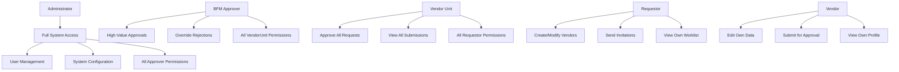

# Role-Based Access Control (RBAC) Matrix

## User Roles & Azure AD Groups

| Role | Azure AD Group | Permissions |
|------|----------------|-------------|
| **Vendor** | `UNESCO-MoUV-Vendor` | Edit own master data and submit for approval |
| **Requestor** | `UNESCO-MoUV-Requestors` | Create/edit own requests, view own worklist |
| **Vendor Unit** | `UNESCO-MoUV-VendorUnit` | Approve requests, view all submissions |
| **BFM Approver** | `UNESCO-MoUV-BFM` | High-value approvals, override rejections |
| **Administrator** | `UNESCO-MoUV-Admins` | Full system access, user management |

---

## Screen Access Matrix

### Public Routes (No Authentication Required)

| Route | Screen | All Roles |
|-------|--------|-----------|
| `/login` | Login Page | ✅ |
| `/register` | Vendor Self-Registration | ✅ |
| `/invitation/register/:token` | Invitation-Based Registration | ✅ |

---

### Vendor Routes

| Route | Screen | Vendor | Requestor | VendorUnit | BFM | Admin |
|-------|--------|:------:|:---------:|:----------:|:---:|:-----:|
| `/profile` | Vendor Profile | ✅ | ❌ | ❌ | ❌ | ❌ |
| `/dashboard` | Vendor Dashboard | ✅ | ❌ | ❌ | ❌ | ❌ |
| `/requests` | Request History | ✅ | ❌ | ❌ | ❌ | ❌ |
| `/requests/new` | New Change Request | ✅ | ❌ | ❌ | ❌ | ❌ |

**Vendor Flows:**
1. **Profile Management** - View and edit vendor master data
2. **Change Requests** - Submit changes for approval
3. **Request Tracking** - Monitor approval status

---

### Requestor & Approver Routes

| Route | Screen | Vendor | Requestor | VendorUnit | BFM | Admin |
|-------|--------|:------:|:---------:|:----------:|:---:|:-----:|
| `/approver/worklist` | Approver Worklist | ❌ | ✅ | ✅ | ✅ | ✅ |
| `/approver/history` | Approval History | ❌ | ✅ | ✅ | ✅ | ✅ |
| `/approver/create-vendor` | **Direct Vendor Creation** | ❌ | ✅ | ✅ | ✅ | ✅ |
| `/approver/update-vendor` | **Modify Existing Vendor** | ❌ | ✅ | ✅ | ✅ | ✅ |
| `/approver/invite-vendor` | Invite New Vendor | ❌ | ✅ | ✅ | ✅ | ✅ |
| `/approver/requests/:id` | Review Change Request | ❌ | ❌ | ✅ | ✅ | ✅ |
| `/approver/onboarding/:id` | Review Onboarding | ❌ | ❌ | ✅ | ✅ | ✅ |
| `/view-vendor` | View Vendor Details | ❌ | ✅ | ✅ | ✅ | ✅ |

**Requestor Flows:**
1. **Direct Vendor Creation** - Create new vendors directly in the system
2. **Modify Vendor** - Update existing vendor master data
3. **Invitation Management** - Send vendor invitations
4. **Worklist Management** - View own requests and submissions

**Approver Flows (VendorUnit, BFM):**
1. **Worklist Management** - Review pending approvals
2. **Direct Vendor Creation** - Create vendors without invitation
3. **Modify Vendor** - Update vendor master data
4. **Approval Workflow** - Approve/reject vendor changes
5. **Onboarding Review** - Review invitation-based registrations

---

### Admin Routes (Administrator Only)

| Route | Screen | Vendor | Requestor | VendorUnit | BFM | Admin |
|-------|--------|:------:|:---------:|:----------:|:---:|:-----:|
| `/admin/dashboard` | System Administration | ❌ | ❌ | ❌ | ❌ | ✅ |
| `/admin/invite` | Invite New Vendor | ❌ | ❌ | ❌ | ❌ | ✅ |
| `/admin/invitations` | Invitation Management | ❌ | ❌ | ❌ | ❌ | ✅ |
| `/admin/system-status` | System Health Monitor | ❌ | ❌ | ❌ | ❌ | ✅ |

**Admin Flows:**
1. **Invitation Management** - Send/resend/cancel vendor invitations
2. **System Monitoring** - View SAP connection, Logic Apps status
3. **User Impersonation** - Test application as different roles
4. **Workflow Configuration** - Manage approval rules

---

## Role Hierarchy & Permissions

### Permission Levels

### Detailed Permission Matrix

| Permission | Vendor | Requestor | VendorUnit | BFM | Admin |
|------------|:------:|:---------:|:----------:|:---:|:-----:|
| **Vendor Management** |
| Edit own vendor data | ✅ | ❌ | ❌ | ❌ | ❌ |
| Create new vendors | ❌ | ✅ | ✅ | ✅ | ✅ |
| Modify any vendor | ❌ | ✅ | ✅ | ✅ | ✅ |
| View all vendors | ❌ | ✅ | ✅ | ✅ | ✅ |
| **Request Management** |
| Submit change requests | ✅ | ❌ | ❌ | ❌ | ❌ |
| View own requests | ✅ | ✅ | ✅ | ✅ | ✅ |
| View all requests | ❌ | ✅ | ✅ | ✅ | ✅ |
| **Approval Workflow** |
| Approve requests | ❌ | ❌ | ✅ | ✅ | ✅ |
| Reject requests | ❌ | ❌ | ✅ | ✅ | ✅ |
| Override rejections | ❌ | ❌ | ❌ | ✅ | ✅ |
| High-value approvals | ❌ | ❌ | ❌ | ✅ | ✅ |
| **Invitation Management** |
| Send invitations | ❌ | ✅ | ✅ | ✅ | ✅ |
| Resend invitations | ❌ | ❌ | ❌ | ❌ | ✅ |
| Cancel invitations | ❌ | ❌ | ❌ | ❌ | ✅ |
| **System Administration** |
| User impersonation | ❌ | ❌ | ❌ | ❌ | ✅ |
| System monitoring | ❌ | ❌ | ❌ | ❌ | ✅ |
| Workflow configuration | ❌ | ❌ | ❌ | ❌ | ✅ |

### Role Inheritance

- **Admin** inherits all permissions from BFM, VendorUnit, and Requestor
- **BFM** inherits all permissions from VendorUnit and Requestor
- **VendorUnit** inherits all permissions from Requestor
- **Requestor** has independent permissions (no inheritance)
- **Vendor** has independent permissions (no inheritance)

---

## Special Access Rules

### Approver Role (Generic)
- **VendorUnit**, **BFM**, and **Admin** all inherit the `Approver` role
- Routes marked `allowedRoles={['Approver', 'Admin']}` are accessible to all three

### Default Redirect Logic
When a user logs in, they are redirected based on their role:
- **Vendor** → `/profile`
- **Requestor** → `/profile` (or custom requestor dashboard if implemented)
- **VendorUnit** → `/approver/worklist`
- **BFM** → `/approver/worklist`
- **Admin** → `/admin/dashboard`

### Role Mismatch Handling
If a user tries to access a route they don't have permission for:
- **Approvers** → Redirected to `/approver/worklist`
- **Admins** → Redirected to `/admin/dashboard`
- **Others** → Redirected to `/profile`

---

## Implementation Files

- **Route Definitions**: [`App.tsx`](file:///Users/jplopez/projects/vendor-mdm-portal/frontend/src/App.tsx)
- **Role Mapping**: [`ClaimsTransformationService.cs`](file:///Users/jplopez/projects/vendor-mdm-portal/backend/VendorMdm.Api/Services/ClaimsTransformationService.cs)
- **Auth Context**: [`AuthContext.tsx`](file:///Users/jplopez/projects/vendor-mdm-portal/frontend/src/context/AuthContext.tsx)
- **Protected Route**: [`App.tsx` lines 25-48](file:///Users/jplopez/projects/vendor-mdm-portal/frontend/src/App.tsx#L25-L48)

---

## Testing with Mock Authentication

All 5 roles can be tested using the mock authentication feature:

1. Navigate to `/login`
2. Click "Sign-in options"
3. Select desired role to test
4. Application redirects to role-appropriate dashboard
