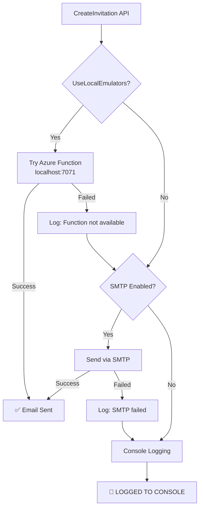

# Email Service - Diagnostic Guide

**Status:** ✅ Email service is WORKING correctly (logging mode for local dev)  
**Issue:** Emails are being logged to console instead of actually sent

---

## 🔍 How Email Service Works

The [EmailService.cs](file:///Users/jplopez/projects/vendor-mdm-portal/backend/VendorMdm.Api/Services/EmailService.cs) has a **3-tier fallback strategy**:

```
1. Azure Function HTTP Endpoint (if UseLocalEmulators = true)
     ↓ (if fails)
2. SMTP Server (if configured)
     ↓ (if fails)
3. Console Logging (fallback for local dev)
```

---

## 📋 Current Configuration (Local Dev)

Based on the code analysis:

- ✅ `UseLocalEmulators = true` (development mode)
- ❌ Azure Function not running on `http://localhost:7071`
- ❌ SMTP not configured

**Result:** Emails are **logged to console** (lines 289-340)

---

## 🔎 Check Backend Console Logs

When you create an invitation, you should see this in the backend terminal:

```
═══════════════════════════════════════════════════════════
📧 INVITATION EMAIL (LOCAL DEV - EMAIL SENT)
═══════════════════════════════════════════════════════════
To: vendor@example.com
Subject: Action Required: Invitation to Register as Vendor with Your Company
Vendor Name: Example Vendor
Invited By: Admin User
Invitation Link: http://localhost:3000/invitation/register/ABC123TOKEN
Expires: December 22, 2025 at 11:59 PM
═══════════════════════════════════════════════════════════
```

This means the email service **is working** - it's just logging instead of sending real emails (which is correct for local development).

---

## ✅ Solution Options

### Option 1: Console Logging (Current - Recommended for Local Dev)

**No changes needed!** This is the correct behavior for local development.

**How to use:**
1. Create an invitation via the UI or API
2. Check the **backend console** for the email output
3. Copy the invitation link from the console
4. Share it manually with the vendor (or use it yourself for testing)

**Pros:** ✅ No external services needed, ✅ Fast, ✅ Free  
**Cons:** ⚠️ Manual copy/paste required

---

### Option 2: SMTP Configuration (Real Emails - Gmail/Outlook)

Configure real email sending via SMTP.

#### Step 1: Create Email App Password

**Gmail:**
1. Go to Google Account → Security
2. Enable 2-Step Verification
3. Generate App Password for "Mail"
4. Copy the 16-character password

**Outlook/Office365:**
1. Go to account.microsoft.com → Security
2. Create App Password
3. Copy the password

#### Step 2: Create User Secrets File

```bash
cd backend/VendorMdm.Api
dotnet user-secrets init
dotnet user-secrets set "EmailService:Smtp:Enabled" "true"
dotnet user-secrets set "EmailService:Smtp:Host" "smtp.gmail.com"  # or smtp.office365.com
dotnet user-secrets set "EmailService:Smtp:Port" "587"
dotnet user-secrets set "EmailService:Smtp:Username" "your-email@gmail.com"
dotnet user-secrets set "EmailService:Smtp:Password" "your-app-password-here"
dotnet user-secrets set "EmailService:Smtp:FromEmail" "your-email@gmail.com"
dotnet user-secrets set "EmailService:Smtp:FromName" "Vendor Management Portal"
dotnet user-secrets set "EmailService:Smtp:UseSsl" "true"
```

#### Step 3: Restart Backend

```bash
# Stop current backend (Ctrl+C)
cd backend
dotnet run --project VendorMdm.Api
```

**Pros:** ✅ Real emails sent, ✅ Production-like testing  
**Cons:** ⚠️ Requires email account setup, ⚠️ May hit sending limits

---

### Option 3: Azure Function (Advanced)

Run the Azure Function locally to process emails via Azure Communication Services.

#### Requirements:
- Azure Communication Services resource
- Azure Function runtime installed
- Connection strings configured

#### Steps:

1. **Install Azure Functions Core Tools:**
   ```bash
   brew install azure-functions-core-tools@4
   ```

2. **Configure Function:**
   ```bash
   cd backend/VendorMdm.Artifacts
   # Create local.settings.json with Azure Communication Services connection
   ```

3. **Run Function:**
   ```bash
   func start --port 7071
   ```

4. **Run Backend API:**
   ```bash
   # In another terminal
   cd backend
   dotnet run --project VendorMdm.Api
   ```

**Pros:** ✅ Production-like, ✅ Azure native  
**Cons:** ⚠️ Requires Azure resources, ⚠️ More complex setup

---

## 🧪 Testing Email Service

### Test 1: Create Invitation (Console Logging)

```bash
# Via API
curl -X POST http://localhost:5001/api/invitation/create \
  -H "Content-Type: application/json" \
  -d '{
    "vendorLegalName": "Test Vendor Co",
    "primaryContactEmail": "test@example.com",
    "expirationDays": 14,
    "notes": "Testing email service"
  }'

# Check backend console for:
# 📧 INVITATION EMAIL (LOCAL DEV - EMAIL SENT)
```

### Test 2: Verify Email Content

The logged email should contain:
- ✅ Correct recipient email
- ✅ Invitation link with token
- ✅ Expiration date (14 days from now)
- ✅ Invited by name

### Test 3: Use Invitation Link

```bash
# Copy link from console, e.g.:
# http://localhost:3000/invitation/register/ABC123TOKEN

# Paste in browser or test via API:
curl http://localhost:5001/api/invitation/validate/ABC123TOKEN
```

---

## 🐛 Troubleshooting

### Problem: No email logs in console

**Check:**
1. Backend is running (`dotnet run --project VendorMdm.Api`)
2. Console output is visible (not redirected)
3. Invitation was created successfully (check HTTP 200 response)

**Solution:**
- Look for `📧 INVITATION EMAIL (LOCAL DEV - EMAIL SENT)` in backend console
- If not found, check for errors before that line

### Problem: SMTP "Authentication failed"

**Causes:**
- Wrong username/password
- App password not created
- 2FA not enabled (for Gmail)

**Solution:**
- Regenerate app password
- Double-check `user-secrets` values
- Test SMTP credentials with a mail client first

### Problem: Azure Function not found

**Expected behavior:**
```
Azure Function not available at http://localhost:7071/api/invitation/send-email. 
Falling back to logging.
```

This is **normal** if you haven't started the Azure Function. The service will fall back to console logging.

---

## 📊 Email Service Flow Diagram



---

## 💡 Recommendations

**For Local Development:**
- ✅ **Use Console Logging** (current setup) - fastest and simplest
- Copy invitation links from console for testing

**For Testing Real Emails:**
- ✅ **Use SMTP with Gmail** - easiest real email option
- Good for testing email templates and delivery

**For Production:**
- ✅ **Azure Communication Services** via Azure Function
- Configured in Azure infrastructure

---

## 🔗 Related Files

- **Email Service:** [EmailService.cs](file:///Users/jplopez/projects/vendor-mdm-portal/backend/VendorMdm.Api/Services/EmailService.cs)
- **Invitation Service:** [InvitationService.cs](file:///Users/jplopez/projects/vendor-mdm-portal/backend/VendorMdm.Api/Services/InvitationService.cs) (calls EmailService at line 193-233)
- **Configuration:** `backend/VendorMdm.Api/appsettings.json` (for production)
- **User Secrets:** `~/.microsoft/usersecrets/[guid]/secrets.json` (for local dev)

---

**Current Status:** ✅ Working as designed for local development  
**To Actually Send Emails:** Configure Option 2 (SMTP) or Option 3 (Azure Function)
