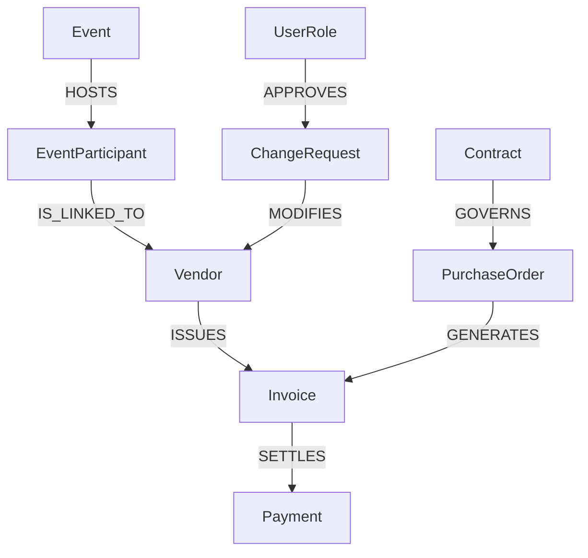

# Master Ontology Registry

**Status:** LIVING DOCUMENT
**Maintainer:** Architecture Team

---

## 1. Vision: The "World Model"
This document serves as the **Master Registry** for the Domain Ontology. It describes **what exists** (Concepts) and **how they behave** (Rules) independently of **where they are stored** (Database) or **how they were created** (Flows).

**Rule**: Any new Entity or Relationship added to the system MUST be defined here first.

---

## 2. Global Concepts Registry

### A. Vendor (`VendorEntity`)
*The legal or natural person providing goods/services.*
*   **Attributes**: `LegalName` (Identity), `TaxID` (Identity), `SanctionsRisk`.
*   **Origin Contexts**:
    *   `Direct`: Created via manual invitation. Requires TaxID.
    *   `Event`: Created via Event Registration. TaxID optional (Provisional).
    *   `Grant`: Created via Grant Application. Special Account Group `Z005`.
    *   `SelfReg`: Created via Public Portal. Status `PendingReview` by default.
*   **Rules**:
    *   "Cannot be invited if SanctionsRisk is High."
    *   "Cannot issue Invoices if Origin is Event (until converted)."

### B. Event (`EventEntity`)
*A structured gathering requiring logistical or financial participants.*
*   **Attributes**: `EventCode` (Identity), `StartDate`.
*   **Origin Contexts**:
    *   `Planned`: Created by UN Staff in system.
    *   `AdHoc`: Created on the fly for emergency missions.
*   **Rules**:
    *   "Participants can only be Paid if they are linked to a Vendor Record."
    *   "AdHoc events expire after 30 days."

### C. ChangeRequest (`ChangeRequestEntity`)
*A formal request to modify the state of another Entity.*
*   **Attributes**: `RequestId` (Identity), `TargetEntityId`, `Status`.
*   **Origin Contexts**:
    *   `UserInitiated`: Vendor requesting profile update.
    *   `SystemAudit`: Automated compliance check failure.
*   **Rules**:
    *   "Transitions to 'Approved' require 2 distinct Approvers if value > $10k."
    *   "Cannot modify TaxID if Vendor has active Contracts."

### D. UserRole (`UserRoleEntity`)
*The defined capabilities of a human actor.*
*   **Attributes**: `UserId` (Identity), `RoleName`.
*   **Origin Contexts**:
    *   `OktaProvisioned`: Synced from IDP. Read-Only attributes.
    *   `LocalSystem`: Created for testing/emergency admin.
*   **Rules**:
    *   "Admin Role cannot approve their own Change Requests."

### E. Payment (`PaymentEntity`)
*The transfer of value to a Vendor.*
*   **Attributes**: `TransactionId` (Identity), `Amount`, `Currency`.
*   **Origin Contexts**:
    *   `InvoiceSettlement`: Triggered by approved Invoice.
    *   `Stipend`: Triggered by Event Attendance (No invoice needed).
*   **Rules**:
    *   "Stipends validation: Vendor must be individual, not Org."

---

## 3. Relationships Graph

